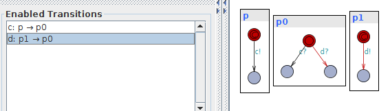
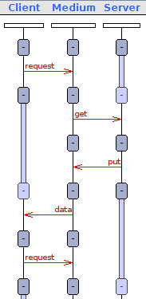
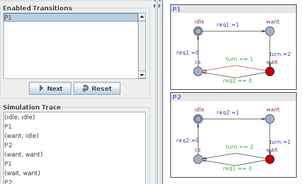
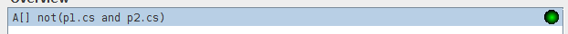
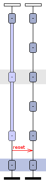

*******************
Klausurvorbereitung
*******************

Einführung
==========

    **Welcher Begriff von "Parallelität" und "Nebenläufigkeit" ist der allgemeinere? (S.9)**:

Parallelität bezeichnet das gleichzeitige Ausführen von Aktionen, während Nebenläufigkeit lediglich die Möglichkeit der Parallelität angibt. Nebenläufigkeit ist also der allgemeinere Begriff. Bei Nebenläufigkeit können Aktionen

- unabhängig laufen
- es besteht keine kausale Abhängigkeit
- die Aktionen sind symmetrisch

Automatenkopplung
=================

    **Entwurf eines erweiterten endlichen Automaten (S.21)**:

*Aufgabenstellung*: Ein Prozess sendet Pakete, die er mit Sequenznummern 0, 1, 2, ..., 127 durchnummeriert, wobei die Zählung mit Paket Nr. 128 wieder von 0 beginnt. Auf Paket n folgt also Paket Nr. n+1 modulo 27.

*Lösung*:

.. image:: yed/automaton_page_21.png

----

    **Beschreiben Sie eine Ampel als Transitionssystem**:

*Zustandsmenge*:

- rot
- rot/gelb
- gelb
- grün

*Aktionen*:

- bereit machen
- fahren
- bremsen
- anhalten

----

    **UML Sequenzdiagramm parallele Ausführung (S.55)**:

.. image:: umlet/uml_sequence_page_55.png

*Welche sechs verschiedenen Nachrichtensequenzen sind möglich?*:

1. m3 -> m4 -> m5 -> m6
2. m3 -> m5 -> m6 -> m4
3. m3 -> m5 -> m4 -> m6
4. m5 -> m6 -> m3 -> m4
5. m5 -> m3 -> m4 -> m6
6. m5 -> m3 -> m6 -> m4

----

    **Erläutern Sie das Konzept des Mealy-Automaten an, indem Sie einen Automatengraphen zeichnen und alle Bestandteile benennen.**:

    **Was ist ein Transitionssystem? Geben Sie zwei Beispiele an!**:

Ein Transitionssystem enhält eine definierte Anzahl an Zuständen und eine Anzahl an Übergängen, um zwischen den Zuständen wechseln zu können.

1. Das gezeigte Ampelsystem
2. reguläre Ausdrücke in Programmiersprachen

    **Welche Erweiterungen für Automatenmodelle kennen Sie?**:

- endliche deterministische Automaten
- endliche nicht deterministische Automaten
- Kellerautomaten

    **Was sind "Spontanübergänge"? Geben Sie ein Zustandsübergangsdiagramm für einen indeterministischen Automaten an!**:

Spontanübergänge sind Übergange zwischen zwei Zuständen, die an keine Bedingung geknüpft sind und keine Anweisungen enthalten. Diese Übergange bezeichnet man auch als :math:`\epsilon`-Übergange.

    **Was ist synchrone Kopplung? Was ist asynchrone Kopplung? Welche alternativen Begriffe kennen Sie für "synchron" bzw. "asynchron"?**:

Bei einer synchronen Kopplung kann ein Übergang zwischen zwei Automaten nur bei gleichzeitigem Senden und Empfangen von Nachrichten erfolgen. Bei asynchroner Kopplung muss eine gesendete Nachricht nicht sofort verarbeitet werden. DIe Automaten werden nicht blockiert.

``synchron``: direkte Kopplung, Übereinkunftskopplung, Rendez-Vous-Kopplung
``asynchron``: speichernde Kopplung, Übertragungskopplung

    **Erläutern Sie das Prinzip der Erreichbarkeitsanalyse? Benutzen und erläutern Sie dazu die Begriffe Lokalzustand, Globalzustand, Transition, Wurzelknoten, Terminalknoten, .... !**:

Innerhalb einer Erreichbarkeitsanalyse werden die Lokalzustände ermittelt, die ein Automat mit Hilfe von Ein- und Ausgaben bzw. Transitionen erreichen kann. Gängig bei diesem Vorgang ist, den Baum aus den Wurzelknoten 0ee0 starten zu lassen (vorausgesetzt das System besteht aus zwei Automaten). Globalzustände innerhalb des Systems bezeichnen Kombinationen aus den einzelnen Lokalzuständen der Automaten und beinhalten den Globalzustand des Systems.

    **Wie formen Sie einen Erreichbarkeitsgraphen in einen Erreichbarkeitsbaum um?**:

Graphen besitzen keine doppelte Knoten, sondern verweisen wieder zurück auf bereits explorierte Zustände. Die Blätter eines Baumes sind Zustände, die während der Analyse bereits aufgetreten sind.

    **Welche Fehlertypen sind bei einer Zustandsraumexploration von Modellen für Kommunikationsprotokollen relevant?**:

- Syntaktische Fehler

    + Statischer bzw. Globaler Deadlock
    + Nicht spezifizierter Empfang
    + Protokollüberlauf
    + Nicht erreichbarer Code

    **Welche Vor- und Nachteile besitzt das sog. bit-state-Verfahren im Gegensatz zu einem vollständigen Explorationsverfahren?**:

Meist muss nur geprüft werden ob überhaupt ein Fehler innerhalb eines Modells auftritt. Zu diesem Zweck genügt das bit-state-Verfahren. Eine vollständige Exploration ist meist sehr teuer und aufwendig. Durch das Hashing werden bei Kollisionen des Hashwertes bestimmte Teilbäume ausgelassen. Hierdurch können aber tendenziell schneller Fehler gefunden werden, da überflüssige Teilbäumen verworfen werden.

    **Was ist Hashing? Wie ist eine Hashfunktion aufgebaut? Erläutern Sie "Kollisionsauflösung"! Was ist der Vorteil von Hashing gegenüber baumorientierten Verfahren? (Steht nicht explizit im Skript, aber gehört zur Allgemeinbildung!)**:

Hashing bezeichnet man als mathematische Einwegfunktionen. Ermittelte Werte aus diesen Funktionen können nicht auf den ursprünglichen Wert zurückgerechnet werden.

Zeitbehaftete Synchrone Automaten
=================================

    **Beispiele S.13**

*zu 1*: Bei ``committed`` wird die Transition L1 -> L2 sofort ausgeführt. Zeitgleich oder danach kann L3 -> L4 ausgeführt werden

*zu 2*: Die Transition L1 -> L2 wird ohne Zeitverlust, aber erst wenn x >= 2 beträgt, ausgeführt.

----

    **Beispiele S.14**:

*zu 1*: Wenn ``committed`` enthalten ist, kann nur die Transition ``c!`` und ``c?`` ausgeführt werden. Wenn ``urgend`` enthalten ist können beide Nachrichten gesendet werden, es würde lediglich kein Zeitverlust bei ``c!`` auftreten.

*zu 2*: In Uppaal sind beide Transitionen möglich.

Download: `Teil 1.3 Seite 14 <../../_static/uppaal_exam_prep/part_1.3_page_14.xml>`_

----

    **Client/Server-Kommunikation (S.15)**:

Die Kommunikation geht immer zwischen Client und Server hin und her. Es gibt nur einen möglichen Ablauf.

----

Download: `Client/Server-Kommunikation S.15 <../../_static/uppaal_exam_prep/part_1.3_page_15.xml>`_

    **Petterson Mutual Exclusion (S.41)**:

----

    **Uhren (S.46)**:

- Der Automat kann L0 -> L2 nur im Zeitrahmen 5 < y < 10 schalten.
- Der Automat kann L0 -> L1 nur im Zeitrahmen x <= 5 schalten.
- Ohne einen zweiten Automaten kann die Schaltung L0 -> L0 nicht durchgeführt werden
- Die Schaltung L0 -> L0 bringt an dieser Stelle nur etwas wenn der Automat in L0 verharrt und die Uhren extern geändert werden.
- Beim Guard L0 -> L2 muss anstelle des Komma ein ``and`` enthalten sein
- Beim Update L0 -> L0 muss nach ``x:=0`` ein Komma gesetzt werden

Download: `Teil 1.3 Seite 16 <../../_static/uppaal_exam_prep/part_1.3_page_46.xml>`_

----

    **Nutshell-Example (S. 50)**:

1. A0 -> A1:

     a) Kann erfolgen wenn 3 <= y <= 6
     b) Setzt y auf 0
     c) Zwingt B zur Schaltung B0 -> B1

2. B0 -> B1

     a) Kann erfolgen wenn 2 <= x <= 4
     b) Setzt n auf 5
     c) Setzt x auf 0

3. A1 -> A2

     a) y ist nach der Transition >= 4

4. A2 -> A3

     a) kann erfolgen, da zuvor n auf 5 gesetzt wurde

5. B1 -> B2

     a) n ist nach der Transition = 6

6. B2 -> B3

     a) Epsilonübergang

A3 und B3 müssen nicht immer erreicht werden. Wenn B vor A schaltet besitzt n den Wert 6 wonach die Transition A2 -> A3 nicht mehr erfolgen kann.

----

    **Urgent Channel (S.56)**:

In Uppaal macht die Verwendung des Automaten keinen Unterschied egal ob ``urgent`` verwendet wird oder nicht. Laut Defintion darf aber bei x2 (also ``urgent``) keine Zeit zwischen den Transitionen vergehen. In einer Urgent Location darf keine Zeit vergehen. Bei der Transition eines urgent channels darf keine Zeit vergehen.

Download: `Teil 1.3 Seite 56 <../../_static/uppaal_exam_prep/part_1.3_page_56.xml>`_

----

    **Urgent Channel vs. Urgent Location (S.62)**:

Wenn anstelle der urgent-Channel der Zustand ``begin`` als urgent gekennzeichnet wird, darf nach Abschluss der Arbeit (work_easy...) kein Zeitverlust beim Beginn eines neuen Jobs vergehen. Wenn lediglich die Kanäle als urgent gekennzeichnet sind, kann zwischen dem Abschluss und dem Start Zeit vergehen (je nach Invariante).

Download: `Teil 1.3 Seite 61/62 <../../_static/uppaal_exam_prep/part_1.3_page_61.xml>`_

Zusatzaufgabe **Raucher**
=========================

Eine Beschreibung des Problems ist auf `Wikipedia <https://de.wikipedia.org/wiki/Raucherproblem>`_ zu finden.

Uppaal Lösung: `Raucherproblem <../../_static/uppaal_exam_prep/smoker_problem.xml>`_

Java Lösung: `Github - Smoker <https://github.com/captain-proton/aise/tree/master/concurrency/src/main/java/ude/masteraise/concurrency/smoker>`_
