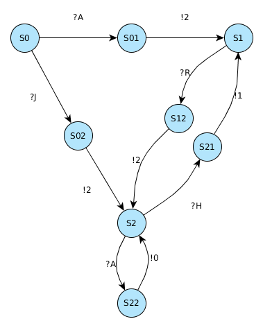
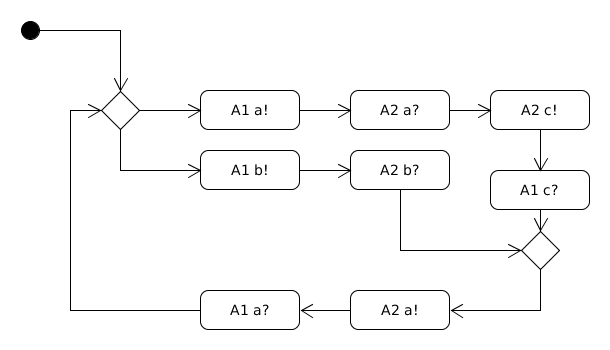
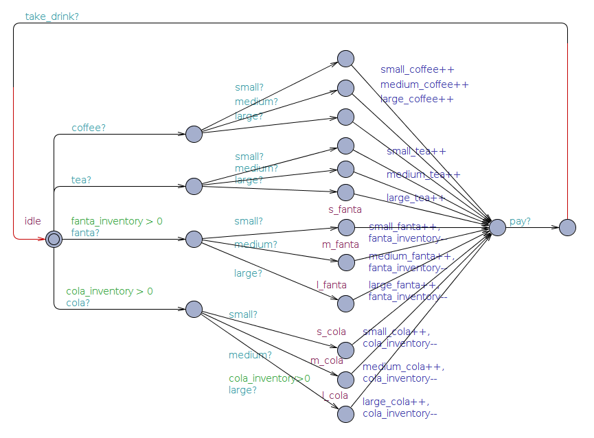
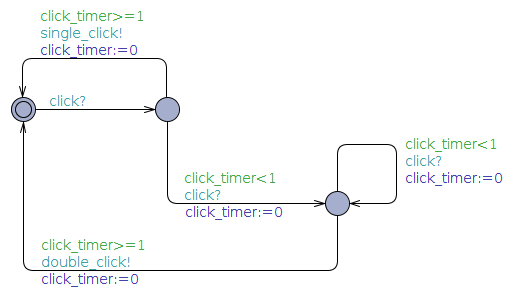
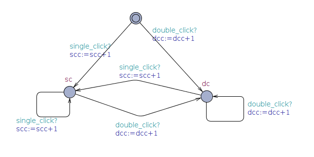

*****
Übung
*****

Die hier gelisteten Lösungen wurden mit Hilfe unterschiedlicher Werkzeuge realisiert.

+--------+-------------+---------------------------------------------+
| Ordner | Erweiterung | Tool                                        |
+========+=============+=============================================+
| umlet  | uxf         | `Umlet <http://umlet.com/>`_                |
+--------+-------------+---------------------------------------------+
| yed    | graphml     | `yEd <http://www.yworks.com/products/yed>`_ |
+--------+-------------+---------------------------------------------+
| uppaal | xml         | `UPPAAL <http://www.uppaal.org/>`_          |
+--------+-------------+---------------------------------------------+

UPPAAL Tutorial
===============

- Zeiteinheiten in UPPAAL werden in Clocks gemessen

Notizen
-------

- Assignment = Update
- sync = gleichzeitiges ausführen
- guard = bedingung
- urgend = zustand muss dringend verlassen werden
- committed = zustand muss sofort verlassen werden

Übungsblatt 1
=============

`Aufgabenblatt 1 <../_static/exercise/b1.pdf>`_

Problem 1.1 Mealey-Automaten
----------------------------

1.1.1
^^^^^

Antwort: 2012

1.1.2
^^^^^

a) Ja: JAAA
b) Nein: Die Eingabe zwei aufeinander folgender Einsen ist nicht möglich

1.1.3
^^^^^

Problem 1.2 Gekoppelte Systeme
------------------------------

1.2.1
^^^^^

Wenn der Eingabepuffer des Systems größer eins ist kann eine Eingabe von zwei
mal a erfolgen. Alternativ kann eine Synchronisation nach der ersten Eingabe
erfolgen wodurch unterschiedliche Zustandsfolgen erreicht werden.

1.2.2
^^^^^

Nach Eingabe der Zeichenfolge a,b,a,b befindet sich Automat A2 im Zustand 2 und kann nur noch durch die Eingabe von b wieder in den Zustand 0 überführt werden. Hier tritt ein unerwarteter Empfang auf, da A2 im Zustand 2 ein empfangenes b nicht verarbeiten kann.

1.2.3
^^^^^

Sobald A1 versucht das zweite ``b`` zu senden könnte A2 den Empfang nicht verarbeiten, es tritt also ein Deadlock auf.

1.3.1
^^^^^

.. image:: solutions/yed/Blatt_1_Aufgabe_1.3.1.png

1.3.2
^^^^^

.. image:: solutions/yed/Blatt_1_Aufgabe_1.3.2.png

Übungsblatt 2
=============

`Aufgabenblatt 2 <../_static/exercise/b2.pdf>`_

Problem 2.1 Fehlerklassen
-------------------------

2.1.1 Deadlock
^^^^^^^^^^^^^^

2.1.2 Nicht spezifizierter Empfang
^^^^^^^^^^^^^^^^^^^^^^^^^^^^^^^^^^

.. image:: solutions/yed/Blatt_2_Aufgabe_2.1.2.png

2.1.3 Pufferüberlauf
^^^^^^^^^^^^^^^^^^^^

2.1.4 Toter Code
^^^^^^^^^^^^^^^^

.. image:: solutions/yed/Blatt_2_Aufgabe_2.1.4.png

Problem 2.2 Automatenentwurf
----------------------------

.. image:: solutions/yed/Blatt_2_Aufgabe_2.2.png

Übungsblatt 2 Zusatz
====================

Erstellen Sie ein synchron gekoppeltes System aus zwei Automaten. Der erste ist der Getränkeautomat, der zweite der Kunde.

Der Kunde hat folgende Wahlmöglichkeiten:

Cola, Fanta, Sprite, diese 3 Sorten jeweils in groß, mittel und klein.

Getränkeauswahl, bezahlen sowie Getränk entnehmen sollen durch Nachrichten dargestellt werden.

Während das Getränk im Automaten zubereitet wird soll gespeichert werden (z.B. über boolean- oder int-Variablen) welches Getränk zubereitet wird. Dieser Wert soll erst beim Entnehmen wieder auf 0 gesetzt werden.

Zusatzübung 1
=============

`Zusatzaufgabenblatt 1 <../_static/exercise/z1.pdf>`_

Folieninformationen
-------------------

Folie 7
^^^^^^^

Bei asychroner Kommunikation ist die Linie von System 1 nach 2 und umgekehrt immer durchgezogen.

Folie 9
^^^^^^^

- Grundsätzlich ist die Reihenfolge egal, es muss lediglich die Nachricht m4 vor m5 versendet werden
- m3 darf nicht ohne m4 gesendet werden

Folie 19
^^^^^^^^

- bei Google nicht nach Bit-State suchen sondern nach Supertrace-Algorithmus

Problem 1.1 Bit-State-Algorithmus
---------------------------------

.. image:: solutions/yed/Zusatzblatt_1_Aufgabe_1.1.png

+------+-----+--------------+
| h(z) | 0/1 | Kommentar    |
+======+=====+==============+
| 0    | 1   | (0, 0, e, e) |
+------+-----+--------------+
| 1    | 0   |              |
+------+-----+--------------+
| 2    | 1   | (1, 0, a, e) |
+------+-----+--------------+
| 3    | 1   | (2, 0, b, e) |
+------+-----+--------------+
| 4    | 0   |              |
+------+-----+--------------+
| 5    | 0   |              |
+------+-----+--------------+
| 6    | 1   | (2, 2, e, e) |
+------+-----+--------------+
| 7    | 0   |              |
+------+-----+--------------+
| 8    | 0   |              |
+------+-----+--------------+
| 9    | 0   |              |
+------+-----+--------------+

Problem 1.2 UML-Diagramme
-------------------------

Sequenzdiagramm
^^^^^^^^^^^^^^^

Aktivitätsdiagramm
^^^^^^^^^^^^^^^^^^

Zustandsdiagramm
^^^^^^^^^^^^^^^^

.. image:: solutions/umlet/Zusatzblatt_1_Aufgabe_1.2.zustand.png

Problem 1.3 Bit-State Details
-----------------------------

1.3.1 Vorteil- und Nachteile
^^^^^^^^^^^^^^^^^^^^^^^^^^^^

Vorteile:

- Speicherbedarfeinsparung
- Rechenzeiteinsparung

Nachteile:

- Es ist möglich, dass bestimmte Globalzustände nicht erreicht und Fehler nicht gefunden werden

1.3.2 Hashing vs. Baumorientiert
^^^^^^^^^^^^^^^^^^^^^^^^^^^^^^^^

Bei Hashingverfahren ist der Aufwand um Fehlerfälle zu finden um ein vielfaches niedriger als die Untersuchung eines kompletten Baums. Zudem ist es meist deutlich schneller als baumorientierte Verfahren.

1.3.3 *fair progress*
^^^^^^^^^^^^^^^^^^^^^

Bei asynchroner Kommunikation ist es möglich, dass bestimmte Teile des Ablaufs häufiger durchlaufen werden als andere. Es kann dazu kommen, dass ein Prozess andere Prozesse blockt. Durch fair progress soll vermieden werden, dass diese Prozesse nicht übergangen werden.

Priorisierung. hernutersetzen der Priorität von bereits genutzten Transitionen.

Übungsblatt 3
=============

`Aufgabenblatt 3 <../_static/exercise/b3.pdf>`_

Notizen
-------

Die Anzahl der möglichen Globalzustände beträgt:

Anzahl Zustände der Automaten \* Anzahl der möglichen Variablenbelegungen

Bsp:

Problem 3.1 UPPAAL: wechselseitiger Ausschluss
----------------------------------------------

3.1.1 UPPAAL Konstruktion
^^^^^^^^^^^^^^^^^^^^^^^^^

Declarations:

 .. code-block:: c

     int turn = 0;

Template:

.. image:: solutions/uppaal/blatt_3.1.1.png

System declarations:

.. code-block:: c

    // Place template instantiations here.
    worker_1 = Mutex(1);
    worker_2 = Mutex(2);
    // List one or more processes to be composed into a system.
    system worker_1, worker_2;

3.1.2 Message Sequence Chart
^^^^^^^^^^^^^^^^^^^^^^^^^^^^

Message Sequence Chart:

.. image:: solutions/uppaal/blatt_3.1.2_msc.png

Als UML Sequenzdiagramm:

.. image:: solutions/umlet/Blatt_3_Aufgabe_3.1.2.png

3.1.3 Anzahl möglicher Globalzustände
^^^^^^^^^^^^^^^^^^^^^^^^^^^^^^^^^^^^^

Die Zustände der Automaten bilden sich aus:

- Z1 = {idle, want, crit}
- Z2 = {idle, want, crit}

Die Anzahl der Übergänge beträgt drei, da ``turn`` drei unterschiedliche Werte erhalten kann.

Somit bildet sich der Globalzustand aus:

G Teilmenge aus Z1 x Z2 x A1 x A2. Die Anzahl der möglichen Globalzustände ist somit 27.

Problem 3.2 Automatenentwurf
----------------------------

3.2.1 - 3.2.3 UPPAAL Konstruktion
^^^^^^^^^^^^^^^^^^^^^^^^^^^^^^^^^

Global Declarations:

.. code-block:: c

    chan coffee,tea,cola,fanta;
    chan small,medium,large;
    chan pay,take_drink;

Automaton Declarations:

.. code-block:: c

    int cola_inventory = 2;
    int fanta_inventory = 2;
    int small_tea,medium_tea,large_tea;
    int small_coffee,medium_coffee,large_coffee;
    int small_fanta,medium_fanta,large_fanta;
    int small_cola,medium_cola,large_cola;

System declarations:

.. code-block:: c

    customer_1 = Customer();
    customer_2 = Customer();
    automaton = Automaton();
    // List one or more processes to be composed into a system.
    system customer_1,customer_2,automaton;

Template *Customer*:

.. image:: solutions/uppaal/blatt_3.2.1.customer.png

Template *Automaton*:

Download: `Getränkeautomat 3.2 <../_static/uppaal_models/blatt_3.2.xml>`_

3.2.4 Anzahl der Zustände
^^^^^^^^^^^^^^^^^^^^^^^^^

- Anzahl Zustände Kunde: 4
- Anzahl Zustände Automat: 19
- Anzahl Übergänge Kunde: 9
- Anzahl Übergänge Automat: 30

Anzahl der Gesamtzustände: 4 \* 19 \* 9 \* 30 = 20520

Übungsblatt 4
=============

`Aufgabenblatt 4 <../_static/exercise/b4.pdf>`_

Problem 4.1 UPPAAL: Mausklickerkennung
--------------------------------------

Benutzer
^^^^^^^^

Maus
^^^^

Lösung mit Hilfe von Guards.

Lösung über die Verwendung einer Invariante.

.. image:: solutions/uppaal/blatt_4.1.mouse_invariant.png

Observer
^^^^^^^^

Eine Verwendung von drei Zuständen ist nur dann notwendig, wenn ein Zustand einen Klick repräsentiert. Ansonsten kann der Zähler auch ausschließlich über zwei Zustände erfolgen.

Übungsblatt 5
=============

`Aufgabenblatt 5 <../_static/exercise/b5.pdf>`_

Problem 5.1 Bäume mit CTL unterscheiden
---------------------------------------

5.1.1
^^^^^

Abfrage: Es exististert ein Pfad in dem immer ``k`` zutrifft.

Formel: :math:`\exists \square k` eq. ``E [] k``

Alternative Abfrage: Für alle Pfade gilt k oder m.

Formel: :math:`\forall \square k \vee m` eq. ``A [] k v m``

5.1.2
^^^^^

Abfrage: Es exististert ein Pfad in dem ``m`` zutrifft.

Formel: :math:`\exists \lozenge m` eq. ``E <> m``

5.1.3
^^^^^

Abfrage: Es exististert ein Pfad in dem immer ``k`` zutrifft.

Formel: :math:`\exists \square k` eq. ``E [] k``

5.1.4
^^^^^

Abfrage: Es exististert ein Pfad in dem aus :math:`m \wedge \neg k`, :math:`k \wedge \neg m` folgt.

Formel: :math:`\exists \lozenge m \wedge \neg k \rightarrow k \wedge \neg m` eq. ``E <> m and not k -> k and not m``

5.1.5
^^^^^

Abfrage: Es existiert ein Pfad in dem aus :math:`k \wedge m`, :math:`k \wedge m` folgt.

Formel: :math:`\exists \lozenge k \wedge m \rightarrow k \wedge m` eq. ``E <> k and m -> k and m``

5.1.6
^^^^^

Abfrage: Es existiert ein Pfad in dem aus :math:`k \wedge m`, :math:`m \wedge \neg k` folgt.

Formel: :math:`\exists \lozenge k \wedge m \rightarrow m \wedge \neg k` eq. ``E <> k and m -> m and not k``

Problem 5.2 CTL und Umgangssprache
----------------------------------

5.2.1.1
^^^^^^^

Die umgangssprachliche Form entspricht nicht der Formel. Die Formel :math:`\forall \lozenge k` entspricht der Aussage "*Für alle Pfade wird irgendwann k auftreten*".

.. image:: solutions/yed/Blatt_5_Aufgabe_5.2.1.1.Formel.png

Ein Equivalent der Umgangssprache ist: :math:`\exists \lozenge k`

.. image:: solutions/yed/Blatt_5_Aufgabe_5.2.1.1.Aussage.png

5.2.1.2
^^^^^^^

*Möglicherweise* ist eine Tautologie und kann in UPPAAL nicht sinnvoll dargestellt werden. Demnach ist die Aussage immer wahr. Ein dazugehöriger Baum kann beliebiger Form sein. Die Formel entspricht der Aussage "*Es existiert ein Pfad in dem immer k oder m gilt*".

.. image:: solutions/yed/Blatt_5_Aufgabe_5.2.1.2.png

5.2.1.3
^^^^^^^

Die umgangssprachliche Form entspricht nicht der Formel. Die Formel :math:`k \rightarrow m` entspricht der Aussage "*Für alle Pfade tritt k auf irgendwann gefolgt von einem m*".

.. image:: solutions/yed/Blatt_5_Aufgabe_5.2.1.3.Formel.png

Ein Equivalent der Umgangssprache ist: :math:`k \wedge m`

.. image:: solutions/yed/Blatt_5_Aufgabe_5.2.1.3.Aussage.png

5.2.2
^^^^^

Folgende Lösungen sind über den UPPAAL Verifier realisiert worden. Die Details sind in den einzelnen Unterabschnitten näher erläutert.

Download: `UPPAAL Modell Philosophen <../_static/uppaal_models/philosophers.xml>`_

5.2.2.1
"""""""

Die Formel impliziert, dass Philosoph 1 auf jeden Fall irgendwann essen wird, entspricht also nicht der Aussage. Die Aussage entspricht der Formel :math:`E \lozenge fork_1.Occupied \rightarrow philo_1.Eating` (``E <> fork_1.Occupied -> philo_1.Eating``)

5.2.2.2
"""""""

Die Formel sagt aus, dass ein Pfad existiert in dem Gabel 2 belegt ist und Philosoph 2 nicht denkt. Die Aussage bezieht sich nicht auf einen bestimmten Pfad, sondern ist eine generelle Aussage. Die Formel dazu ist :math:`A \square \neg (fork_2.Occupied \wedge \neg philo_2.Thinking)` (``A [] not (fork_2.Occupied and not philo_2.Thinking)``)

5.2.2.3
"""""""

Die Formel sagt aus, dass in allen Pfaden Philosoph 1 oder 3 isst. Die Aussage widerum bezieht sich nur auf eine Möglichkeit, dass Philosoph 1 und 3 gleichzeitig essen können. Die Formel dazu ist :math:`\exists \lozenge philo_1.Eating \wedge philo_3.Eating` (``E <> philo_1.Eating and philo_3.Eating``)

Zusatzübung 2
=============

`Zusatzaufgabenblatt 2 <../_static/exercise/z2.pdf>`_

Problem 2.1 UPPAAL - asychrone Automatensysteme
-----------------------------------------------

Da UPPAAL nicht in der Lage ist asychrone Kommunikation über Kanäle abzubilden, beläuft sich die Idee der Lösung auf den Einsatz eines Mediums. Zusätzlich wird wird das Senden und Empfangen einer Nachricht in zwei separate Kanäle aufgeteilt - aus ``a(!|?)`` wird ``send_a(!|?)`` und ``receive_a(!|?)``.

Automat
^^^^^^^

.. image:: solutions/uppaal/zusatzblatt_2_2.1.a2.png

Message Sequence Chart
^^^^^^^^^^^^^^^^^^^^^^

Alternative
^^^^^^^^^^^

Für jeden Automaten kann ein einzelnes Medium modeliert werden, dass die Nachricht(en) an den anderen Automaten als Buffer darstellt. Für den genannten Fall wäre dass ein Automat A1->A2 und ein Automat A2->A1. Optional kann in einem Zähler die Anzahl der Zeichen im Buffer speichern, um z.B. einen Überlauf erkennen zu können.

Problem 2.2 CTL
---------------

2.2.1.Z
^^^^^^^

+--------------------------------------------------------+-----------------------------------------------------------+----------------+
| Aussage                                                | Umgangssprache                                            | trifft zu?     |
+========================================================+===========================================================+================+
| ``E[] not k`` ( :math:`\exists \square \neg k` )       | Es existiert ein Pfad in dem ``k`` nicht gilt             | X              |
+--------------------------------------------------------+-----------------------------------------------------------+----------------+
| ``A<> k`` ( :math:`\forall \lozenge k` )               | In allen Pfaden tritt irgendwann ``k`` zu                 |                |
+--------------------------------------------------------+-----------------------------------------------------------+----------------+
| ``E<> k and m`` ( :math:`\exists \lozenge k \wedge m`) | Es existiert ein Pfad in dem irgendwann k und m zutreffen | X              |
+--------------------------------------------------------+-----------------------------------------------------------+----------------+
| ``k -> k`` ( :math:`k \rightarrow k` )                 | Auf k folgt irgendwann k                                  | X (Tautologie) |
+--------------------------------------------------------+-----------------------------------------------------------+----------------+
| ``m -> not k`` ( :math:`m \rightarrow \neg k` )        | Auf m folgt nicht k                                       |                |
+--------------------------------------------------------+-----------------------------------------------------------+----------------+

2.2.2.Z
^^^^^^^

Anmerkung: Das hier dargestellte Template liefert nicht die Ergebnisse, die sich nach händischer Überprüfung ergeben. Die Musterlösung ist als korrekt anzusehen.

Template
""""""""

.. image:: solutions/uppaal/zusatzblatt_2_2.2.2.template.png

Verifier
""""""""

Download: `UPPAAL Modell Zusatzaufgabe 2.2.2 <../_static/uppaal_models/zusatzblatt_2_2.2.2.xml>`_

Musterlösung
""""""""""""

Der Baum ist unendlich tief zu betrachten. Daher ergeben sich folgende Schlüsse:

+--------------------------------------------------------+-----------------------------------------------------------+------------+
| Aussage                                                | Umgangssprache                                            | trifft zu? |
+========================================================+===========================================================+============+
| ``E[] not k`` ( :math:`\exists \square \neg k` )       | Es existiert ein Pfad in dem ``k`` nicht gilt             |            |
+--------------------------------------------------------+-----------------------------------------------------------+------------+
| ``A<> k`` ( :math:`\forall \lozenge k` )               | In allen Pfaden tritt irgendwann ``k`` zu                 | X          |
+--------------------------------------------------------+-----------------------------------------------------------+------------+
| ``E<> k and m`` ( :math:`\exists \lozenge k \wedge m`) | Es existiert ein Pfad in dem irgendwann k und m zutreffen | X          |
+--------------------------------------------------------+-----------------------------------------------------------+------------+
| ``k -> k`` ( :math:`k \rightarrow k` )                 | Auf k folgt irgendwann k                                  | X          |
+--------------------------------------------------------+-----------------------------------------------------------+------------+
| ``m -> not k`` ( :math:`m \rightarrow \neg k` )        | Auf m folgt nicht k                                       |            |
+--------------------------------------------------------+-----------------------------------------------------------+------------+

Problem 2.3 CTL in UPPAAL
-------------------------

**Es warten niemals beide Kunden zugleich auf ein Getränk**:
``A[] not (customer_1.size_chosen and customer_2.size_chosen)``

**Wenn der Vorrat eines Getränks leer ist, kann das Getränk auch nicht mehr bestellt werden**:
``A<> automaton.cola_inventory == 0 imply (not automaton.s_cola and not automaton.m_cola and not automaton.l_cola)``

**Das System ist deadlockfrei**:
Hier liegt ein rekursives Problem vor. Die Grundidee ist, dass auf jeden Zustand ein Folgezustand folgen muss. Eine Instanz muss also von einem Startzustand immer wieder in Ihrem Startzustand landen. Dieser Vorgang darf nicht unterbrochen werden. Das stellt grundsätzlich ein Problem dar, sobald irgendwann Bedingungen nicht mehr zutreffen, die vielleicht in drei Durchläufen noch zutrafen. Sobald eine Abfrage dieser Art in UPPAAL ausgeführt wird ist das System in einer Endlosrekursion gefangen.

In CTL gibt es eine generelle Abfrage, die nichts desto trotz Deadlockfreiheit garantiert:
:math:`\forall \square \exists X true` (``A[] E<> true`` <=> ``AG EX true``)

**UPPAAL**: ``A[] not deadlock``

*Für jeden Status der erreicht werden kann, gibt es einen Folgezustand der erreicht werden kann.*

`Deadlock-freeness (Systems and Software Verification - B.Berard) <http://link.springer.com/chapter/10.1007/978-3-662-04558-9_9#page-1>`_

**Wenn ein Kunde eine Bestellung aufgegeben hat erhält er auch ein Getränk**:
``E<> customer_1.size_chosen imply customer_1.has_drink``

Problem 2.4 CTL - verschachtelte Ausdrücke
------------------------------------------

Die Idee zur Lösung ist die geschachtelten Ausdrücke von innen nach außen (*Bottom Up strategy*) zu untersuchen. Man nimmt den kleinsten Ausdruck und untersucht den gesamten Graph/Baum danach. Für alle Fälle die zutreffen untersucht man den nächst *höheren* Ausdruck bis zur Wurzel.

Beispiel
^^^^^^^^

Auf Seite 20 des `Online Skripts zu CTL <http://www.inf.ed.ac.uk/teaching/courses/propm/papers/CTL.pdf>`_ ist ein Graph zu finden in dem geprüft werden soll ob ein Zustand Element des Ausdrucks ``AF AG x`` bzw. ``A<> A[] x`` ist.

*Umgangssprache*: Auf allen Pfaden gilt irgendwann immer x.

Zur Veranschaulichung ist ausgehend vom gewählten Knoten der Baum erstellt.

**Wichtig**: Hier soll nur ein Zustand im Hinblick auf den Baum betrachtet werden und nicht der komplette Baum zum Graphen! Für die Übungen ist der Normalfall die Prüfung des gesamten Baums!

.. image:: solutions/yed/Beispielgraph_CTL_Verschachtelung.png

Der Ausdruck ``A[] x`` ausgewertet auf den gesamten Baum würde ``false`` ergeben. Es ist allerdings wichtig diesen Ausdruck nur auf den Teil des Baums auszuwerten für den zuvor ``x`` geprüft wurde (daher auch *bottom up*).

2.4.1.Z
^^^^^^^

*Umgangssprache*: Für alle Pfad gilt irgendwann, dass ein Pfad existiert in dem nicht k oder nicht m gilt.

+--------------------+--------------+-----------------------------------------------------------------+
| Ausdruck           | Substitution | Umgangssprache                                                  |
+====================+==============+=================================================================+
| ``not k or not m`` | ``p``        | Es gelten nicht k und m zusammen (``not (k and m)``)            |
+--------------------+--------------+-----------------------------------------------------------------+
| ``E<> p``          | ``q``        | Es existiert ein Pfad in dem p gilt (also nicht k oder nicht m) |
+--------------------+--------------+-----------------------------------------------------------------+
| ``A<> q``          |              | Für alle Pfade gilt irgendwann q                                |
+--------------------+--------------+-----------------------------------------------------------------+

:math:`\forall \lozenge \exists \lozenge \neg k \vee \neg m` (``A<> E<> not k or not m``)

Baum = **True**
"""""""""""""""

.. image:: solutions/yed/Zusatzblatt_2_Aufgabe_2.4.1.png

Graph = **True**
""""""""""""""""

2.4.2.Z
^^^^^^^

*Umgangssprache*: Für einen Pfad gilt immer, dass in allen Pfaden nicht k oder nicht m gilt.

+--------------------+--------------+---------------------------------------------------------------------+
| Ausdruck           | Substitution | Umgangssprache                                                      |
+====================+==============+=====================================================================+
| ``not k or not m`` | ``p``        | Es gelten nicht k und m zusammen (``not (k and m)``)                |
+--------------------+--------------+---------------------------------------------------------------------+
| ``A<> p``          | ``q``        | Auf allen Pfaden existiert irgendwann p (also nicht k oder nicht m) |
+--------------------+--------------+---------------------------------------------------------------------+
| ``E[] q``          |              | Für mindestens einen Pfad gilt immer q                              |
+--------------------+--------------+---------------------------------------------------------------------+

:math:`\exists \square \forall \lozenge \neg k \vee \neg m` (``E[] A<> not k or not m``)

Baum = **True**
"""""""""""""""

.. image:: solutions/yed/Zusatzblatt_2_Aufgabe_2.4.2.png

Graph = **False**
"""""""""""""""""

.. image:: solutions/yed/Zusatzblatt_2_Aufgabe_2.4.2.Graph.png

2.4.3.Z
^^^^^^^

*Umgangssprache*: Für alle Pfade gilt immer, dass in einem Pfad nicht k oder nicht m gilt.

+--------------------+--------------+-----------------------------------------------------------------+
| Ausdruck           | Substitution | Umgangssprache                                                  |
+====================+==============+=================================================================+
| ``not k or not m`` | ``p``        | Es gelten nicht k und m zusammen (``not (k and m)``)            |
+--------------------+--------------+-----------------------------------------------------------------+
| ``E<> p``          | ``q``        | Es existiert ein Pfad in dem p gilt (also nicht k oder nicht m) |
+--------------------+--------------+-----------------------------------------------------------------+
| ``A[] q``          |              | Für alle Pfade und alle Knoten gilt immer q                     |
+--------------------+--------------+-----------------------------------------------------------------+

:math:`\forall \square \exists \lozenge \neg k \vee \neg m` (``A[] E<> not k or not m``)

Baum = **False**
""""""""""""""""

Graph = **False**
"""""""""""""""""

.. image:: solutions/yed/Zusatzblatt_2_Aufgabe_2.4.3.Graph.png

Aufgabe Lampe
=============

Zu erstellen sind eine Lampe mit variabler Lichtstärke und ein Nutzer der die Lampe per Touch bedienen kann. Die mögliche Lichtstärke der Lampe ist 0 für ausgeschaltet und 10 als Maximaleinstellung. Wenn der Nutzer schnell auf die Lampe drückt (timer < 1), soll die Lichtstärke solange erhöht werden bis die maximale Lichtstärke erreicht wurde. Sollte weiterhin schnell auf die Lampe gedrückt werden passiert nichts und die Lampe bleibt auf voller Stärke. Wenn der Nutzer einmal nicht schnell auf die Lampe gedrückt hat soll die Lichtstärke bei jeder Berührung wieder herunter geregelt werden bis die Lampe aus ist. Eine erneute Verstärkung der Intensität während der Verminderung ist nicht vorgesehen.

Lösung
------

Download: `Erweiterte Lampe <../_static/uppaal_models/lamp.xml>`_
