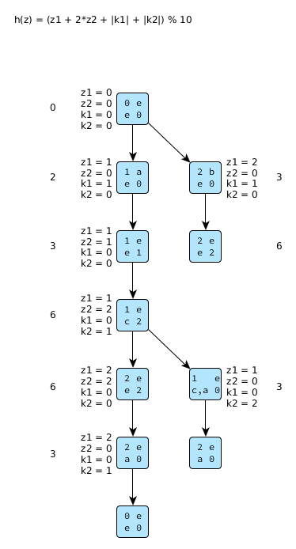

Zusatzübung 1
=============

`Zusatzaufgabenblatt 1 <../../_static/exercise/part_1/z1.pdf>`_

Folieninformationen
-------------------

Folie 7
^^^^^^^

Bei asychroner Kommunikation ist die Linie von System 1 nach 2 und umgekehrt immer durchgezogen.

Folie 9
^^^^^^^

- Grundsätzlich ist die Reihenfolge egal, es muss lediglich die Nachricht m4 vor m5 versendet werden
- m3 darf nicht ohne m4 gesendet werden

Folie 19
^^^^^^^^

- bei Google nicht nach Bit-State suchen sondern nach Supertrace-Algorithmus

Problem 1.1 Bit-State-Algorithmus
---------------------------------

+------+-----+--------------+
| h(z) | 0/1 | Kommentar    |
+======+=====+==============+
| 0    | 1   | (0, 0, e, e) |
+------+-----+--------------+
| 1    | 0   |              |
+------+-----+--------------+
| 2    | 1   | (1, 0, a, e) |
+------+-----+--------------+
| 3    | 1   | (2, 0, b, e) |
+------+-----+--------------+
| 4    | 0   |              |
+------+-----+--------------+
| 5    | 0   |              |
+------+-----+--------------+
| 6    | 1   | (2, 2, e, e) |
+------+-----+--------------+
| 7    | 0   |              |
+------+-----+--------------+
| 8    | 0   |              |
+------+-----+--------------+
| 9    | 0   |              |
+------+-----+--------------+

Problem 1.2 UML-Diagramme
-------------------------

Sequenzdiagramm
^^^^^^^^^^^^^^^

Aktivitätsdiagramm
^^^^^^^^^^^^^^^^^^

.. image:: solutions/umlet/Zusatzblatt_1_Aufgabe_1.2.interaktivitaet.png

Zustandsdiagramm
^^^^^^^^^^^^^^^^

Problem 1.3 Bit-State Details
-----------------------------

1.3.1 Vorteil- und Nachteile
^^^^^^^^^^^^^^^^^^^^^^^^^^^^

Vorteile:

- Speicherbedarfeinsparung
- Rechenzeiteinsparung

Nachteile:

- Es ist möglich, dass bestimmte Globalzustände nicht erreicht und Fehler nicht gefunden werden

1.3.2 Hashing vs. Baumorientiert
^^^^^^^^^^^^^^^^^^^^^^^^^^^^^^^^

Bei Hashingverfahren ist der Aufwand um Fehlerfälle zu finden um ein vielfaches niedriger als die Untersuchung eines kompletten Baums. Zudem ist es meist deutlich schneller als baumorientierte Verfahren.

1.3.3 *fair progress*
^^^^^^^^^^^^^^^^^^^^^

Bei asynchroner Kommunikation ist es möglich, dass bestimmte Teile des Ablaufs häufiger durchlaufen werden als andere. Es kann dazu kommen, dass ein Prozess andere Prozesse blockt. Durch fair progress soll vermieden werden, dass diese Prozesse nicht übergangen werden.

Priorisierung. hernutersetzen der Priorität von bereits genutzten Transitionen.
