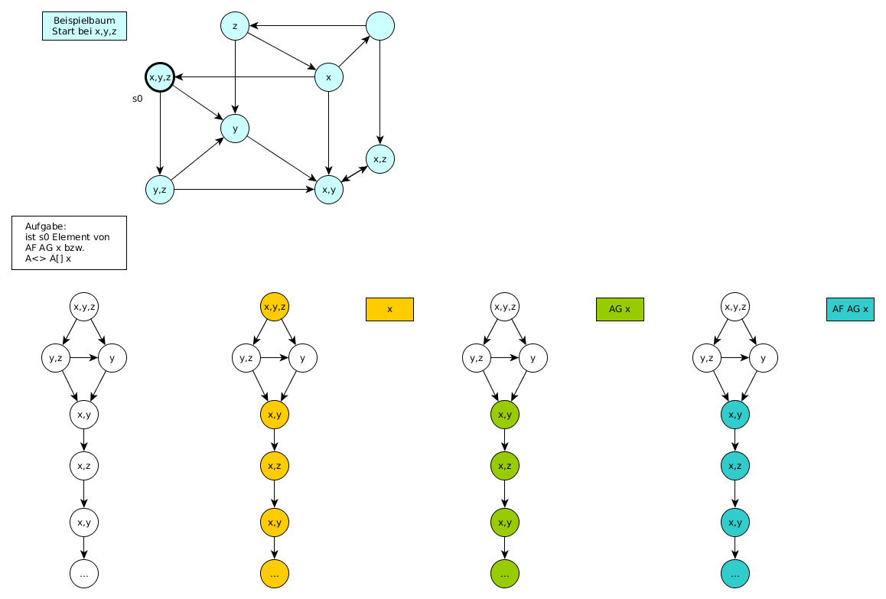

Zusatzübung 2
=============

`Zusatzaufgabenblatt 2 <../../_static/exercise/part_1/z2.pdf>`_

Problem 2.1 UPPAAL - asychrone Automatensysteme
-----------------------------------------------

Da UPPAAL nicht in der Lage ist asychrone Kommunikation über Kanäle abzubilden, beläuft sich die Idee der Lösung auf den Einsatz eines Mediums. Zusätzlich wird wird das Senden und Empfangen einer Nachricht in zwei separate Kanäle aufgeteilt - aus ``a(!|?)`` wird ``send_a(!|?)`` und ``receive_a(!|?)``.

Automat
^^^^^^^

.. image:: solutions/uppaal/zusatzblatt_2_2.1.a1.png

.. image:: solutions/uppaal/zusatzblatt_2_2.1.a2.png

.. image:: solutions/uppaal/zusatzblatt_2_2.1.medium.png

Message Sequence Chart
^^^^^^^^^^^^^^^^^^^^^^

.. image:: solutions/uppaal/zusatzblatt_2_2.1.msc.png

Alternative
^^^^^^^^^^^

Für jeden Automaten kann ein einzelnes Medium modeliert werden, dass die Nachricht(en) an den anderen Automaten als Buffer darstellt. Für den genannten Fall wäre dass ein Automat A1->A2 und ein Automat A2->A1. Optional kann in einem Zähler die Anzahl der Zeichen im Buffer speichern, um z.B. einen Überlauf erkennen zu können.

Problem 2.2 CTL
---------------

2.2.1
^^^^^^^

+--------------------------------------------------------+-----------------------------------------------------------+----------------+
| Aussage                                                | Umgangssprache                                            | trifft zu?     |
+========================================================+===========================================================+================+
| ``E[] not k`` ( :math:`\exists \square \neg k` )       | Es existiert ein Pfad in dem ``k`` nicht gilt             | X              |
+--------------------------------------------------------+-----------------------------------------------------------+----------------+
| ``A<> k`` ( :math:`\forall \lozenge k` )               | In allen Pfaden tritt irgendwann ``k`` zu                 |                |
+--------------------------------------------------------+-----------------------------------------------------------+----------------+
| ``E<> k and m`` ( :math:`\exists \lozenge k \wedge m`) | Es existiert ein Pfad in dem irgendwann k und m zutreffen | X              |
+--------------------------------------------------------+-----------------------------------------------------------+----------------+
| ``k -> k`` ( :math:`k \rightarrow k` )                 | Auf k folgt irgendwann k                                  | X (Tautologie) |
+--------------------------------------------------------+-----------------------------------------------------------+----------------+
| ``m -> not k`` ( :math:`m \rightarrow \neg k` )        | Auf m folgt nicht k                                       |                |
+--------------------------------------------------------+-----------------------------------------------------------+----------------+

2.2.2
^^^^^^^

Anmerkung: Das hier dargestellte Template liefert nicht die Ergebnisse, die sich nach händischer Überprüfung ergeben. Die Musterlösung ist als korrekt anzusehen.

Template
""""""""

Verifier
""""""""

.. image:: solutions/uppaal/zusatzblatt_2_2.2.2.verifier.png

Download: `UPPAAL Modell Zusatzaufgabe 2.2.2 <../../_static/uppaal_models/zusatzblatt_2_2.2.2.xml>`_

Musterlösung
""""""""""""

Der Baum ist unendlich tief zu betrachten. Daher ergeben sich folgende Schlüsse:

+--------------------------------------------------------+-----------------------------------------------------------+------------+
| Aussage                                                | Umgangssprache                                            | trifft zu? |
+========================================================+===========================================================+============+
| ``E[] not k`` ( :math:`\exists \square \neg k` )       | Es existiert ein Pfad in dem ``k`` nicht gilt             |            |
+--------------------------------------------------------+-----------------------------------------------------------+------------+
| ``A<> k`` ( :math:`\forall \lozenge k` )               | In allen Pfaden tritt irgendwann ``k`` zu                 | X          |
+--------------------------------------------------------+-----------------------------------------------------------+------------+
| ``E<> k and m`` ( :math:`\exists \lozenge k \wedge m`) | Es existiert ein Pfad in dem irgendwann k und m zutreffen | X          |
+--------------------------------------------------------+-----------------------------------------------------------+------------+
| ``k -> k`` ( :math:`k \rightarrow k` )                 | Auf k folgt irgendwann k                                  | X          |
+--------------------------------------------------------+-----------------------------------------------------------+------------+
| ``m -> not k`` ( :math:`m \rightarrow \neg k` )        | Auf m folgt nicht k                                       |            |
+--------------------------------------------------------+-----------------------------------------------------------+------------+

Problem 2.3 CTL in UPPAAL
-------------------------

**Es warten niemals beide Kunden zugleich auf ein Getränk**:
``A[] not (customer_1.size_chosen and customer_2.size_chosen)``

**Wenn der Vorrat eines Getränks leer ist, kann das Getränk auch nicht mehr bestellt werden**:
``A<> automaton.cola_inventory == 0 imply (not automaton.s_cola and not automaton.m_cola and not automaton.l_cola)``

**Das System ist deadlockfrei**:
Hier liegt ein rekursives Problem vor. Die Grundidee ist, dass auf jeden Zustand ein Folgezustand folgen muss. Eine Instanz muss also von einem Startzustand immer wieder in Ihrem Startzustand landen. Dieser Vorgang darf nicht unterbrochen werden. Das stellt grundsätzlich ein Problem dar, sobald irgendwann Bedingungen nicht mehr zutreffen, die vielleicht in drei Durchläufen noch zutrafen. Sobald eine Abfrage dieser Art in UPPAAL ausgeführt wird ist das System in einer Endlosrekursion gefangen.

In CTL gibt es eine generelle Abfrage, die nichts desto trotz Deadlockfreiheit garantiert:
:math:`\forall \square \exists X true` (``AG EX true``)

**UPPAAL**: ``A[] not deadlock``

*Für jeden Status der erreicht werden kann, gibt es einen Folgezustand der erreicht werden kann.*

`Deadlock-freeness (Systems and Software Verification - B.Berard) <http://link.springer.com/chapter/10.1007/978-3-662-04558-9_9#page-1>`_

**Wenn ein Kunde eine Bestellung aufgegeben hat erhält er auch ein Getränk**:
``E<> customer_1.size_chosen imply customer_1.has_drink``

Problem 2.4 CTL - verschachtelte Ausdrücke
------------------------------------------

Die Idee zur Lösung ist die geschachtelten Ausdrücke von innen nach außen (*Bottom Up strategy*) zu untersuchen. Man nimmt den kleinsten Ausdruck und untersucht den gesamten Graph/Baum danach. Für alle Fälle die zutreffen untersucht man den nächst *höheren* Ausdruck bis zur Wurzel.

Beispiel
^^^^^^^^

Auf Seite 20 des `Online Skripts zu CTL <http://www.inf.ed.ac.uk/teaching/courses/propm/papers/CTL.pdf>`_ ist ein Graph zu finden in dem geprüft werden soll ob ein Zustand Element des Ausdrucks ``AF AG x`` bzw. ``A<> A[] x`` ist.

*Umgangssprache*: Auf allen Pfaden gilt irgendwann immer x.

Zur Veranschaulichung ist ausgehend vom gewählten Knoten der Baum erstellt.

**Wichtig**: Hier soll nur ein Zustand im Hinblick auf den Baum betrachtet werden und nicht der komplette Baum zum Graphen! Für die Übungen ist der Normalfall die Prüfung des gesamten Baums!

Der Ausdruck ``A[] x`` ausgewertet auf den gesamten Baum würde ``false`` ergeben. Es ist allerdings wichtig diesen Ausdruck nur auf den Teil des Baums auszuwerten für den zuvor ``x`` geprüft wurde (daher auch *bottom up*).

2.4.1
^^^^^^^

*Umgangssprache*: Für alle Pfad gilt irgendwann, dass ein Pfad existiert in dem nicht k oder nicht m gilt.

+--------------------+--------------+-----------------------------------------------------------------+
| Ausdruck           | Substitution | Umgangssprache                                                  |
+====================+==============+=================================================================+
| ``not k or not m`` | ``p``        | Es gelten nicht k und m zusammen (``not (k and m)``)            |
+--------------------+--------------+-----------------------------------------------------------------+
| ``E<> p``          | ``q``        | Es existiert ein Pfad in dem p gilt (also nicht k oder nicht m) |
+--------------------+--------------+-----------------------------------------------------------------+
| ``A<> q``          |              | Für alle Pfade gilt irgendwann q                                |
+--------------------+--------------+-----------------------------------------------------------------+

:math:`\forall \lozenge \exists \lozenge \neg k \vee \neg m` (``A<> E<> not k or not m``)

Baum = **True**
"""""""""""""""

Graph = **True**
""""""""""""""""

.. image:: solutions/yed/Zusatzblatt_2_Aufgabe_2.4.1.Graph.png

2.4.2
^^^^^^^

*Umgangssprache*: Für einen Pfad gilt immer, dass in allen Pfaden nicht k oder nicht m gilt.

+--------------------+--------------+---------------------------------------------------------------------+
| Ausdruck           | Substitution | Umgangssprache                                                      |
+====================+==============+=====================================================================+
| ``not k or not m`` | ``p``        | Es gelten nicht k und m zusammen (``not (k and m)``)                |
+--------------------+--------------+---------------------------------------------------------------------+
| ``A<> p``          | ``q``        | Auf allen Pfaden existiert irgendwann p (also nicht k oder nicht m) |
+--------------------+--------------+---------------------------------------------------------------------+
| ``E[] q``          |              | Für mindestens einen Pfad gilt immer q                              |
+--------------------+--------------+---------------------------------------------------------------------+

:math:`\exists \square \forall \lozenge \neg k \vee \neg m` (``E[] A<> not k or not m``)

Baum = **True**
"""""""""""""""

Graph = **False**
"""""""""""""""""

2.4.3
^^^^^^^

*Umgangssprache*: Für alle Pfade gilt immer, dass in einem Pfad nicht k oder nicht m gilt.

+--------------------+--------------+-----------------------------------------------------------------+
| Ausdruck           | Substitution | Umgangssprache                                                  |
+====================+==============+=================================================================+
| ``not k or not m`` | ``p``        | Es gelten nicht k und m zusammen (``not (k and m)``)            |
+--------------------+--------------+-----------------------------------------------------------------+
| ``E<> p``          | ``q``        | Es existiert ein Pfad in dem p gilt (also nicht k oder nicht m) |
+--------------------+--------------+-----------------------------------------------------------------+
| ``A[] q``          |              | Für alle Pfade und alle Knoten gilt immer q                     |
+--------------------+--------------+-----------------------------------------------------------------+

:math:`\forall \square \exists \lozenge \neg k \vee \neg m` (``A[] E<> not k or not m``)

Baum = **False**
""""""""""""""""

.. image:: solutions/yed/Zusatzblatt_2_Aufgabe_2.4.3.png

Graph = **False**
"""""""""""""""""

Aufgabe Lampe
-------------

Zu erstellen sind eine Lampe mit variabler Lichtstärke und ein Nutzer der die Lampe per Touch bedienen kann. Die mögliche Lichtstärke der Lampe ist 0 für ausgeschaltet und 10 als Maximaleinstellung. Wenn der Nutzer schnell auf die Lampe drückt (timer < 1), soll die Lichtstärke solange erhöht werden bis die maximale Lichtstärke erreicht wurde. Sollte weiterhin schnell auf die Lampe gedrückt werden passiert nichts und die Lampe bleibt auf voller Stärke. Wenn der Nutzer einmal nicht schnell auf die Lampe gedrückt hat soll die Lichtstärke bei jeder Berührung wieder herunter geregelt werden bis die Lampe aus ist. Eine erneute Verstärkung der Intensität während der Verminderung ist nicht vorgesehen.

Lösung
^^^^^^

Download: `Erweiterte Lampe <../../_static/uppaal_models/lamp.xml>`_
