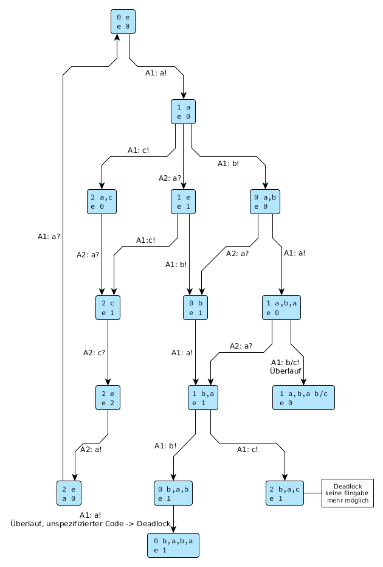

Übungsblatt 1
=============

Problem 1.1 Mealey-Automaten
----------------------------

1.1.1
^^^^^

Antwort: 2012

1.1.2
^^^^^

a) Ja: JAAA
b) Nein: Die Eingabe zwei aufeinander folgender Einsen ist nicht möglich

1.1.3
^^^^^

.. image:: solutions/yed/Blatt_1_Aufgabe_1.1.3.png

Problem 1.2 Gekoppelte Systeme
------------------------------

1.2.1
^^^^^

Wenn der Eingabepuffer des Systems größer eins ist kann eine Eingabe von zwei
mal a erfolgen. Alternativ kann eine Synchronisation nach der ersten Eingabe
erfolgen wodurch unterschiedliche Zustandsfolgen erreicht werden.

1.2.2
^^^^^

Nach Eingabe der Zeichenfolge a,b,a,b befindet sich Automat A2 im Zustand 2 und kann nur noch durch die Eingabe von b wieder in den Zustand 0 überführt werden. Hier tritt ein unerwarteter Empfang auf, da A2 im Zustand 2 ein empfangenes b nicht verarbeiten kann.

1.2.3
^^^^^

Sobald A1 versucht das zweite ``b`` zu senden könnte A2 den Empfang nicht verarbeiten, es tritt also ein Deadlock auf.

1.3.1
^^^^^

1.3.2
^^^^^

.. image:: solutions/yed/Blatt_1_Aufgabe_1.3.2.png
