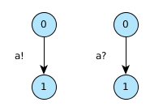
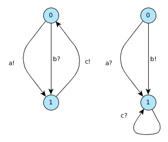
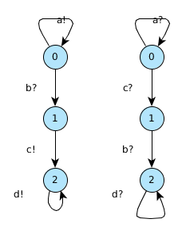
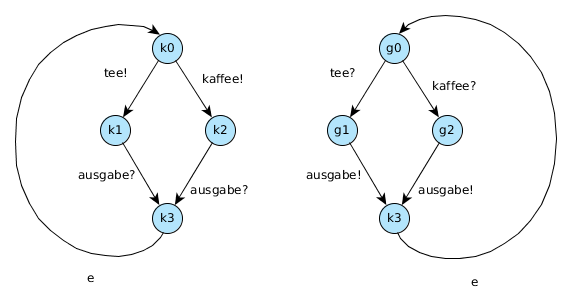

Übungsblatt 2
=============

Problem 2.1 Fehlerklassen
-------------------------

2.1.1 Deadlock
^^^^^^^^^^^^^^

2.1.2 Nicht spezifizierter Empfang
^^^^^^^^^^^^^^^^^^^^^^^^^^^^^^^^^^

2.1.3 Pufferüberlauf
^^^^^^^^^^^^^^^^^^^^

.. image:: solutions/yed/Blatt_2_Aufgabe_2.1.3.png

2.1.4 Toter Code
^^^^^^^^^^^^^^^^

Problem 2.2 Automatenentwurf
----------------------------

Übungsblatt 2 Zusatz
====================

Erstellen Sie ein synchron gekoppeltes System aus zwei Automaten. Der erste ist der Getränkeautomat, der zweite der Kunde.

Der Kunde hat folgende Wahlmöglichkeiten:

Cola, Fanta, Sprite, diese 3 Sorten jeweils in groß, mittel und klein.

Getränkeauswahl, bezahlen sowie Getränk entnehmen sollen durch Nachrichten dargestellt werden.

Während das Getränk im Automaten zubereitet wird soll gespeichert werden (z.B. über boolean- oder int-Variablen) welches Getränk zubereitet wird. Dieser Wert soll erst beim Entnehmen wieder auf 0 gesetzt werden.
