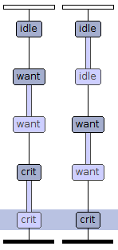

Übungsblatt 3
=============

Notizen
-------

Die Anzahl der möglichen Globalzustände beträgt:

Anzahl Zustände der Automaten \* Anzahl der möglichen Variablenbelegungen

Bsp:

Problem 3.1 UPPAAL: wechselseitiger Ausschluss
----------------------------------------------

3.1.1 UPPAAL Konstruktion
^^^^^^^^^^^^^^^^^^^^^^^^^

Declarations:

 .. code-block:: c

     int turn = 0;

Template:

System declarations:

.. code-block:: c

    // Place template instantiations here.
    worker_1 = Mutex(1);
    worker_2 = Mutex(2);
    // List one or more processes to be composed into a system.
    system worker_1, worker_2;

3.1.2 Message Sequence Chart
^^^^^^^^^^^^^^^^^^^^^^^^^^^^

Message Sequence Chart:

Als UML Sequenzdiagramm:

.. image:: solutions/umlet/Blatt_3_Aufgabe_3.1.2.png

3.1.3 Anzahl möglicher Globalzustände
^^^^^^^^^^^^^^^^^^^^^^^^^^^^^^^^^^^^^

Die Zustände der Automaten bilden sich aus:

- Z1 = {idle, want, crit}
- Z2 = {idle, want, crit}

Die Anzahl der Übergänge beträgt drei, da ``turn`` drei unterschiedliche Werte erhalten kann.

Somit bildet sich der Globalzustand aus:

G Teilmenge aus Z1 x Z2 x A1 x A2. Die Anzahl der möglichen Globalzustände ist somit 27.

Problem 3.2 Automatenentwurf
----------------------------

3.2.1 - 3.2.3 UPPAAL Konstruktion
^^^^^^^^^^^^^^^^^^^^^^^^^^^^^^^^^

Global Declarations:

.. code-block:: c

    chan coffee,tea,cola,fanta;
    chan small,medium,large;
    chan pay,take_drink;

Automaton Declarations:

.. code-block:: c

    int cola_inventory = 2;
    int fanta_inventory = 2;
    int small_tea,medium_tea,large_tea;
    int small_coffee,medium_coffee,large_coffee;
    int small_fanta,medium_fanta,large_fanta;
    int small_cola,medium_cola,large_cola;

System declarations:

.. code-block:: c

    customer_1 = Customer();
    customer_2 = Customer();
    automaton = Automaton();
    // List one or more processes to be composed into a system.
    system customer_1,customer_2,automaton;

Template *Customer*:

Template *Automaton*:

.. image:: solutions/uppaal/blatt_3.2.1.automaton.png

Download: `Getränkeautomat 3.2 <../../_static/uppaal_models/blatt_3.2.xml>`_

3.2.4 Anzahl der Zustände
^^^^^^^^^^^^^^^^^^^^^^^^^

- Anzahl Zustände Kunde: 4
- Anzahl Zustände Automat: 19
- Anzahl Übergänge Kunde: 9
- Anzahl Übergänge Automat: 30

Anzahl der Gesamtzustände: 4 \* 19 \* 9 \* 30 = 20520

