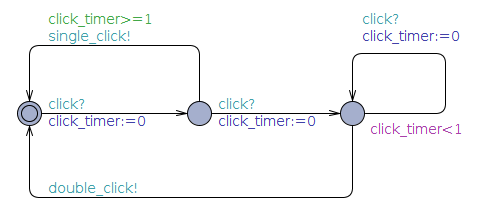

Übungsblatt 4
=============

Problem 4.1 UPPAAL: Mausklickerkennung
--------------------------------------

Benutzer
^^^^^^^^

.. image:: solutions/uppaal/blatt_4.1.user.png

Maus
^^^^

Lösung mit Hilfe von Guards.

.. image:: solutions/uppaal/blatt_4.1.mouse_guards.png

Lösung über die Verwendung einer Invariante.

Observer
^^^^^^^^

Eine Verwendung von drei Zuständen ist nur dann notwendig, wenn ein Zustand einen Klick repräsentiert. Ansonsten kann der Zähler auch ausschließlich über zwei Zustände erfolgen.

.. image:: solutions/uppaal/blatt_4.1.click_observer.png
