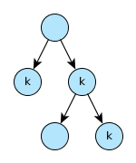
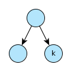
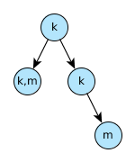
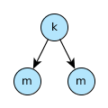
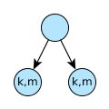
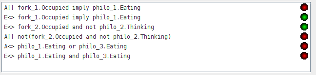

Übungsblatt 5
=============

`Aufgabenblatt 5 <../../_static/exercise/part_1/b5.pdf>`_

Problem 5.1 Bäume mit CTL unterscheiden
---------------------------------------

5.1.1
^^^^^

Abfrage: Es exististert ein Pfad in dem immer ``k`` zutrifft.

Formel: :math:`\exists \square k` eq. ``E [] k``

Alternative Abfrage: Für alle Pfade gilt k oder m.

Formel: :math:`\forall \square k \vee m` eq. ``A [] k v m``

5.1.2
^^^^^

Abfrage: Es exististert ein Pfad in dem ``m`` zutrifft.

Formel: :math:`\exists \lozenge m` eq. ``E <> m``

5.1.3
^^^^^

Abfrage: Es exististert ein Pfad in dem immer ``k`` zutrifft.

Formel: :math:`\exists \square k` eq. ``E [] k``

5.1.4
^^^^^

Abfrage: Es exististert ein Pfad in dem aus :math:`m \wedge \neg k`, :math:`k \wedge \neg m` folgt.

Formel: :math:`\exists \lozenge m \wedge \neg k \rightarrow k \wedge \neg m` eq. ``E <> m and not k -> k and not m``

5.1.5
^^^^^

Abfrage: Es existiert ein Pfad in dem aus :math:`k \wedge m`, :math:`k \wedge m` folgt.

Formel: :math:`\exists \lozenge k \wedge m \rightarrow k \wedge m` eq. ``E <> k and m -> k and m``

5.1.6
^^^^^

Abfrage: Es existiert ein Pfad in dem aus :math:`k \wedge m`, :math:`m \wedge \neg k` folgt.

Formel: :math:`\exists \lozenge k \wedge m \rightarrow m \wedge \neg k` eq. ``E <> k and m -> m and not k``

Problem 5.2 CTL und Umgangssprache
----------------------------------

5.2.1.1
^^^^^^^

Die umgangssprachliche Form entspricht nicht der Formel. Die Formel :math:`\forall \lozenge k` entspricht der Aussage "*Für alle Pfade wird irgendwann k auftreten*".

Ein Equivalent der Umgangssprache ist: :math:`\exists \lozenge k`

5.2.1.2
^^^^^^^

*Möglicherweise* ist eine Tautologie und kann in UPPAAL nicht sinnvoll dargestellt werden. Demnach ist die Aussage immer wahr. Ein dazugehöriger Baum kann beliebiger Form sein. Die Formel entspricht der Aussage "*Es existiert ein Pfad in dem immer k oder m gilt*".

5.2.1.3
^^^^^^^

Die umgangssprachliche Form entspricht nicht der Formel. Die Formel :math:`k \rightarrow m` entspricht der Aussage "*Für alle Pfade tritt k auf irgendwann gefolgt von einem m*".

Ein Equivalent der Umgangssprache ist: :math:`k \wedge m`

5.2.2
^^^^^

Folgende Lösungen sind über den UPPAAL Verifier realisiert worden. Die Details sind in den einzelnen Unterabschnitten näher erläutert.

Download: `UPPAAL Modell Philosophen <../../_static/uppaal_models/philosophers.xml>`_

5.2.2.1
"""""""

Die Formel impliziert, dass Philosoph 1 auf jeden Fall irgendwann essen wird, entspricht also nicht der Aussage. Die Aussage entspricht der Formel :math:`E \lozenge fork_1.Occupied \rightarrow philo_1.Eating` (``E <> fork_1.Occupied -> philo_1.Eating``)

5.2.2.2
"""""""

Die Formel sagt aus, dass ein Pfad existiert in dem Gabel 2 belegt ist und Philosoph 2 nicht denkt. Die Aussage bezieht sich nicht auf einen bestimmten Pfad, sondern ist eine generelle Aussage. Die Formel dazu ist :math:`A \square \neg (fork_2.Occupied \wedge \neg philo_2.Thinking)` (``A [] not (fork_2.Occupied and not philo_2.Thinking)``)

5.2.2.3
"""""""

Die Formel sagt aus, dass in allen Pfaden Philosoph 1 oder 3 isst. Die Aussage widerum bezieht sich nur auf eine Möglichkeit, dass Philosoph 1 und 3 gleichzeitig essen können. Die Formel dazu ist :math:`\exists \lozenge philo_1.Eating \wedge philo_3.Eating` (``E <> philo_1.Eating and philo_3.Eating``)
