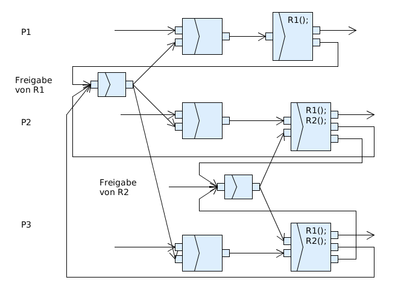

Zusatzübungsblatt 1
===================

`Zusatzaufgabenblatt 1 <../_static/exercise/Zusatzübung 1 SS2016.pdf>`_

Problem 1 Determinismus & Indeterminismus
-----------------------------------------

Bei beiden Diagrammen wurde auf die Prüfung des Wetters verzichtet, da dies nicht relevant für die eigentliche Fragestellung ist. Der indeterministische Teil ist die Ermittlung der Wetterdaten.

*Indeterministische Lösung*:

.. image:: solutions/umlet/additional_exercise_1.1.indeterministic.png

*Deterministische Lösung*:

.. image:: solutions/umlet/additional_exercise_1.1.deterministic.png

Problem 2 Exklusive Ressourcen
------------------------------

Problem 3 Beliebige Ressourcen
------------------------------

Problem 4 Sequentiell vs. Nebenläufig
-------------------------------------

1.4.1
^^^^^

*Sequentiell*:

.. image:: solutions/umlet/additional_exercise_1.4.1.png

1.4.2
^^^^^

*Nebenläufig*:

.. image:: solutions/umlet/additional_exercise_1.4.2.png

1.4.3
^^^^^

*Nebenläufig*:

