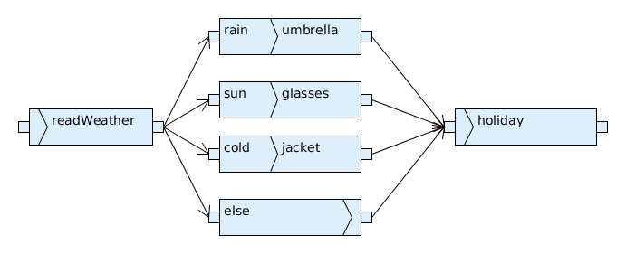
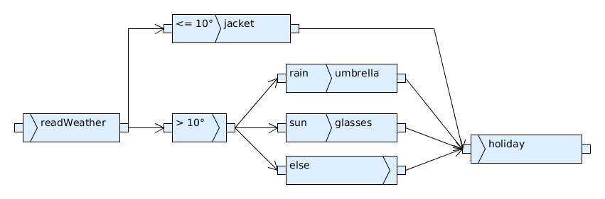

Zusatzübungsblatt 1
===================

`Zusatzaufgabenblatt 1 <../_static/exercise/Zusatzübung 1 SS2016.pdf>`_

Problem 1 Determinismus & Indeterminismus
-----------------------------------------

Bei beiden Diagrammen wurde auf die Prüfung des Wetters verzichtet, da dies nicht relevant für die eigentliche Fragestellung ist. Der indeterministische Teil ist die Ermittlung der Wetterdaten.

*Indeterministische Lösung*:

*Deterministische Lösung*:

Problem 2 Exklusive Ressourcen
------------------------------

