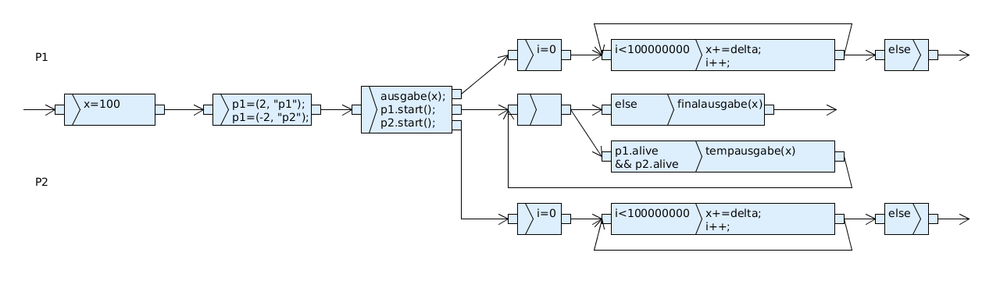

Zusatzübungsblatt 2
===================

`Zusatzaufgabenblatt 2 <../../_static/exercise/part_2/Zusatzuebung_2_SS2016.pdf>`_

Problem 1
---------

Das Programm erzeugt solange die Prozesse 1 und 2 aktiv sind Ausgaben von der gemeinsam genutzten Variable ``x``. Wenn beide Threads beendet sind wird der finale Wert von ``x`` ausgegeben. Der finale Wert von ``x`` ist nicht wie anzunehmen der Startwert, da die Operation ``main.x += delta;`` keine atomare Operation ist.

.. literalinclude:: ../../_static/src/concurrency/src/main/java/ude/masteraise/concurrency/part2/extrasheet2/ExtraExercise2_1.java
   :language: Java

Damit der Ausgangswert erreicht wird muss entweder die genannte Anweidung synchronisiert werden, oder es wird auf einer Resource gearbeitet, die ansich synchron ist wie z.B. ``AtomicInteger``.

.. code-block:: Java

    public static void main(String[] args) {

        run_original_exercise();
        // run_original_exercise_synchronized();
        // run_exercise_on_atomic();
    }

Problem 2 Produzent und Konsument
---------------------------------

Zusätzlicher Code im ``Producer``
^^^^^^^^^^^^^^^^^^^^^^^^^^^^^^^^^

.. code-block:: Java

    synchronized (warehouse) {
        if (!warehouse.isFull()) {
            warehouse.produce();
            ThreadUtils.sout(this, "produced", "goods", warehouse.goodsCount);
        }
    }

Zusätzlicher Code im ``Consumer``
^^^^^^^^^^^^^^^^^^^^^^^^^^^^^^^^^

.. code-block:: Java

    synchronized (warehouse) {
            if (warehouse.hasGoods()) {
                warehouse.remove();
                ThreadUtils.sout(this, "consumed", "goods", warehouse.goodsCount);
        }
    }

Zusätzlicher Code im ``Warehouse``
^^^^^^^^^^^^^^^^^^^^^^^^^^^^^^^^^^

.. code-block:: Java

    void produce() {
        goodsCount++;
    }

    void remove() {
        goodsCount--;
    }

    boolean hasGoods() { return goodsCount > 0; }

    boolean isFull() { return goodsCount >= maxGoodsCount; }

Implementierung (``ExtraExercise2_2.java``)
^^^^^^^^^^^^^^^^^^^^^^^^^^^^^^^^^^^^^^^^^^^

.. literalinclude:: ../../_static/src/concurrency/src/main/java/ude/masteraise/concurrency/part2/extrasheet2/ExtraExercise2_2.java
   :language: Java

Problem 3 Analyse einer Synchronisation
---------------------------------------

Ablauf
^^^^^^

1. ``p1`` schläft für 100ms
2. ``p2`` schläft für 200ms
3. ``p4`` schläft für 400ms
4. ``monitor.in`` wird von ``p1`` ausgeführt (``p.x != 2``)
5. ``p1`` schläft für 200ms
6. ``monitor.in`` wird von ``p2`` ausgeführt (``p.x == 2``)
7. ``monitor.wait``
8. ``p2`` schläft für 200ms
9. ``monitor.out`` wird von ``p1`` ausgeführt (nach ca 300ms Schlaf)
10. ``monitor.in`` wird von ``p4`` ausgeführt (``p.x != 2``)

Implementierung (``ExtraExercise2_3.java``)
^^^^^^^^^^^^^^^^^^^^^^^^^^^^^^^^^^^^^^^^^^^

.. literalinclude:: ../../_static/src/concurrency/src/main/java/ude/masteraise/concurrency/part2/extrasheet2/ExtraExercise2_3.java
   :language: Java
