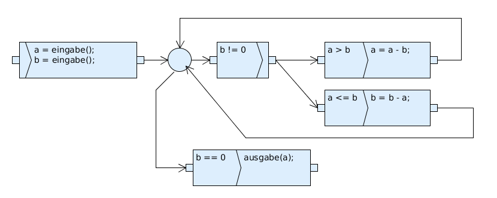
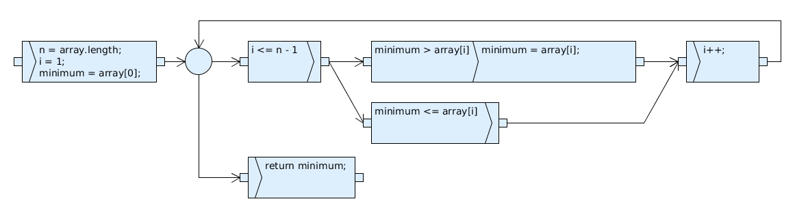
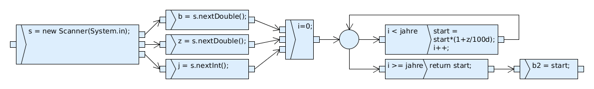

Übungsblatt 1
=============

`Aufgabenblatt 1 <../../_static/exercise/part_2/Uebungsblatt_01_SS2016.pdf>`_

Aufgabe 1.1 Ablaufmodelle
-------------------------

1.1.1
^^^^^

a) Ein Ablaufmodell dient zur graphischen Darstellung eines Programmcodes
b) Es besteht aus den Elementen

     1. Aktionen
     2. Aktions-Anfängen
     3. Aktions-Ende
     4. Kanten

Aufgabe 1.2 Boxenstop
---------------------

1.2.1
^^^^^

1. Auf Grund der Nebenläufigkeit nach ``Aufbocken`` und ``Material bereitlegen`` ist jede beliebigen Kombination möglich
2. ``Anhalten`` besitzt zu ``Tanken`` und ``Aufbocken`` separate Aktionsenden, daher sind sie nebenläufig
3. ``Losfahren`` kann erst nach ``Abbocken`` erfolgen, was widerum das Wechseln aller vier Räder voraussetzt, daher werden in jedem Fall alle Räder gewechselt
4. ``Visier putzen`` ist die einzige optionale Aktion
5. Reihenfolgen:

     a) Möglich
     b) Nicht möglich: Die Aktion ``Rad 3 abmontieren`` muss vor ``Neues Rad 3 montieren`` erfolgen
     c) Nicht möglich: Die Aktion ``Losfahren`` kann erst erfolgen nach dem ``Tanken`` durchgeführt ist

Aufgabe 2.1 Euklidischer Algorithmus
------------------------------------

Aufgabe 2.2
-----------

Aufgabe 3
---------

