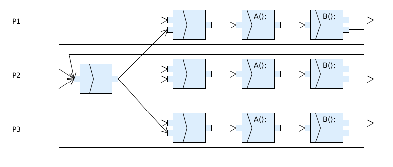
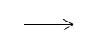

Übungsblatt 2
=============

`Aufgabenblatt 2 <../../_static/exercise/part_2/Uebungsblatt_02_SS2016.pdf>`_

Aufgabe 2.1.1
-------------

1. A vor B, B vor C, B neb D, D vor E, E vor G, E alt F, F seq G, F neb C, C vor G.
2. Die Aktionen B und D dürfen nicht gleichzeitig Ausgeführt werden.

.. image:: solutions/umlet/exercise_2.1.1.png

Aufgabe 2.1.2 gegenseitiges Warten
----------------------------------

Aufgabe 2.1.3 gegenseitiges Warten mit Timeout
----------------------------------------------

Aufgabe 2.2 Konflikte
---------------------

+---+----+------------+------------+------------+
|   | A  | B          | C          | D          |
+===+====+============+============+============+
| A | \- | LK a und b | DA a,      | DA a und c |
|   |    | DA c       | SK c       |            |
+---+----+------------+------------+------------+
| B |    | \-         | DA a und c | DA a,      |
|   |    |            |            | LK c       |
+---+----+------------+------------+------------+
| C |    |            | \-         | DA c,      |
|   |    |            |            | SK a       |
+---+----+------------+------------+------------+
| D |    |            |            | \-         |
+---+----+------------+------------+------------+

Aufgabe 2.3 Eisenbahn
---------------------

Definition:

- ZugA, ZugB
- G1, G2, G3
- ZugA && G3 -> ZugB wartet
- ZugA && G1 -> ZugB darf auf G2 und G3
    - ZugB wartet bis G1 frei bei Bedarf
