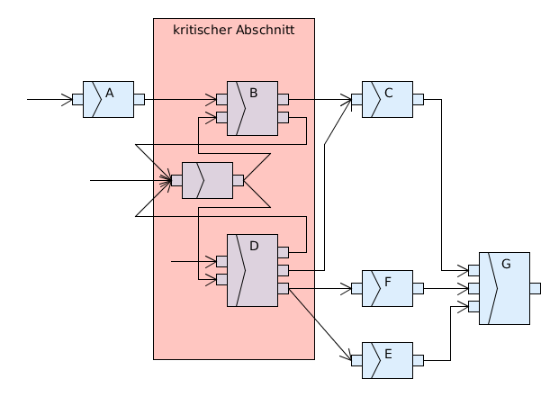
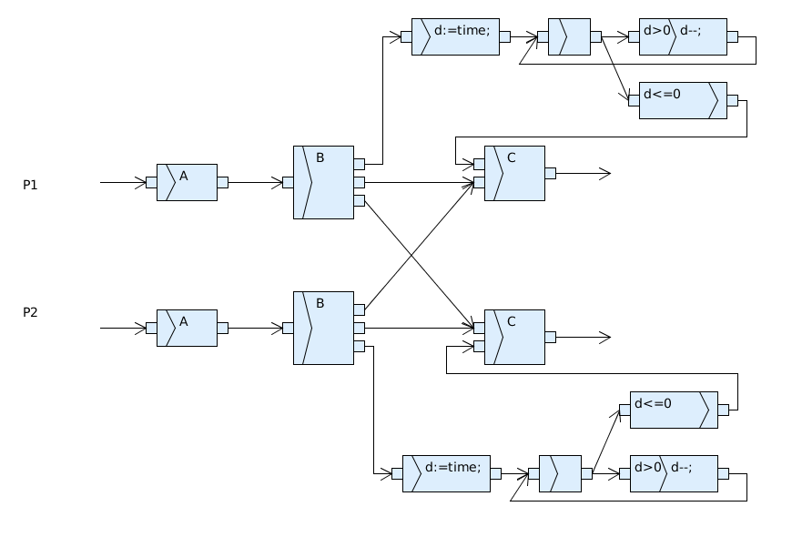

Übungsblatt 2
=============

Aufgabe 2.1.1
-------------

1. A vor B, B vor C, B neb D, D vor E, E vor G, E alt F, F seq G, F neb C, C vor G.
2. Die Aktionen B und D dürfen nicht gleichzeitig Ausgeführt werden.

Aufgabe 2.1.2 gegenseitiges Warten
----------------------------------

.. image:: solutions/umlet/exercise_2.1.2.png

In der Aufgabenstellung ist gemeint, dass die Prozesse zwischen Aktion A und Aktion B aufeinander warten sollen. Auf Grund dessen ergibt sich die folgende Musterlösung.

Aufgabe 2.1.3 gegenseitiges Warten mit Timeout
----------------------------------------------

In der Musterlösung nutzen beide Prozesse **eine** gemeinsame Uhr.

Aufgabe 2.2 Konflikte
---------------------

+---+----+------------+------------+------------+
|   | A  | B          | C          | D          |
+===+====+============+============+============+
| A | \- | LK a und b | LK a,      | DA a und c |
|   |    | DA c       | DA a       |            |
|   |    |            | SK c       |            |
+---+----+------------+------------+------------+
| B |    | \-         | LK a       | DA a,      |
|   |    |            | DA a und c | LK c       |
+---+----+------------+------------+------------+
| C |    |            | \-         | LK a,      |
|   |    |            |            | DA c,      |
|   |    |            |            | SK a       |
+---+----+------------+------------+------------+
| D |    |            |            | \-         |
+---+----+------------+------------+------------+

Aufgabe 2.3 Eisenbahn
---------------------

Definition:

- ZugA, ZugB
- G1, G2, G3
- ZugA && G3 -> ZugB wartet
- ZugA && G1 -> ZugB darf auf G2 und G3
    - ZugB wartet bis G1 frei bei Bedarf

In der Lösung ist beim Ausfahren der Zugriff auf das Gleis nicht beachtet. Hier müssten dieselben Regeln zum Tragen kommen wie beim einfahren. Das System ist nicht deadlockfrei!

In der Musterlösung kann Zug A auch auf Gleis 2 einfahren. Es ist als simpler gegenseitiger Ausschluss umgesetzt. Wenn ein Zug auf ein Gleis einfahren möchte in denen sich eine Kreuzung ergibt werden die jeweiligen Gleise als Resource benötigt. Es wird auf das Einfahren und Ausfahren verzichtet.
Die Lösung ist so implementiert, dass die einfachste Möglichkeit aufgezeichnet ist und die komplexeren jeweils ergänzt werden.
