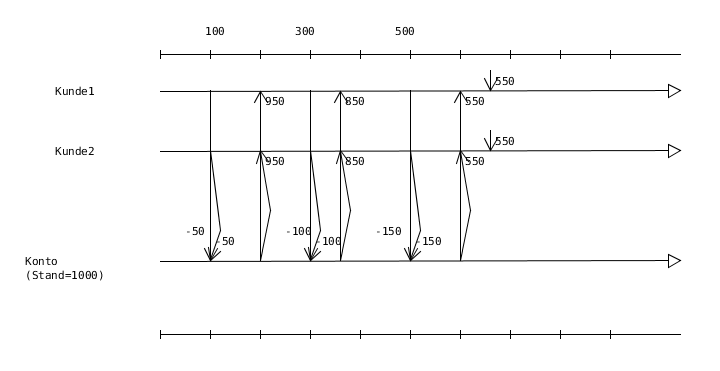
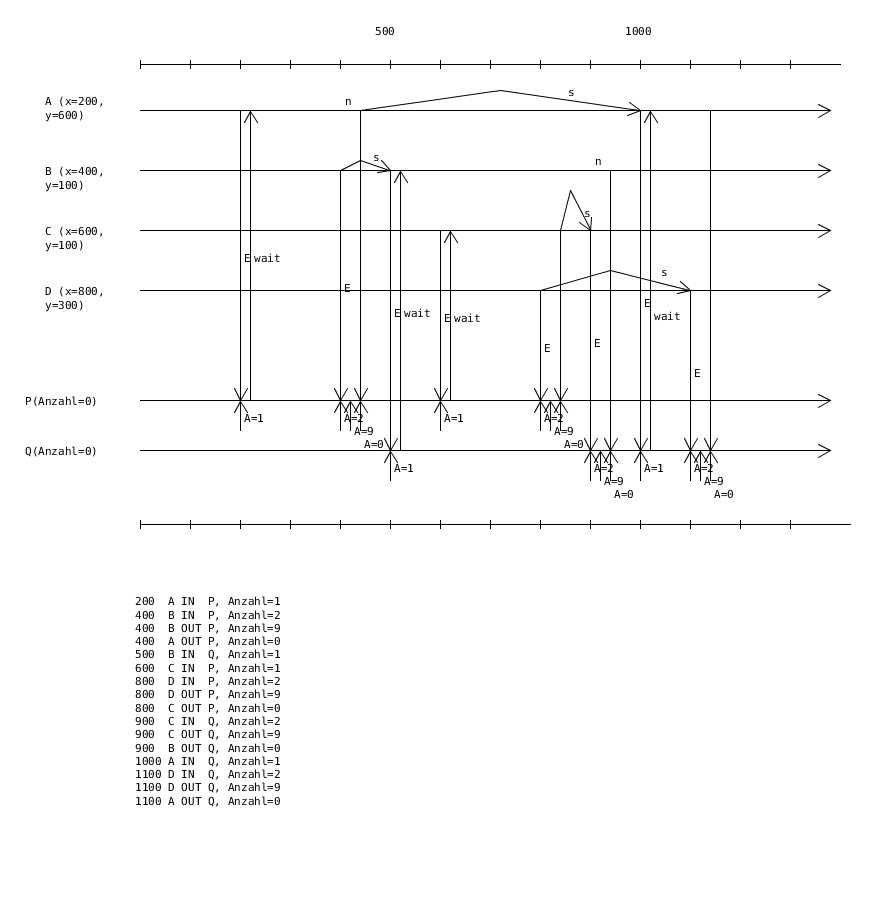

Übungsblatt 4
=============

Der Quellcode zu den Lösungen ist in kompletter Form unter `Github - Concurrency - Sheet 4 <https://github.com/captain-proton/aise/tree/master/concurrency/src/main/java/ude/masteraise/concurrency/part2/sheet4>`_  einzusehen.

Aufgabe 4.1
-----------

Teil a
^^^^^^

.. literalinclude:: ../../_static/src/concurrency/src/main/java/ude/masteraise/concurrency/part2/sheet4/Exercise4_1a.java
   :language: Java

Teil b
^^^^^^

Zum Programm soll ein Zeitdiagramm erstellt werden. Wie stellt man eine Synchronisation in einem Zeitdiagramm dar?

.. literalinclude:: ../../_static/src/concurrency/src/main/java/ude/masteraise/concurrency/part2/sheet4/Exercise4_1b.java
   :language: Java

Aufgabe 4.2
-----------

Teil a
^^^^^^

.. literalinclude:: ../../_static/src/concurrency/src/main/java/ude/masteraise/concurrency/part2/sheet4/Exercise4_2.java
   :language: Java

Teil b
^^^^^^

Es soll ein Programm erstellt werden in dem der Reader erst lesen darf, wenn der Writer Objekte in den Stack geschrieben hat. Bei der Verwendung der Klasse ``Stack`` wird eine ``EmptyStackException`` geworfen sobald dieser leer ist und versucht wird daraus zu lesen. Wo ist der Unterschied zu Teilaufgabe a?

Aufgabe 4.3
-----------

Wichtig zu markieren sind die Zeitpunkte an denen ein Thread sich auf Grund von ``wait`` schlafen legt und später mittels ``notify`` wieder geweckt wird.

Aufgabe 4.4
-----------

.. literalinclude:: ../../_static/src/concurrency/src/main/java/ude/masteraise/concurrency/part2/sheet4/Exercise4_4.java
   :language: Java
