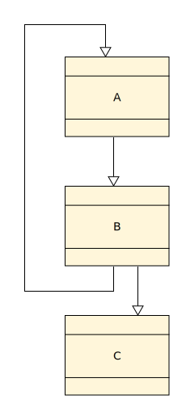
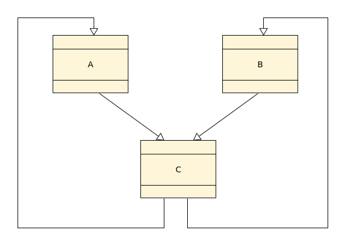
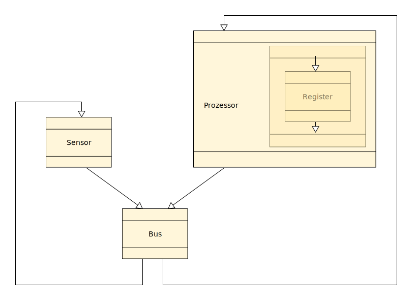
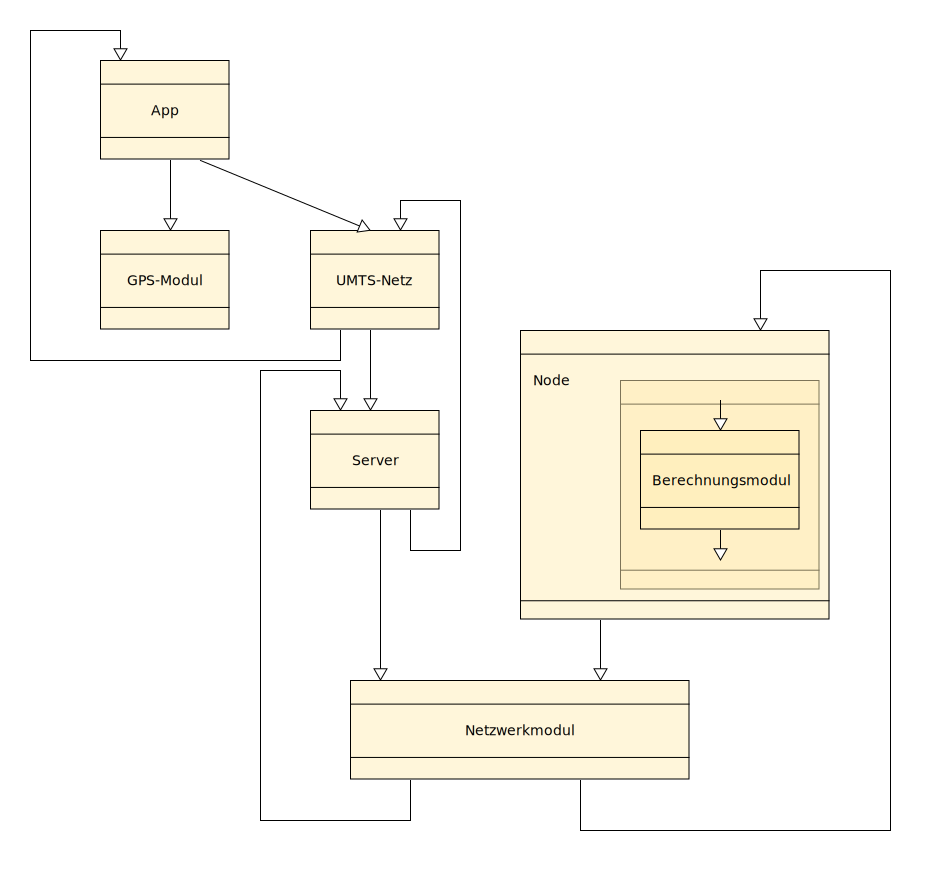

Übungsblatt 1 - Komponenten
===========================

Aufgabe 1 - Konzepte
--------------------

+----+---------------------------------------+-----------+-------------------------------------------------------------------------------+
| #  | Konzept                               | Implizit? | Umsetzung in Java                                                             |
+====+=======================================+===========+===============================================================================+
| 1  | Komposition                           | -         | Referenz auf eine andere Klasse                                               |
+----+---------------------------------------+-----------+-------------------------------------------------------------------------------+
| 2  | Klassen und Objekte                   | X         | ``class Person`` bzw. ``new Person()``                                        |
+----+---------------------------------------+-----------+-------------------------------------------------------------------------------+
| 3  | Operation                             | X         | Jede Art von Methode                                                          |
+----+---------------------------------------+-----------+-------------------------------------------------------------------------------+
| 4  | Attribute                             | X         | Instanzvariablen in Klassen                                                   |
+----+---------------------------------------+-----------+-------------------------------------------------------------------------------+
| 5  | Gleichheit/Identität                  | X         | Vergleich mittels ``==``-Operator                                             |
+----+---------------------------------------+-----------+-------------------------------------------------------------------------------+
| 6  | In-Parameter einer Operation          | X         | Übergabeparameter                                                             |
+----+---------------------------------------+-----------+-------------------------------------------------------------------------------+
| 7  | Out-Parameter einer Operation         | X         | Rückgabeparameter                                                             |
+----+---------------------------------------+-----------+-------------------------------------------------------------------------------+
| 8  | Inout-Parameter einer Operation       | -         | Keine direkte Umsetzung, Objekte als Übergabeparameter können geändert werden |
+----+---------------------------------------+-----------+-------------------------------------------------------------------------------+
| 9  | Typ des Rückgabewerts einer Operation | X         | ``<T> T getObject()...``                                                      |
+----+---------------------------------------+-----------+-------------------------------------------------------------------------------+
| 10 | Schnittstelle                         | X         | ``interface``                                                                 |
+----+---------------------------------------+-----------+-------------------------------------------------------------------------------+
| 11 | Komponente                            | -         | Abstrakte Umsetzung möglich                                                   |
+----+---------------------------------------+-----------+-------------------------------------------------------------------------------+

Beispiel zu *1*:

.. code-block:: Java

    public class Job {
        private String role;
        private long salary;
        private int id;

        ....
    }

    public class Person {

        private Job job;
        ...
    }

Aufgabe 2
---------

Teilaufgabe 2.1
^^^^^^^^^^^^^^^

Kapselung in Java wird durch die drei Schlüsselwörter ``public``, ``protected``, ``private`` und ohne Schlüsselwort als ``package private`` ermöglicht.

Teilaufgabe 2.2
^^^^^^^^^^^^^^^

a) ``public double getMedian(List<Double> values)``, Rückgabe ``double``, Eingabe ``List<Double>``
b) ``public Integer(int value) { ... }``, Verwendung durch den Konstruktor
c) ``java -Dparam value``, beim Start des Programms

Teilaufgabe 3
^^^^^^^^^^^^^

Eine Komponente kann aus mehreren Klassen bestehen. Klassen bilden die niedrigste Stufe der Hierarchie. Eine Komponente verwendet zur Lösung eines Problems eine oder mehrere Klassen. Innerhalb eines Pakets werden eine oder mehrere Komponenten zusammengestellt, je nach Sinnhaftigkeit. Ein oder mehrere Komponenten können durch das Deployment in Form von Archiven zur Verfügung gestellt werden.

Aufgabe 3
---------

Teilaufgabe 1
^^^^^^^^^^^^^

Teilaufgabe 2
^^^^^^^^^^^^^

Teilaufgabe 3
^^^^^^^^^^^^^

Teilaufgabe 4
^^^^^^^^^^^^^

