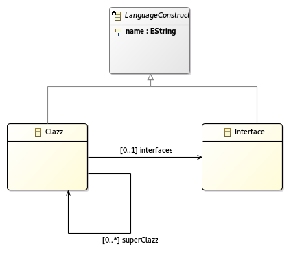
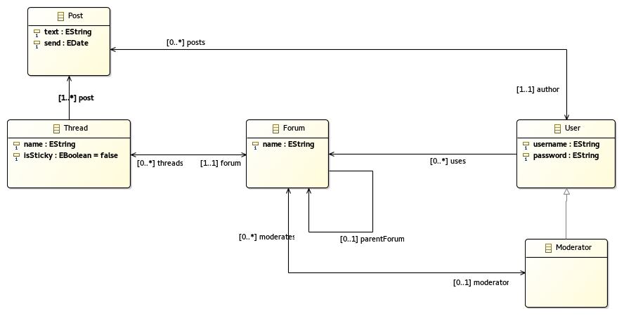

Übungsblatt 2 – Sichten und Modelle
===================================

Aufgabe 1: Theorie
------------------

Teilaufgabe 1.1
^^^^^^^^^^^^^^^

Eine Sicht kann mehrere Ausprägungen haben. Z.B. die Gesamtstruktur auf oberster Ebene. Durch Einsatz unterschiedlicher Sprachen und Werkzeuge wie z.B. UML kann diese Sicht erstellt werden. Eine Sicht kann aber auch den Ablauf einer bestimmten Funktion innerhalb des Systems darstellen.

- Abstraktion von Details
- Dokumentation des Systems

    + Entwickler
    + (neue) Anwender

Teilaufgabe 1.2
^^^^^^^^^^^^^^^

Viele der Darstellungen können durch UML-Diagramme dargestellt werden. Siehe hierzu `uml-diagrams.org <http://www.uml-diagrams.org>`_.

+--------------------------------+--------------------------------------------------------------------------------------------------+
| Darstellung                    | Modelltyp                                                                                        |
+================================+==================================================================================================+
| Komponenten und Schnittstellen | UML Composite Structure                                                                          |
+--------------------------------+--------------------------------------------------------------------------------------------------+
| Verteilung von Komponenten     | UML Deployment Diagram                                                                           |
+--------------------------------+--------------------------------------------------------------------------------------------------+
| Zustände und Zustandswechsel   | UML State machine                                                                                |
+--------------------------------+--------------------------------------------------------------------------------------------------+
| Prozesse                       | `BPMN <https://en.wikipedia.org/wiki/Business_Process_Model_and_Notation>`_, Aktivitätsdiagramme |
+--------------------------------+--------------------------------------------------------------------------------------------------+
| Daten                          | Data Flow Diagram, ER-Diagram, Ontologien                                                        |
+--------------------------------+--------------------------------------------------------------------------------------------------+
| Interaktionen                  | UML communication diagram, Sequenzdiagramm                                                       |
+--------------------------------+--------------------------------------------------------------------------------------------------+
| Organisatorische Hierarchien   | Organigramm, `oganizational chart <https://en.wikipedia.org/wiki/Organizational_chart>`_         |
+--------------------------------+--------------------------------------------------------------------------------------------------+
| Zeit                           | Sequenzdiagramm, UML timing diagram                                                              |
+--------------------------------+--------------------------------------------------------------------------------------------------+
| Anforderungen                  | UML use case                                                                                     |
+--------------------------------+--------------------------------------------------------------------------------------------------+

Teilaufgabe 1.3
^^^^^^^^^^^^^^^

  +-----------+-----------------------+-------------------+
  |           | statisch              | dynamisch         |
  +===========+=======================+===================+
  | Struktur  | - Klassendiagramm     | Objektdiagramm    |
  |           | - Komponentendiagramm |                   |
  |           | - Datenmodelle        |                   |
  +-----------+-----------------------+-------------------+
  | Verhalten |                       | Zustandsautomaten |
  +-----------+-----------------------+-------------------+

Teilaufgabe 1.4
^^^^^^^^^^^^^^^

1. Code-Generierung aus dem Modell
2. Werkzeuge führen die Modellspezifikation aus

Probleme entstehen durch die Beschränkungen, die durch die Generierung auferlegt sind. Im schlimmsten Fall führt das sogar zu Sicherheitslücken und schlechter Wartbarkeit.

Aufgabe 2: Code-Generierung
---------------------------

Aufgabe 2.1: Screencast
^^^^^^^^^^^^^^^^^^^^^^^

Aufgabe 2.2: Modellierung
^^^^^^^^^^^^^^^^^^^^^^^^^

