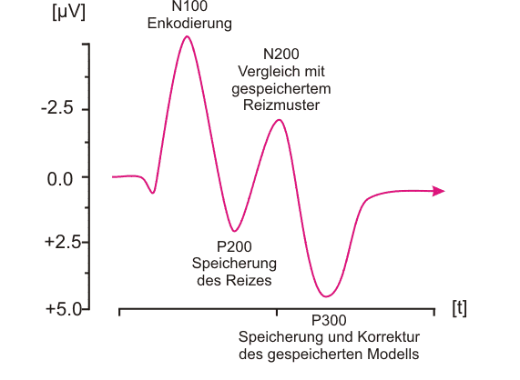

Input and Output
================

Über welche Sensoren können Körpersignale aufgezeichnet werden?
---------------------------------------------------------------

- `EMG`: Myogram (Beispiel Myo Armband)
- `EEG`: Encephalografie (Brain-computer interface)
- `ECG`: Kardio (Herzmuskel)
- `EOG`: Okulografie (Auge - Eyetracker)

EEG
^^^

Über das EEG werden elektrische Ströme im Gehirn gemessen. Das sind ändernde
elektrische Feld an der Kopfhaut verursacht unterschiedliche Ströme, die an
den Elektroden gemessen werden. Die Positionierung der Elektroden ist dabei
von großer Relevanz (10-20 System).

Über die gemessenen Frequenzen kann z.B. ermittelt werden wie "gestresst" der
Nutzer zur Zeit ist bzw. in welchen Zustand er sich befindet (Schlaf,
Meditation, Aufgabenbewältigung).

Externe Stimuli können mit Hilfe von EEG gemessen werden. Dabei unterscheidet
man die zwei Typen ERP (Ereignisse) und SEP (Sensoren). Bei Ereignissen ist
P300 ein anschauliches Beispiel. Bei der Suche von Personen nach Bildern
löst das Ansehen der gesuchten Person ein P300 aus.

Bei SEP reagiert das Gehirn auf einen Sinn, wie z.B. eine bestimmte
Audiofrequenz beim Hören oder blinkende Licht beim Sehen.

.. youtube:: RtM2R-L25W0
    :width: 100%

Im Beispiel demonstriert, wie der Hex Bug durch wechselnd blinkende Lichter
kontrolliert werden kann.

Problematisch bei EEG ist das Rauschen, was in aufgezeichneten Signalen
enthalten ist. Zudem ist die Komplexität der Daten sehr hoch, da
unterschiedlichste äußere Einflüsse auf den Nutzer während der Aufzeichnung
einwirken. Die Übertragung von Merkmalen auf andere Nutzer gestaltet sich als
schwierig, da jeder Nutzer anders auf seine Umgebung reagiert.

EMS
^^^

Bei EMS werden wie bei EEG Elektroden am Körper der Testperson angebracht,
allerdings nicht am Kopf, sondern an Muskelpartien die untersucht oder
kontrolliert werden sollen. Wichtig ist den Muskel der Person genau zu
treffen, da diese sehr klein sein können. Der Sensor sollte im Idealfall die
Größe des Muskels nicht übersteigen, sondern genau so groß sein, da ein hoher
Strom durch große Sensoren fließen kann und die Reaktion entsprechend
ausfällt. Ein zu großer Sensor kann Muskelpartieren beeinflussen, die nicht
beeinflusst werden sollen.

Laufaktuierung
""""""""""""""

.. youtube:: JSfnm_HoUv4
    :width: 100%

Muscle-plotter
""""""""""""""

.. youtube:: u5vQIZflQzQ
    :width: 100%

Tangible user interfaces
^^^^^^^^^^^^^^^^^^^^^^^^

    *The key idea of tangible interfaces is giving physical form to digital
    information.*

    -- Ishii & Ullmer 2012

Ein gutes Beispiel für ein TUI ist die Toniebox. Sie besteht aus einer Box mit
integriertem Lautsprecher und ist über WLAN an das Internet gebunden. Kleine
Figuren, die über einen integrierten Chip verfügen werden auf die Box
gestellt. Die Box erkennt um welche Figur es sich handelt und lädt aus dem
Internet die damit verbundenen Audiodaten herunter. Der Nutzer kann die Box
durch Aktionen wie Kippen (Vor- und Zurückspulen) oder einen Klaps
(Voriger/Nächster Track) steuern. Die Audiodatei bekommt in Form der Figur
eine physische Repräsentation.

Exertion interface
^^^^^^^^^^^^^^^^^^

    *An Exertion Interface is an interface that deliberately requires intense
    physical effort.*

    -- http://www.exertioninterfaces.com/exertion_interfaces/definition.htm

Das Zusammenspiel zwischen Technologie, Körper und Spiel wird unter dem Begriff
Exertion games zusammengefasst.

.. youtube:: kwticv9ai_Q
    :width: 100%