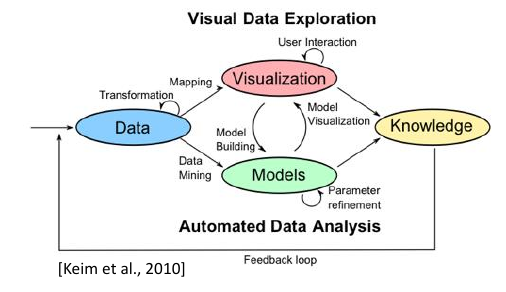

.. role:: quote
    :class: quote

********************
Prüfungsvorbereitung
********************

Grundlagen
==========

Einführung
----------

Definition Informationsvisualisierung
^^^^^^^^^^^^^^^^^^^^^^^^^^^^^^^^^^^^^

:quote:`Informationsvisualisierung als Vermittlung von abstrakten Daten durch die Benutzung von interaktiven visuellen Oberflächen.`

Abstrakte Daten
^^^^^^^^^^^^^^^

:quote:`Im Kontext der Vorlesung definiert als Text und Tabellen, Hierarchien und Graphen, Multivariate Daten und Zeitreihen. Diese Daten besitzen keine räumliche bzw. physische Repräsentation.`

Visuelle Analytik
^^^^^^^^^^^^^^^^^

Elemente der visuellen Analytik:

- Daten
- Modelle
- Visualisierung
- Wissen

Visualisierungen werden verwendet um die Fähigkeiten von Mensch und Maschine zu verbinden. Wenn Aufgaben vage spezifiziert oder menschliche Einschätzung nötig ist, werden Visualisierungen eingesetzt.

Sobald klare Spezifikationen benannt sind können algorithmische bzw. mathematische Lösungen eingesetzt werden.

SeeSoft
^^^^^^^

Das Programm zeigt Änderungen in Versionen der Software in Minimaps an. Änderungen werden zeilenweise farblich hervorgehoben.

Definition Softwarevisualisierung
^^^^^^^^^^^^^^^^^^^^^^^^^^^^^^^^^

Visualisierung von Artefakten, die mit Software und deren Entwicklung verbunden sind (Struktur, Verhalten und Evolution)

Softwareartefakte
^^^^^^^^^^^^^^^^^

+-----------------+-----------------+
| technisch       | andere          |
+=================+=================+
| Quelltext       | Anforderungen   |
+-----------------+-----------------+
| Datenstrukturen | Softwaredesign  |
+-----------------+-----------------+
| Datenbank       | Code-Änderungen |
+-----------------+-----------------+
| ...             | ...             |
+-----------------+-----------------+

Teilgebiete
^^^^^^^^^^^

1. Struktur

     a) Softwarearchitektur
     b) Abhängigkeiten zwischen Artefakten
     c) Datenstrukturen

2. Verhalten

     a) Ablauf eines Algorithmus
     b) Laufzeitverhalten
     c) Programmzustand

3. Evolution

     a) Entwicklungsgeschichte
     b) Änderungen am Quelltext
     c) Teamentwicklung

Visuelle Wahrnehmung
--------------------

Welche Einschränkungen haben die Einschränkungen der menschlichen Wahrnehmung für die Visualisierung?

- Fehlinterpretationen möglich
- Visualisierung ungeeignet
- Darstellung muss z.B. farblich angepasst werden um vom Nutzer interpretiert werden zu können

Nach welchen Phasen werden Muster erkannt?

#. primitive Mustererkennung (das Objekt ist ein Haus)
#. \

    #. komplexe Erkennung (das Haus ist eine Villa)
    #. Aktionen

#. Arbeitsgedächtnis

Blickbewegungen
^^^^^^^^^^^^^^^

- Sakkade (schnelle Augenbewegung)
- Fixation
- Blickbewegung

Farbwahrnehmung
^^^^^^^^^^^^^^^

:L-Zapfen: rot
:M-Zapfen: grün
:S-Zapfen: blau

Konsequenzen für die Visualisierung durch Farbwahrnehmung, Helligkeits- und Farbkontraste

- Rot-Grün vermeiden es sei denn die Semantik wird eingetzt (Fehler, Erfolg)
- Wichtige Infos als Helligkeitskontrast
- max. 6 - 12 Farben

Mustererkennung
^^^^^^^^^^^^^^^

*Was ist die Präatentive Wahrnehmung?*

Als präatentive Wahrnehmung bezeichnet man den Vorgang andersartige Objekte in einer Gruppe gleichartiger Objekte schnell zu erkennen (<200ms)

*Wie erfolgt die visuelle Suche?*

Über die Augenbewegung wird ständig die Mustererkennung ausgeführt. Sobald ein Kandidat gewählt wurde, wird dieser auf bekannte Muster geprüft. Wenn kein Muster erkannt wurde erfolgt eine weitere Bewegung.

*Erläutern und beschreiben Sie Gestaltgesetze?*

:Nähe: Gruppen werden identifiziert, wenn mehrere Objekte nahe beeinander liegen.
:Ähnlichkeit: Objekte in ähnlicher Form und Farbe werden als Gruppe wahrgenommen
:Verbundenheit: Mit einander verbundene Objekte werden als ein Objekt erkannt/empfunden
:Stetigkeit: Stetige Objekte können einfacher separiert werden als Objekte mit abrupten Richtungswechseln.

Wodurch wird Tiefe in einem 2D-Bild festgestellt?

- Maßstab
- Perspektive
- Schatten
- Verdeckung
- (Wechsel des Standpunktes)

Informationsvisualisierung
==========================

Multivariate Daten und Zeitreihen
---------------------------------

Definition Metapher
^^^^^^^^^^^^^^^^^^^

:quote:`Eine Metapher ist eine rhetorische Figur, bei der ein Wort nicht in seiner wörtlichen, sondern in einer übertragenen Bedeutung gebraucht wird, und zwar so, dass zwischen der wörtlich bezeichneten Sache und der übertragenen gemeinten eine Beziehung der Ähnlichkeit besteht.`

Beispiel: Hat der Hausdrache heute schon wieder die übliche Verwarnung ausgesprochen.

Der Hausdrache ist hier die Metapher |winkingsmiley|

*Metaphern in der Informatik:*

- Bäume
- Städte
- Federn

Symbole oder Piktogramme eignen sich gut zur Darstellung von Metaphern (Bsp. Papierkorb). DIe Bildsprache Isotype wird z.B. häufig zur Vermittlung von statistischen Informationen verwendet.

Multivariate Daten
^^^^^^^^^^^^^^^^^^

Multivariate Daten enthalten mehrere Variablen pro Objekt. Sind als Tabelle einfach darzustellen. Beispiel Datensatz ``mtcars``

+----------------+------+-----+-------+-----+------+-------+-------+----+----+------+------+
|                | mpg  | cyl | disp  | hp  | drat | wt    | qsec  | vs | am | gear | carb |
+================+======+=====+=======+=====+======+=======+=======+====+====+======+======+
| Mazda RX4      | 21.0 | 6   | 160.0 | 110 | 3.90 | 2.620 | 16.46 | 0  | 1  | 4    | 4    |
+----------------+------+-----+-------+-----+------+-------+-------+----+----+------+------+
| Mazda RX4  Wag | 21.0 | 6   | 160.0 | 110 | 3.90 | 2.875 | 17.02 | 0  | 1  | 4    | 4    |
+----------------+------+-----+-------+-----+------+-------+-------+----+----+------+------+
| Datsun 710     | 22.8 | 4   | 108.0 | 93  | 3.85 | 2.320 | 18.61 | 1  | 1  | 4    | 1    |
+----------------+------+-----+-------+-----+------+-------+-------+----+----+------+------+

Zeilen enthalten die Objekte, Spalten die Variablen. Eine zusätzliche Dimension wäre denkbar, wenn man Versionen der Objekte hinzu nimmt.

Deskriptive Statistik
^^^^^^^^^^^^^^^^^^^^^

:Mittelwert: Durchschnitt
:Median: mittlerer Wert
:Quartil: wie viele Werte liegen kleiner gleich X, z.B. beim 25% Quartil liegen 25% der Werte kleiner gleich der Gesamtheit
:Modus: häufigste Wert der Stichprobe
:Standardabweichung: Streuung um den Mittelwert bei Normalverteilung
:Standardfehler: Wurzel der Varianz

Diagramme
^^^^^^^^^

- Boxplot
- Histogramm
- Streudiagramm (Scatterplot)
- Star Plot
- Chernoff Faces
- Parallele Koordinaten

Zeitreihen
^^^^^^^^^^

Darstellung von Variablen mit zeitlicher Dimension eher in ``time-to-space`` (Zeitleiste) oder in ``time-to-time`` (Animation).

- Lineare Zeitachsen

    + Liniendiagramme
    + Gestapelte Flächendiagramme (ThemeRiver)
    + Small Mutiples
    + Horizon Graphs (platzsparend)

        * Einfärbung der negativen Werte
        * Mirror oder Offset der negativen Variablen
        * Wiederholung der Prozedur je nach Anzahl der Mirror

- Sparklines

    + Einfache, datenintensive wortgroße Grafiken. Häufig verwendet in Tabellen als Linien- oder Balkendiagramm.

- Zyklische Zeitachsen
- Trajektorien

    + Ort über die Zeit aufgezeichnet
    + 2D-Raum + 1D Zeit als Linie

Mengenstrukturen und Hierarchien
--------------------------------

Durch die Abstraktion von multivariaten Daten lassen sich diese auf spezielle Eigenschaften besser test/darstellen und interpretieren. Beispiel: Darstellung der Objekte in einem Koordinatensystem als Punkte.

Algorithmen:

- Hauptkomponentenanalyse
- t-distributed Stochastic Neighborhood Embedding (t-SNE)

Clustering
^^^^^^^^^^

- Gruppierung ähnlicher Objekte zu Clustern (Mengen)
- Partitionierung, z.B. ``kmeans``

    1. Setzen von n zufälligen Mittelpunkten im n-dimensionalen Raum
    2. Zuordnung der Punkte zum nächst gelegenen Mittelpunkt
    3. Position der Mittelpunkte verschieben auf den berechneten Mittelpunkt der zugeordneten Punkte
    4. Solange sich Änderungen ergeben zurück zu 2.

Mengenstruktur
^^^^^^^^^^^^^^

- Eine Mengenstruktur ist eine Gruppe von Mengen
- Eine Partition ist nicht leere Teilmenge, so dass jedes Objekt genau einer Partition zugewiesen wird

Diagramme:

- Euler-Diagramm
- Venn-Diagramm

Mengenstrukturen können gut als Overlay/Überlagerung genutzt werden.

Darstellung als Graph denkbar, Partition als Knoten mit mehreren Verbindungen zu einer neuen Partition.

Hierarchische Daten
^^^^^^^^^^^^^^^^^^^

:quote:`Hierarchie = Baum`

Baumelemente:

- Wurzel (Eingangsgrad = 0)
- innere Knoten (Ausgangsgrad > 0)
- Blätter (Ausgangsgrad = 0)

Beispiele:

- Stammbäume
- Unternehmenshierarchien
- Taxonomien
- Dateistruktur
- Vererbung

Visualisierungen
^^^^^^^^^^^^^^^^

- Knoten-Kanten-Diagramm (Node-Link)

    + Positionierung der Knoten frei wählbar
    + `Dendrogramm <https://bl.ocks.org/mbostock/4063570>`_

- Einrückung (Dateistruktur)
- Icicle Plot
- Treemap

Vergleich von Hierarchien
^^^^^^^^^^^^^^^^^^^^^^^^^

- Einfärbung

    + Brushing: Einfärbung nach Selektion mit der Maus
    + Linking: Verhalten von Punkten in jedem Diagramm hervorheben (z.B. Größenänderung und Positionierung)
    + `Linking and Brushing <http://www.infovis-wiki.net/index.php?title=Linking_and_Brushing>`_

- Verbindungskanten
- Animation
- Matrix
- Fusion (auch wieder Farben)

Visual Analytics
================

Softwarevisualisierung
======================

Evaluation
==========

.. |winkingsmiley| raw:: html

    &#12485;
