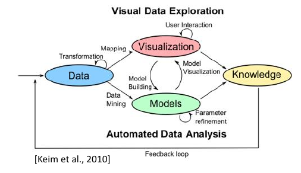

.. role:: quote
    :class: quote

.. |winkingsmiley| raw:: html

    &#12485;

.. |rightarrow| raw:: html

    &#x2192;

.. |leftarrow| raw:: html

    &#x2190;

.. |middlearrow| raw:: html

    &#x2194;

Grundlagen
==========

Einführung
----------

Definition Informationsvisualisierung
^^^^^^^^^^^^^^^^^^^^^^^^^^^^^^^^^^^^^

:quote:`Informationsvisualisierung als Vermittlung von abstrakten Daten durch die Benutzung von interaktiven visuellen Oberflächen.`

Abstrakte Daten
^^^^^^^^^^^^^^^

:quote:`Im Kontext der Vorlesung definiert als Text und Tabellen, Hierarchien und Graphen, Multivariate Daten und Zeitreihen. Diese Daten besitzen keine räumliche bzw. physische Repräsentation.`

Visuelle Analytik
^^^^^^^^^^^^^^^^^

Elemente der visuellen Analytik:

- Daten
- Modelle
- Visualisierung
- Wissen

Visualisierungen werden verwendet um die Fähigkeiten von Mensch und Maschine zu verbinden. Wenn Aufgaben vage spezifiziert oder menschliche Einschätzung nötig ist, werden Visualisierungen eingesetzt.

Sobald klare Spezifikationen benannt sind können algorithmische bzw. mathematische Lösungen eingesetzt werden.

SeeSoft
^^^^^^^

Das Programm zeigt Änderungen in Versionen der Software in Minimaps an. Änderungen werden zeilenweise farblich hervorgehoben.

Definition Softwarevisualisierung
^^^^^^^^^^^^^^^^^^^^^^^^^^^^^^^^^

:quote:`Visualisierung von Artefakten, die mit Software und deren Entwicklung verbunden sind (Struktur, Verhalten und Evolution)`

Softwareartefakte
^^^^^^^^^^^^^^^^^

+-----------------+-----------------+
| technisch       | andere          |
+=================+=================+
| Quelltext       | Anforderungen   |
+-----------------+-----------------+
| Datenstrukturen | Softwaredesign  |
+-----------------+-----------------+
| Datenbank       | Code-Änderungen |
+-----------------+-----------------+
| ...             | ...             |
+-----------------+-----------------+

Teilgebiete
^^^^^^^^^^^

1. Struktur

     a) Softwarearchitektur
     b) Abhängigkeiten zwischen Artefakten
     c) Datenstrukturen

2. Verhalten

     a) Ablauf eines Algorithmus
     b) Laufzeitverhalten
     c) Programmzustand

3. Evolution

     a) Entwicklungsgeschichte
     b) Änderungen am Quelltext
     c) Teamentwicklung

Visuelle Wahrnehmung
--------------------

Welche Einschränkungen haben die Einschränkungen der menschlichen Wahrnehmung für die Visualisierung?

- Fehlinterpretationen möglich
- Visualisierung ungeeignet
- Darstellung muss z.B. farblich angepasst werden um vom Nutzer interpretiert werden zu können

Nach welchen Phasen werden Muster erkannt?

1. primitive Mustererkennung (das Objekt ist ein Haus)
2. |rightarrow|

    a) komplexe Erkennung (das Haus ist eine Villa)
    b) Aktionen

3. Arbeitsgedächtnis

Blickbewegungen
^^^^^^^^^^^^^^^

- Sakkade (schnelle Augenbewegung)
- Fixation
- Blickbewegung

Farbwahrnehmung
^^^^^^^^^^^^^^^

:L-Zapfen: rot
:M-Zapfen: grün
:S-Zapfen: blau

Konsequenzen für die Visualisierung durch Farbwahrnehmung, Helligkeits- und Farbkontraste

- Rot-Grün vermeiden es sei denn die Semantik wird eingetzt (Fehler, Erfolg)
- Wichtige Infos als Helligkeitskontrast
- max. 6 - 12 Farben

Mustererkennung
^^^^^^^^^^^^^^^

*Was ist die Präatentive Wahrnehmung?*

Als präatentive Wahrnehmung bezeichnet man den Vorgang andersartige Objekte in einer Gruppe gleichartiger Objekte schnell zu erkennen (<200ms)

*Wie erfolgt die visuelle Suche?*

Über die Augenbewegung wird ständig die Mustererkennung ausgeführt. Sobald ein Kandidat gewählt wurde, wird dieser auf bekannte Muster geprüft. Wenn kein Muster erkannt wurde erfolgt eine weitere Bewegung.

*Erläutern und beschreiben Sie Gestaltgesetze?*

:Nähe: Gruppen werden identifiziert, wenn mehrere Objekte nahe beeinander liegen.
:Ähnlichkeit: Objekte in ähnlicher Form und Farbe werden als Gruppe wahrgenommen
:Verbundenheit: Mit einander verbundene Objekte werden als ein Objekt erkannt/empfunden
:Stetigkeit: Stetige Objekte können einfacher separiert werden als Objekte mit abrupten Richtungswechseln.

Wodurch wird Tiefe in einem 2D-Bild festgestellt?

- Maßstab
- Perspektive
- Schatten
- Verdeckung
- (Wechsel des Standpunktes)
-
