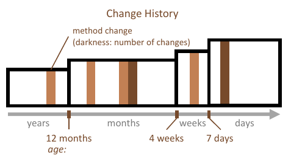
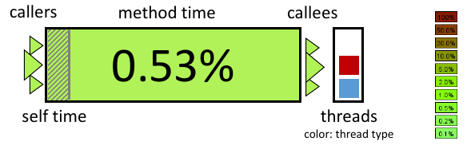

.. role:: quote
    :class: quote

.. |winkingsmiley| raw:: html

    &#12485;

.. |rightarrow| raw:: html

    &#x2192;

.. |leftarrow| raw:: html

    &#x2190;

.. |middlearrow| raw:: html

    &#x2194;

Softwarevisualisierung
======================

Struktur
--------

Codevisualisierung
^^^^^^^^^^^^^^^^^^

Visualisierungen im Code durch:

- Syntax highlighting
- pretty printing

Diagramme:

- Jackson
- Nassi-Shneiderman/Struktogramme
- Flussdiagramm/Programmablaufplan
- Control Structure Diagramme
- UML

Coderepräsentationen für Anfänger
"""""""""""""""""""""""""""""""""

- **Fokus auf den Konzepten nicht auf der Syntax**
- weniger fehleranfällig
- besser verständlich

Anwendungen
"""""""""""

- Stacksplorer
- Code Bubbles

Architekturvisualisierungen
^^^^^^^^^^^^^^^^^^^^^^^^^^^

Definition Softwarearchitektur
""""""""""""""""""""""""""""""

:quote:`Architektur ist die fundamentale Organisation eines Systems, dass durch seine Komponenten, deren Beziehungen untereinander, Umgebung und der Prinzipien zum Design und Evolution verkörpert wird.`

:Komponenten: Hierarchie
:Beziehungen: Graph
:Umgebung: Multivariate Daten, Graphen
:Evolution: Zeit

Typische Beispiele zur Anzeige der Struktur:

- Pfeile und Kästen (siehe git-scm.org)
- Schichten (Pyramide)
- Blackboard

Definition Reverse Engineering
""""""""""""""""""""""""""""""

:quote:`Reverse Engineering bezeichnet den Prozess der Analyse eines Systems, um Repräsentationen des Systems auf einem höheren Level der Abstraktion zu erstellen.`

Abhängigkeitsgraphen |middlearrow| automatisch generierte UML-Klassen
"""""""""""""""""""""""""""""""""""""""""""""""""""""""""""""""""""""

Vorteile:

- Selektiert nur den Interessensbereich, filtert irrelevante Infos
- Probleme wie Dependency Injection können manuell gelöst werden

Nachteile:

- Übersehen von Elementen bei Selektion
- Dauert länger
- Erfordert genaue Kenntnis des Systems

Dependency Structure Matrix
"""""""""""""""""""""""""""

- stellt eine Adjazenzmatrix zur Darstellung von Abhängigkeiten dar

Softwaremetriken
""""""""""""""""

- Anzahl Codezeilen
- Function-Point zur Aufwandsabschätzung
- Kontrollflussorientierte Metriken

    + Anweisungsüberdeckung
    + Zweigüberdeckung
    + Pfadüberdeckung
    + Bedingungsüberdeckung

Softwarestädte und -karten
""""""""""""""""""""""""""

:Gebäude: Artefakte
:Farben: Packages
:Höhe: Anzahl an Revisionen

Evolution
---------

:quote:`All successful software gets changed.`

Softwareevolution ist der Entwicklungsprozess den eine Software über den Zeitraum des Einsatzes besitzt. Die Menge an gespeicherten Informationen wird auch als Softwarearchiv bezeichnet. Dazu gehört Dokumentation, Bug Tracking, Versionsmanagement etc.

Beispiel hier wieder ``SeeSoft``.

Evolutionsmetriken
^^^^^^^^^^^^^^^^^^

- Anzahl Beitragende über die Zeit
- Neue Bugs/Features |middlearrow| behobene Bugs/Features
- Releases
- Commits in Branches (``git log --oneline --graph --decorate --abbrev-commit --all``)

CVSscan
^^^^^^^

Programm zur Darstellung der Evolution in einer Zeitleiste

- y-Achse: Versionen
- x-Achse: Programmzeilen mit Metriken von oben nach unten

    + geändert
    + neu
    + gleich geblieben
    + gelöscht
    + konflikt
    + ...

CVSgrab
^^^^^^^

Analyse verschiendener Klassen/Dateien. Text zur Grafik:

:quote:`Figure 6 shows the evolution of 68 files from a large project (the VTK library) using the same color encoding as in Figure 2, i.e. activity based, and sorted on creation time. The vertical metric view shows the file activity as a 1D bar graph. The horizontal metric view shows the project wide activity. By correlating the main layout with the vertical metric view, we see that file creation time does not fully determine the file activity. Two activity hotspots are identified. They correspond to groups of files that appeared later in the project but had high activity, so they might contain important and/or problematic functionality.`

    `Beschreibung <http://www.cs.rug.nl/~alext/PAPERS/EuroVis06/cvsgrab.pdf>`_

Evolutionsmatrix
^^^^^^^^^^^^^^^^

- Anzeige einer Version in den Spalten
- Klassen in den Zeilen
- Pro Version pro Klasse wird ein Rechteck dargestellt

    + Höhe = Anzahl Attribute
    + Breite = Anzahl Methoden

Hier kann man vor allem Klassen sehen, die sich oft oder auch gar nicht ändern.

Evolution vieler Metriken
^^^^^^^^^^^^^^^^^^^^^^^^^

    `Visualizing multiple evolution metrics <http://www.infosys.tuwien.ac.at/teaching/courses/SWE/papers/RelVis.pdf>`_

Evolution von Struktur und Entwickleraktivität
^^^^^^^^^^^^^^^^^^^^^^^^^^^^^^^^^^^^^^^^^^^^^^

- Diff
- `Codeflows <https://hal.inria.fr/inria-00338601/document>`_
- Softwarestädte
- `Entwickleraktivität als Animation <https://www.youtube.com/watch?v=cNBtDstOTmA>`_
- Entwickleraktivität als Zeitleisten

    + Software Evolution Storylines
    + Developer Rivers

Evolutionäre Kopplung
^^^^^^^^^^^^^^^^^^^^^

Wenn zwei Artefakte sind evolutionär gekoppelt, wenn sie gleichzeitig geändert werden. Es muss keine logische Beziehung zwischen den Artefakten herrschen.

Sei :math:`Supp(c_1, c_2) := \vert \lbrace T_i: c_1 \in T_i, c_2 \in T_i \rbrace \vert` die Menge aller Transaktionen in denen die Klassen :math:`c_1` und :math:`c_2` enthalten sind definiert als ``support``. Dann ist die ``confidence`` :math:`Conf(c_1, c_2) := \dfrac{Supp(c_1, c_2)}{Supp(c_1, c_1)}` also :math:`0 \leq x \leq 1`.

Vergleich strukturelle Abhängigkeiten |middlearrow| evolutionäre Kopplung
^^^^^^^^^^^^^^^^^^^^^^^^^^^^^^^^^^^^^^^^^^^^^^^^^^^^^^^^^^^^^^^^^^^^^^^^^

Wie im Beispiel (``JFtp``) geschildert sind diese nicht deckungsgleich oder sogar ähnlich.

IDE-Integration
^^^^^^^^^^^^^^^

Verhalten
---------

Damit Laufzeitverhalten analysiert werden kann muss ein Profiling statt finden, also eine Aufzeichnung von Speicherverbrauch, Dauer von Methodenausführungen etc.. Änderungen im Speicherverbrauch können dann als Datenvisualisierung dargestellt werden, Aufrufe in einer Codevisualisierung.

Profiling
^^^^^^^^^

1. Sampling

     a) Anhalten des Programms zu bestimmten Zeitpunkten
     b) Abschätzung des Gesamtverhaltens

2. Instrumentierung

     a) Manuelles oder automatisches Einfügen von Analysestellen

Vorteile Instrumentierung:

- man erhält zu relevanten Zeitpunkten Ergebnisse

Problem ist grundsätzlich, dass das Programm zur Analyse angehalten werden muss. Ggfs. ist der Aufwand zur Ermittlung der Laufzeit, Speicherverbrauch etc. sehr hoch.

Performance
^^^^^^^^^^^

- CPU, Laufzeit
- Speicher
- I/O, Latenz (vor allem im Netzwerk)
- Sampling

    + zusätzliche Kontext-Switches
    + Anfang/Ende schwierig aufzuzeichnen
    + ungenau

- Instrumentierung

    + Overhead

Algorithmenanimation
^^^^^^^^^^^^^^^^^^^^

Zur Ausführung eines Algorithmus ist immer ein visuelles Modell und eine entsprechende Animation vorhanden. Nach Ausführung eines Schrittes wird der Übergang auf das Modell gemappt und in der Animation gerendert. Dazu werden die voreigen Zustände des Models und der Animation immer mit einbezogen.

MaxFlow
^^^^^^^

`Erklärung zu Flüssen in Graphen <https://www.youtube.com/watch?v=6UzTtxHY290>`_

|rightarrow| `Ford-Fulkerson <https://www.youtube.com/watch?v=6UzTtxHY290>`_

Architekturen
^^^^^^^^^^^^^

- Ad Hoc Visualisierungen
- Spezielle Datentypen
- Post Mortem Visualisierung
- Interesting Events

    + Annotierung interessanter Programmstellen im Code
    + Senden von Events parallel zur laufenden Animation

- Deklarativ

    + Ausführung im Hintergrund
    + Trennung von Annotierung und Algorithmus

- Semantic-Directed

    + automatische Visualisierung durch einen Interpreter/Debugger

Visuelles Debugging
^^^^^^^^^^^^^^^^^^^

Tools
"""""

- ``printf``
- In IDE integrierte Debugger
- Browserdebugging Tool (Developer Toolbar)
- ``jVisualVM``

Objektzustand
"""""""""""""

*Häufig auftretende Objekte*:

    - Collections
    - Bäume/Graphen
    - Tabellen (multivariate Daten)
    - Farben/Bilder

Slicing
"""""""

Visualisierung werden im Code angezeigt und unterteilt nach:

:statischer Slice: Menge aller Anweisungen die eine Variable bei Ausführung beeinflussen können
:dynamischer Slice: Menge aller Anweisungen die eine Variable bei Ausführung beeinflussen
:Dice: Schnittmenge zwischen zwei Slices

Abdeckung
"""""""""

Mittels Farbkodierung kann angezeigt werden wie die Testabdeckung von Anweisungen ist. Zusätzlich wird zwischen fehlgeschlagenen und erfolgreichen Tests unterschieden.

Beispiel: Tarantula (Software)

Performanzvisualisierung
^^^^^^^^^^^^^^^^^^^^^^^^

- JProfiler (Aufrufbaum)
- CHrome Developer Tools (Icicle Plot)

Dynamische Aufrufgraphen können hier auch gerne als Radiales Graph Layout dargestellt werden

Erweiterte Graphenvisualisierungen
----------------------------------

Gruppierung
^^^^^^^^^^^

- implizit
- explizit
- partitioniert
- embedded/zusammengefasst

Hierarchical Edge Bundle
^^^^^^^^^^^^^^^^^^^^^^^^

Die Darstellung eines Graphen in einem radialen Layout führt bei einer großen Menge an Kanten zu sehr vielen Überlappungen. Auf Basis der Hierarchie können Kanten gebündelt werden, wodurch die Darstellung besser lesbar wird.

1. Pfad zwischen Start und Ende durch den kleinsten gemeinsamen Vorfahren finden
2. Besuchte Knoten als Kontrollpunkte merken
3. Splinekurve durch das Polygon erstellen, was durch die Kontrollpunkt, Start und Ende erzeugt wird

Vergleich von Graphen
^^^^^^^^^^^^^^^^^^^^^

Statisch
""""""""

- zusätzliche Ansicht erstellen

    + nebeneinander
    + Fusionierung

        * Farben
        * Linienform (gestrichelt, durchgängig...)

Beispielsoftware: ``TIGAM``

Dynamisch
"""""""""

1. Animation
2. Zeitleiste

Eine Animation eignet sich eher für ein Diff, da nur zwei Versionen des Graphen miteinander vergleichen werden. Eine Zeitleiste zeigt den Gesamtzustand des Graphen besser an, es entstehen aber Probleme sobald der Graph inklusive Versionen eine gewisse Größe erreicht.

Es können auch Matrizen zum Vergleich genutzt werden, Node-Link ist nicht zwingend notwendig.
