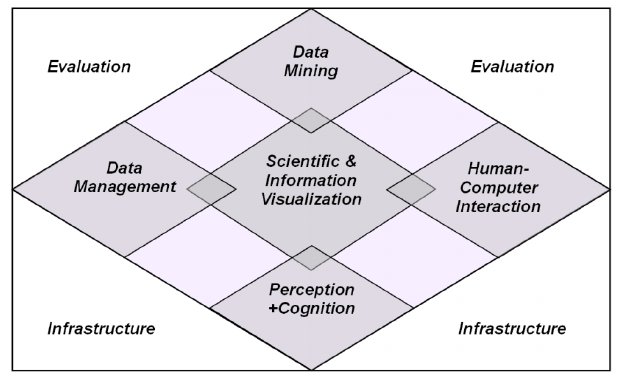

.. role:: quote
    :class: quote

.. |winkingsmiley| raw:: html

    &#12485;

.. |rightarrow| raw:: html

    &#x2192;

.. |leftarrow| raw:: html

    &#x2190;

.. |middlearrow| raw:: html

    &#x2194;

Visual Analytics
================

Interaktionstechniken & interaktive Systeme
-------------------------------------------

*Definition*:

:quote:`Visuelle Analytik bezeichnet die Wissenschaft der analytischen Denkens unterstützt durch interaktive graphische Oberflächen`

VA kann als eine Menge von Disziplinen interpretiert werden

Softwaresysteme beinhalten normalerweise mehrere Visualisierungen und Interaktionstechniken (so ziemlich alle die in der Vorlesung behandelt wurden). Typische Algorithmen sind:

- Clustering
- Suche
- Dimensionsreduktion
- Simulation
- Vorhersage

*Herausforderungen*:

- Kombination von Algorithmen
- Performance/Latenz
- **Verständlichkeit**
- Fehler/Ungenauigkeiten in den Daten

*Analyse*:

:explorativ: ungenaue Fragestellung
:investigativ: konkrete Fragestellung
:bestätigend: Hypothesen verifizieren

Sensemaking-Loop
^^^^^^^^^^^^^^^^

Kreislauf der auf den vier Tätigkeiten basiert:

1. Informationen sammeln
2. Umwandlung der Darstellung, so dass Analyse unterstützt wird
3. Manipulation der Darstellung um Einsicht zu erlangen
4. Ergebnisse produzieren -> zurück zu 1.

Information Foraging and Sensemaking
^^^^^^^^^^^^^^^^^^^^^^^^^^^^^^^^^^^^

In diesem äußerst komplexen Prozess geht es darum durch steigenden Aufwand eine größere Struktur zum Verständnis von externen Daten zu erzeugen. Das ganze teilt sich dann in die in der Grafik 16 genannten Schritte, na herzlichen Glückwunsch. Preisfrage: Warum sind die Nummern nach Erhalt der einzelnen Resultate größer?

Beispielanwendungen
^^^^^^^^^^^^^^^^^^^

- Jigsaw

    + Freie Software
    + Dokumentanalyse
    + Knoten-Kanten-Diagramm

- Scatterblogs

    + Analyse von sozialen Medien
    + Karten, Zeitreihen, Graphenvisualisierungen, Wortwolken
    + Filter, Slider, Linse (`Focus + Context <https://mbostock.github.io/protovis/ex/zoom.html>`_ )

        * ``Focus + Context`` bezeichnet eine Technik nach der der globale Kontext einer Visualisierung durch Anzeige eines Teiles nicht verloren geht

- World Lines

    + Überflutungssimulation

- Tableau

    + kommerziell
    + general purpose

- SAS Visual Analytics

    + kommerziell
    + general purpose

Big Data
^^^^^^^^

:Volume: Menge der Daten |rightarrow| Suche, Filter
:Velocity: Geschwindigkeit |rightarrow| Monitoring
:Variety: Unterschiedlichkeit der Daten |rightarrow| Kombination von Visualisierungen
:Veracity: Richtigkeit |rightarrow| Finden und Beheben von Fehlern

Skalierbarkeit
^^^^^^^^^^^^^^

- Iterative Algorithmen erlauben ein schrittweises Verfeinern
- Beschränkung der Anzeige beachten
- Interaktionen (Selektion/Fokussierung)
- Wahrnehmung des Nutzers beschränkt |rightarrow| skaliert nicht
