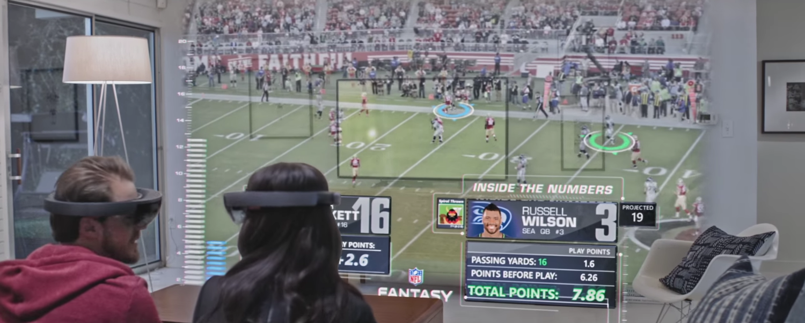

.. header::

    :authors: Nils Verheyen
    :Matrikelnummer: 3043171

Debate on augmented/virtual reality in contrast to 2D screens
=============================================================

Sample
------

With the HoloLens Microsoft introduced a heads up display with which n user is able to see 3d projections in his direct surrounding. The HoloLens uses a half transparent screen where virtual items are shown. Interaction with projected and real world items is based on gestures and movement of the hands and arms of an user.

One use case is to add information to the field of view of the user while `watching a sports event <https://www.youtube.com/watch?v=HvYj3_VmW6I>`_. Inside the video a NFL game is shown on television. One or more users are watching the game. While watching the game users are for example able to select different players. When a player is selected information statistics, given from multivariate data, is added to the field of view. Multiple users are able to see the same information, when they are located in the same room.

Comparison to 2D-Displays
-------------------------

With the heads up display the user is able to use its complete surrounding to display data. Players can be displayed in one to one scale on the floor or the stadium is shown on the coffee table. This way the television is not used as the main interface where information is shown and the main content, in this particular case the football game, is not concealed by additional projections. On a 2D screen the space to show additional information is limited by the size of the display. But this may also be an advantage as the user is able to concentrate on the main content and is not distracted or overloaded by information.

The user is also able to use a 2D screen for a long amount of time. There is no heavy hud that must be carried and the power source is not a battery. Specifications state that the HoloLens weights 579g and can be used up to three hours. Therefore such a device is suited for short term use.

But to be able to show 3D models in one to one scale leads to a better perception on the user side. Virtual items can directly be compared in size with real world items. In a football game this may not be of high use, but for example during frame building of bicycles and cars this detail may be very important.

Finally the interaction with just the hand rather than a mouse or keyboard is a convenient way to control virtual items. Multiple users are able to manipulate items at the same time. Collaboration is very easy this way. It is also a clean way to interact with items, as there are no dirty input devices that must be shared. But to manipulate items in a precise way is harder. Scaling for example is not as precise because the user is not able to enter a precise scaling factor.
