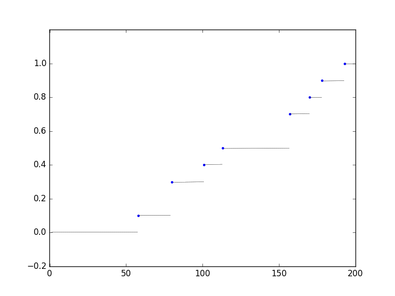
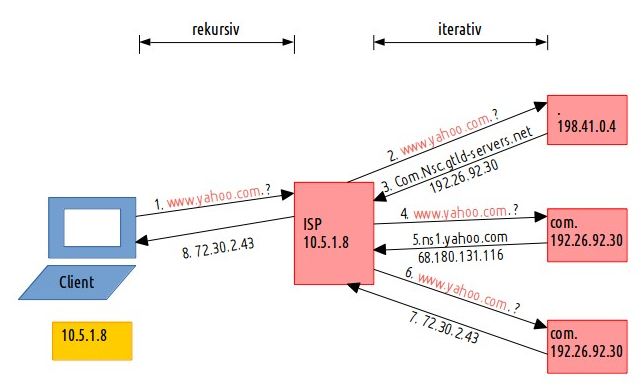
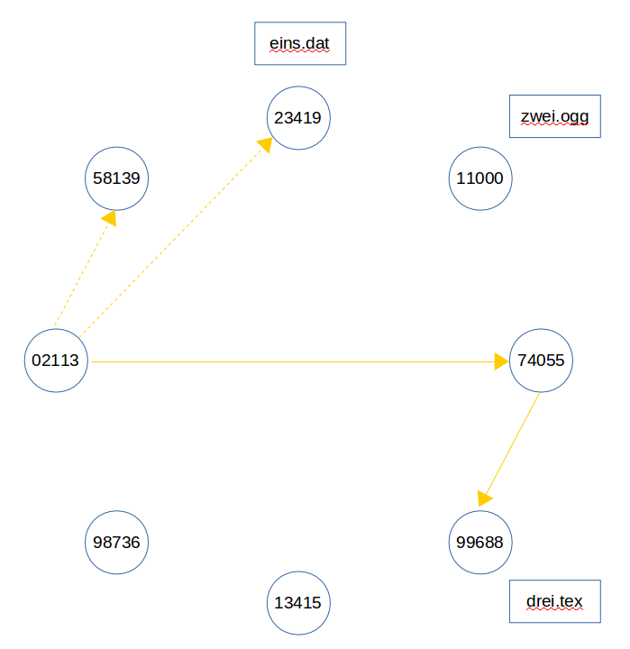
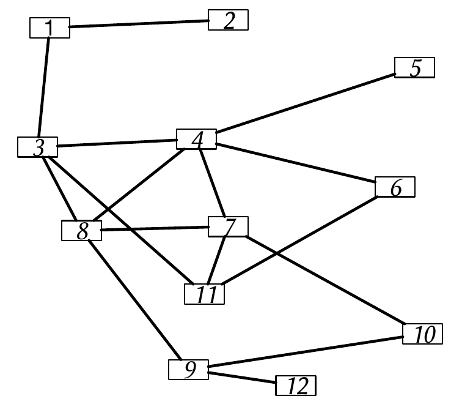

Prüfung 2016
============

.. role:: task
    :class: task

Aufgabe 1 - Netzwerkmessung und Auswertung (10 Punkte)
------------------------------------------------------

Bei einer QoS-Studie wurden folgende Werte für die Netzwerkverzögerung aufgezeichnet

157, 58, 178, 193, 170, 113, 157, 80, 80, 101

1.1
^^^

:task:`Berechnen und zeichnen Sie die CDF in den dafür vorgesehenen Graphen ein.`

Sortieren der Werte
"""""""""""""""""""

58, 80, 80, 101, 113, 157, 157, 170, 178, 193

Einzigartige Werte filtern
""""""""""""""""""""""""""

58, 80, 101, 113, 157, 170, 178, 193

Summieren von Wert <= x
"""""""""""""""""""""""

.. code-block:: shell

    58  80  101  113  157  170  178  193
    1   3   4    5    7    8    9    10

Zeichnen
""""""""

Aufgabe 1.2
^^^^^^^^^^^

:task:`Berechnen Sie nun auch Median, Mittelwert und Varianz.`

Median (mittlere Wert)
""""""""""""""""""""""

Da hier eine gerade Anzahl gegeben gibt es keinen Wert in der Mitte, daher wird der Mittelwert aus beiden "mittleren" Werten bestimmt. :math:`(113 + 157) / 2 = 135`

Mittelwert
""""""""""

:math:`58 + 80 + 80 + 101 + 113 + 157 + 157 + 170 + 178 + 193 = 128,7`

Varianz
"""""""

Erwartungswert = :math:`\mu = \sum_{i = 0}^{n} (x_i * p_i)`

Erwartungswert:

:math:`\mu` = 58 * 0.1 + 80 * 0.2 + 101 * 0.1 + 113 * 0.1 + 157 * 0.2 + 170 * 0.1 + 178 * 0.1 + 193 * 0.1 = 128.7

Varianz = :math:`\sum_{i = 1}^n P(X = x_i) * (x_i - \mu)^2`

:math:`V(x)` = (((58 - 128.7) ** 2) * 0.1) + (((80 - 128.7) ** 2) * 0.2) + ...

Resultat: :math:`2062.80`

Aufgabe 2 - Internettechnologien (8 Punkte)
-------------------------------------------

2.1
^^^

:task:`Zeichnen Sie kurz den schematischen Ablauf und alle involvierten Komponenten einer typischen DNS-Anfrage und Auflösung.`

2.2
^^^

:task:`Zeichnen und erläutern Sie eine typische Architektur eines Data Centers.`

Kam im WiSe 2016/17 nicht dran.

Aufgabe 3 - Strukturierte Overlays (16 Punkte)
----------------------------------------------

3.1
^^^

:task:`Beschreiben Sie zwei typische Datenstrukturen, durch die ein strukturiertes Overlay aufgebaut werden kann.`

Datenstruktur:

DHT
"""

Bei einem DHT werden Objekte und Peers in einem Hashraum mit :math:`N` Elementen angeordnet. Jeder Peer ist dann für einen bestimmten Bereich z.B. ausgehend von seiner ID im Raum bis zum nächsten Peer für die jeweiligen Objekte verantwortlich

Linked List
"""""""""""

Bei einer Linked List kennen Peers jeweils nur ihren Nachfolger, ggfs. auch den Vorgänger. Bei einer Suche nach einem Objekt wird linear vorgegangen. Jeder Peer ist für das Objekt verantwortlich, welches er zur Verfügung stellt.

3.2
^^^

:task:`Was ist der Zweck von 'Consistent Hashing' bei einem strukturierten Overlay?`

1. Jeder Client verwendet die gleich Hashfunktion.
2. Objekte und Adressen gehen in den gleichen Adressraum.

3.3
^^^

:task:`Was sind die Haupteinflussfaktoren auf die Leistung von DHTs? Was versteht man unter Churn?`

Einflussfaktoren:

- Verteilung bzw. Zuständigkeit der Peers und Objekte

    + Hashfunktion
- Churn

:Churn: (un-)planmäßige Aussteigen von Clients aus dem Netzwerk

- Die Hashfunktion sollte für eine Gleichverteilung sorgen
- Kollisionen sollten in der Hashfunktion vermieden werden
- Interne Last (Management) der DHT

3.4
^^^

:task:`Wie kann man bei einer DHT die Verzögerungszeit zu anderen Knoten berücksichtigen? Nennen und beschreiben Sie kurz drei Möglichkeiten.`

Latenzzeiten werden bei Verwendung von ``Constistent Hashing`` ignoriert!

1. Bei der Wahl eines Fingers zur Suche kann es zwar zunächst die bessere Wahl sein, möglichst weit zu springen, aber wenn die Verzögerung zum gewählten Knoten zu groß ist, mag die Wahl eines näheren Knotens besser sein.
2. Siehe `Rendezvous hashing <https://en.wikipedia.org/wiki/Rendezvous_hashing>`_
3. Siehe `Locality-preserving hashing <https://en.wikipedia.org/wiki/Locality-preserving_hashing>`_

Aufgabe 4 - Chord (20 Punkte)
-----------------------------

4.1
^^^

:task:`Wie groß ist die Wahrscheinlichkeit in einer 1-Hop DHT mit n Knoten, dass eine Anfrage weitergeleitet wird?`

1-Hop DHT = Vollvermaschtes Netz

Wenn von einer optimalen Verteilung der Objekte ausgegangen wird ist die Wahrscheinlichkeit, dass der Ausgangsnnoten das Objekte besitzt :math:`\dfrac{1}{n}`. Für alle anderen Fälle muss die Anfrage weitergeleitet werden, woraus sich die Wahrscheinlichkeit :math:`\dfrac{n - 1}{n}` ergibt.

4.2
^^^

:task:`Gegeben seien 100000 gehashte Objekte. Wie groß ist die Wahrscheinlichkeit einer Kollision bei einem Adressraum von 48 bit? (Hinweis: Es kann auch eine Approximation für die Berechnung verwendet werden.)``

:math:`1 - e^{\frac{-k(k - 1)}{2n}}`

Siehe Übung 5.1.6

4.3
^^^

Gegeben seien acht Peers und drei Objekte mit den Namen "eins.dat", "zwei.ogg" und "drei.tex". Weiterhin gegeben ist die Hashfunktion die einstellige (iterative) Quersumme. (Hinweis: Interpretieren Sie die Buchstaben als Zahlen, und somit '.' = 27.
Die (fiktiven) Adressen der Peers lauten:

11000, 23419, 98736, 58139, 13415, 02113, 74055, 99688

:task:`a) Erstellen Sie nun mit Hilfe dieser Daten einen Chord-Ring mit Redundanz r = 0 und die Co-domain` :math:`2^3` :task:`. Vervollständigen Sie den gegebenen Graphen aus der Sichtweise eines der Knoten und begründen Sie kurz Ihre Entscheidung.`

1. Dateien in Hashwerte wandeln
"""""""""""""""""""""""""""""""

.. code-block:: shell

    'eins.dat',     'zwei.ogg',     'drei.tex'
    '591419274120', '262359271577', '418592720524'
    9,              2,              4

Das Objekt 'eins.dat' besitzt als Hash die 9, da der Raum aber nur in :math:`2^3` liegt ist der Hash des Objekts 1 (:math:`9 \bmod 8`)

2. Adressen in Hashwerte wandeln
""""""""""""""""""""""""""""""""

.. code-block:: shell

    11000, 23419, 98736, 58139, 13415, 02113, 74055, 99688
    2,     1,     6,     8,     5,     7,     3,     4

Redundanz r = 0 <=> kein Knoten dupliziert die Daten anderer Knoten

:task:`b) Peer 02113 sucht nun nach Objekt "drei.tex". Spielen Sie nun alle zum Suchvorgang zugehörigen Schritte durch. Wie viele Sprünge werden zur Suche benötigt?`

Peer 02113 muss über Peer 74055 zu Knoten 99688 gelangen, der das Objekt kennt. Es müssen also 2 Hops erfolgen.

Aufgabe 5 - CAN (8 Punkte)
--------------------------

5.1
^^^

:task:`Was bedeutet "Realität" im Kontext von CAN? Beschreiben Sie kurz die Vor- und Nachteile mehrerer Realitäten.`

- Wege zu anderen Peers können kürzer sein
- Berechnung dauert länger
- mehr Nachbarn zu verwalten

5.2
^^^

:task:`Welchen theoretischen Effekt hat die Erhöhung der Dimensionalität eines CAN-Netzes? Gibt es praktische Probleme durch die Erhöhung der Dimensionalität?`

Durch die Erhöhung werden die Wege (in der Theorie) verkürzt, da der Raum verkleinert wird. Jeder Knoten müsste aber mehr Nachbarn speichern, als in einem zwei- dimensionalen Raum.

Aufgabe 6 - Unstrukturierte Overlays (8 Punkte)
-----------------------------------------------

6.1
^^^

:task:`Bestimmen Sie im gegebenen Graphen (a) den globalen Clustering-Koeffizienten und (b) die Betweenness Centrality der Knoten 7 und 8`.

Zur Lösung siehe Übung 7.3. Hier ist derselbe Graph mit denselben Knoten gegeben.

Aufgabe 7 - Filesharing Anwendungen (8 Punkte)
----------------------------------------------

7.1
^^^

:task:`Beschreiben Sie die Funktionsweise und nötigen Mechanismen von Multi-Source Downloads.`

Eine Datei wird in mehrere Chunks/Pieces aufgeteilt. Peers sind im Besitze dieser Chunks. Wenn ein ein Peer aus dem Netzwerk mehrere Chunks gleichzeitig haben möchte, kann er Sie z.B. von mehreren Peers herunter laden. Dabei sind für den Peer der einen Chunk herunterladen möchte die Chunk-Selection wichtig und für Peers, die Chunks verteilen jeweils die Peer-Selection.

7.2
^^^

:task:`Beschreiben Sie den Peer-Selection Mechanismus von BitTorrent.`

In BitTorrent kommt bei der Peer-Selection der ``Tit-for-tat``-Mechanismus zum Tragen. Grundsätzlich können Chunks zu 4 Peers hoch geladen werden. 1 Peer ist per Zufall ausgewählt, die anderen 3 per ``Tit-for-tat``. Hat ein Peer der einen Chunk herunterladen möchte auch viel an diesen Peer hochgeladen liegt er in der Hierarchie weit oben. So sollen Free rider verhindert werden, also Peers die nur herunterladen.

Aufgabe 8 - Video-Streaming (12 Punkte)
---------------------------------------

8.1
^^^

:task:`Unterscheiden Sie anhand eines schematischen Sequenzdiagrammes verschiedene Übertragungsmuster beim Video-Streaming und deren Vor- und Nachteile.`

:simple bulk transfer: Der einfacher Download einer Datei in Segmenten von Anfang von Ende linear. Vorteil ist, dass das Video in jedem Fall heruntergeladen wird mit der gesamten verfügbaren Bandbreite. Nachteil ist, dass völlig unabhängig von den ggfs. angefragten Segmenten heruntergeladen wird.
:paced transfer: In bestimmten Abständen werden Segmente an den Client übertragen. Vorteil ist, dass die Bandbreite nicht wie beim einfachen Download voll beansprucht wird, aber die Wahrscheinlichkeit von Stalling ist höher
:paced block transfer: In bestimmten Abständen werden eine größere Menge an Segmenten übertragen. Es ist eine geringere Wahrscheinlichkeit von Stalling, als beim paced transfer gegeben, aber wenn temporär Engpässe entstehen werden große Blöcke an Segmenten nicht korrekt übertragen, was die Dauer des Stallings vergrößert.
:request segmentation: Wie paced transfer, aber der Client fragt in bestimmten Abständen an, welche Segmente heruntergeladen werden sollen.

8.2
^^^

:task:`Unterscheiden Sie kurz die möglichen Orte der Kontrolle über einen Video-Streaming-Vorgang und beschreiben Sie die Auswirkung davon.`

:Server: Der Server pusht Teile des Videos an den Client. Mehr Kontrolle am Server.
:Client: Der Client fragt Segmente beim Server an. Der Server kann dadurch eher "dumm" sein.

8.3
^^^

:task:`Was passiert wenn beim Video-Streaming nicht genügend Bandbreite vorhanden ist? Unterscheiden Sie hier nach mindestens drei unterschiedlichen Streamingansätzen.``

:adaptive bitrate streaming: Auf Basis der ermittelten verfügbaren Bandbreite kann ein skaliertes Video ausgeliefert werden, welches höhere oder niedrigere Qualität besitzt
:P2P streaming: Sollte die Verbindung vom Provider zum Client schlecht sein, können Inhalte über andere Peers verteilt werden
:progressive download: einfachste Umsetzung, besitzt aber auch keine guten Fehlertolleranzen

Aufgabe 9 - Kryptographie (10 Punkte)
-------------------------------------

9.1
^^^

:task:`Beschreiben Sie die zwei Varianten des Proof-of-Work-Mechanismus. Welcher Ansatz wird in Bitcoin verwendet? Beschreiben Sie diesen kurz.`

:Challenge-Response: Der Client führt einen Request beim Server aus, welcher widerum eine Challenge zur Lösung an den Client übergibt. Sobald der der Client diese Challenge gelöst hat, erteilt der Server die Freigabe auf die Resource.
:Solution-Verification: Hier wird das Problem und die Lösung vom Sender/Client formuliert. Der Receiver/Server nimmt beide Teile an und verifiziert die Problemlösung des Senders.

9.2
^^^

:task:`Definieren Sie im Kontext von Instant Messaging die Begriffe "Malleability" sowie "Malleable Encryption".`

Instant Messaging wurde im WiSe 2016/17 nicht behandelt.
