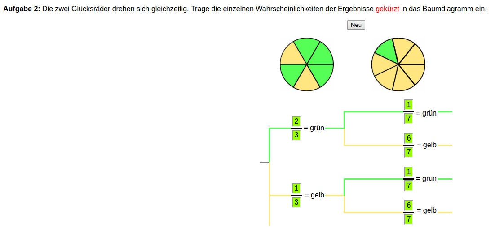
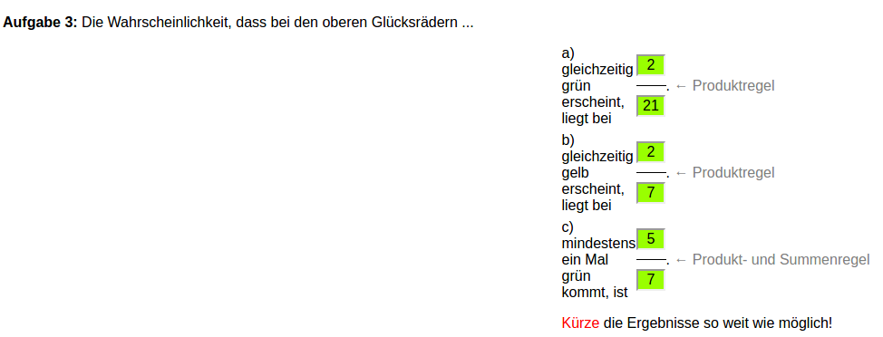
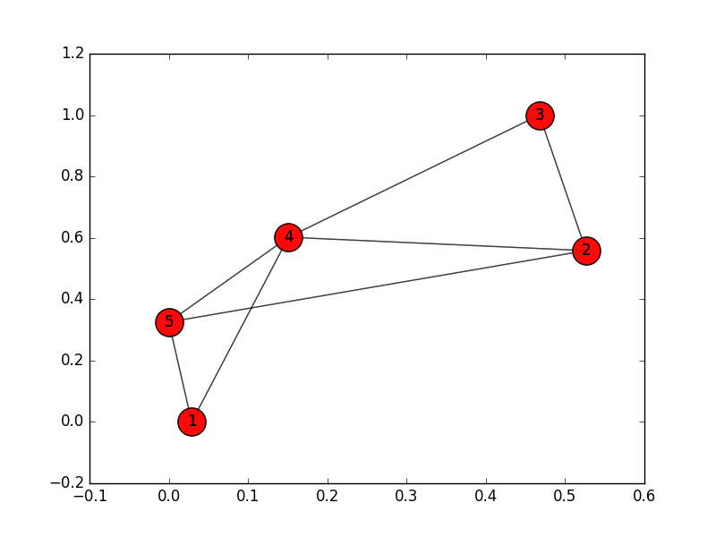

Formelsammlung
==============

Median
------

.. math::
    :nowrap:

    \begin{equation}
      \tilde{x} =
      \begin{cases}
        x_{\frac{n + 1}{2}} & \text{n ungerade} \\
        \frac{1}{2} \left(x_{\frac{n}{2}} + x_{\frac{n}{2} + 1}\right) & \text{n gerade}
      \end{cases}
    \end{equation}

D.h. bei einer geraden Anzahl wird der Wert der beiden mittleren Zahlen geteilt durch zwei ermittelt. Bei einer ungeraden Anzahl ist der Median der Wert der sortierten Mitte.

`Wikipedia - Median <https://de.wikipedia.org/wiki/Median>`_

Quantil
-------

.. math::
    :nowrap:

    \begin{equation}
      x_p =
      \begin{cases}
        \dfrac{1}{2} \left( x_{n*p} + x_{n * p + 1} \right) & \text{wenn n * p ganzzahlig,} \\
        x_{\left\lfloor n*p + 1 \right\rfloor} & \text{wenn n * p nicht ganzzahlig}
      \end{cases}
    \end{equation}

`Wikipedia - Empirisches Quantil <https://de.wikipedia.org/wiki/Empirisches_Quantil>`_

Erwartungswert
--------------

:Formel: :math:`\sum_{i = 1}^{n} x_i * P(x_i)`

:math:`P(x_i)` ist die Wahrscheinlichkeit, dass der Wert :math:`x_i` auftritt.

Für eine gegebene Menge an Zahlen ändert sich lediglich die Summe in :math:`\sum_{i \in I}`

Varianz bzw. unkorrigierte Stichprobenvarianz
---------------------------------------------

:Formel: :math:`s^{'^2}  = \sigma^2 = \dfrac{1}{n} \sum_{i = 1}^{n} (x_i - \bar{x})^2 = \bar{x^2} * \bar{x}^2`

:math:`\bar{x}` = Arithmetisches Mittel

Sollte der wahre Mittelwert bekannt sein und muss nicht aus der Stichprobe ermittelt werden ändert sich die Formel entsprechend.

:Formel: :math:`s^{'^2}  = \sigma^2 = \dfrac{1}{n} \sum_{i = 1}^{n} (x_i - \mu)^2`

`Wikipedia - Stichprobenvarianz <https://de.wikipedia.org/wiki/Stichprobenvarianz>`_

Mehrstufige Zufallsexperimente
------------------------------

Zunächst werden die einzelnen Möglichkeiten als Baum dargestellt. Entlang der Pfade gilt immer die Produktregel, also Wahrscheinlichkeit x * Wahrscheinlichkeit y * .... Sollten mehrere Pfade zutreffen werden die einzelnen am Ende jedes zutrffenden Pfades miteinander addiert.

`Mehrstufige Zufallsexperimente <http://www.mathematik-wissen.de/mehrstufige_zufallsexperimente.htm>`_

`Beispielaufgaben <http://www.aufgabenfuchs.de/mathematik/wahrscheinlichkeit/wahrscheinlichkeitb.shtml>`_

Sprachverlustrate - Paketverlustrate
------------------------------------

:math:`p_{voice} = p_{loss}^R`

Curve Fit mit linearer Gleichungsfunktion
-----------------------------------------

:math:`\alpha = \bar{y} - \beta\bar{x}`

:math:`\beta = \dfrac{\sum_{i=1}^{n}(x_i - \bar{x})(y_i - \bar{y})}{\sum_{i=1}^{n}(x_i - \bar{x})^2}`

:math:`\bar{x} = \dfrac{\sum_{i=1}^{n}x_i}{n}$ und $\bar{y} = \dfrac{\sum_{i=1}^{n}y_i}{n}`

`Methode der kleinsten Quadrate <https://de.wikipedia.org/wiki/Methode_der_kleinsten_Quadrate#Spezialfall_einer_einfachen_linearen_Ausgleichsgeraden>`_

Wahrscheinlichkeit in Tor zur Zugehörigkeit
-------------------------------------------

In Tor besteht ein ``Circle`` immer aus drei Relays. Die Wahrscheinlichkeit, dass alle drei Knoten zu einer Instanz/Firma/... gehören ist:

:math:`\dfrac{\alpha}{n} * \dfrac{(\alpha - 1)}{(n - 1)} * \dfrac{(\alpha - 2)}{(n - 2)}`

Bei ``k`` Knoten:

:math:`\dfrac{\alpha}{n} * \dfrac{(\alpha - 1)}{(n - 1)} * \dfrac{(\alpha - 2)}{(n - 2)} * ... * \dfrac{(\alpha - (k - 1))}{(n - (k - 1))}`

Wahrscheinlichkeit desselben Hashes
-----------------------------------

Grundlage ist die Wahrscheinlichkeit, dass zwei mehrere Hashes einzigartig sind:

:math:`\dfrac{(N - 1)}{N} * \dfrac{(N - 2)}{N} * ... * \dfrac{(N - (k - 2))}{N}* \dfrac{(N - (k - 1))}{N} = P(k)`

Die Wahrscheinlichkeit, dass eine Kollision auftritt ist demnach:

:math:`1 - P(k)`

Umgeformt ergibt diese Vorschrift:

:math:`\large{1 - e^{\small{\dfrac{-k(k - 1)}{2N}}}}`

`Hash Collision Probabilities <http://preshing.com/20110504/hash-collision-probabilities/>`_

Wahrscheinlichkeit, dass ein Peer *i* Hops entfernt ist
-------------------------------------------------------

:math:`p_i = P(X = i) = \dfrac{\binom{k}{i}}{2^k}`

Bei einer Chord Größe von :math:`n = 2^k`

:math:`k` ist hier die Anzahl der Finger eines Knotens.

Für :math:`\binom{n}{k}` siehe `Binomialkoeffizient <http://www.frustfrei-lernen.de/mathematik/binomialkoeffizient.html>`_

Knotengrad
----------

Im ungerichteten Graphen ist der Knotengrad gleich der Anzahl Nachbarn eines Knotens.

`Wikipedia - Knotengrad <https://de.wikipedia.org/wiki/Grad_(Graphentheorie)>`_

Degree centrality
-----------------

:math:`C_D(v) = \dfrac{\delta(v)}{n - 1}`

:math:`n`: Anzahl Knoten im Netz

:math:`\delta(v)`: Knotengrad

Zufallsgraph
-------------------------------

Durchschnittliche Anzahl Kanten: :math:`n * (n - 1) * \dfrac{p}{2}`

Durchschnittlicher Knotengrad :math:`(n - 1) * p`

Preferential Attachment
-----------------------

Wahrscheinlichkeit, dass ein neuer Knoten verbunden mit Knoten :math:`i` ist:

:math:`p_i = \dfrac{k_i}{\sum_j k_j}`

Cluster Koeffizient
-------------------

:math:`v`: Knoten

:math:`K_v`: Knotengrad

:math:`N_v`: Anzahl Verbindungen unter den Knoten von :math:`v`

Lokal
^^^^^

:math:`CC(v) = \dfrac{2 N_v}{K_v(K_v - 1)}`

Global
^^^^^^

:math:`GCC = \dfrac{\sum_{i = 1}^{n}CC(v_i)}{n}`

Betweenness Centrality
----------------------

1. Man bildet die Paare der kürzesten Pfade.
2. Für jedes Paar :math:`(s, t)` werden die Anzahlen der kürzesten Pfade :math:`\sigma_{(s, t)}` zueinander gezählt.
3. Davon werden die Anzahl der kürzesten Pfade, die durch den gewählten Knoten verlaufen :math:`\sigma_{(s, t|v)}` geteilt durch die Anzahl der kürzestens Pfade zwischen den Knoten = :math:`betweenness_i`.

Beispiel
^^^^^^^^

Graph
"""""

Kürzeste Pfade
""""""""""""""

.. code-block:: shell

    1 -- 2:
      [1, 4, 2]
      [1, 5, 2]
    1 -- 3:
      [1, 4, 3]
    1 -- 4:
      [1, 4]
    1 -- 5:
      [1, 5]
    2 -- 3:
      [2, 3]
    2 -- 4:
      [2, 4]
    2 -- 5:
      [2, 5]
    3 -- 4:
      [3, 4]
    3 -- 5:
      [3, 2, 5]
      [3, 4, 5]
    4 -- 5:
      [4, 5]

Knoten 2
""""""""

Nach Filterung bleibt übrig:

.. code-block:: shell

    3 -- 5:
        [3, 2, 5] <--
        [3, 4, 5]

Die Betweenness Centrality ist :math:`B_2 = \dfrac{1}{2}`

Knoten 4
""""""""

Nach Filterung bleibt übrig:

.. code-block:: shell

    1 -- 2:
      [1, 4, 2] <--
      [1, 5, 2]
    1 -- 3:
      [1, 4, 3] <--
    3 -- 5:
      [3, 2, 5]
      [3, 4, 5] <--

Die Betweenness Centrality ist :math:`B_4 = \dfrac{1}{2} + 1 + \dfrac{1}{2}`

Theoretische Anzahl an Bitcoins
-------------------------------

Für jeden neuen Block in der Kette wird derjenige, der den Block generiert hat mit einer Anzahl Bitcoins belohnt. Zu Beginn waren das 50 BTC. Alle 210000 Blöcke wird diese Zahl halbiert. Die maximale Anzahl an Bitcoins ist somit:

:math:`\sum_{i = 0}^\infty \dfrac{210000 * 50}{2^i}`
