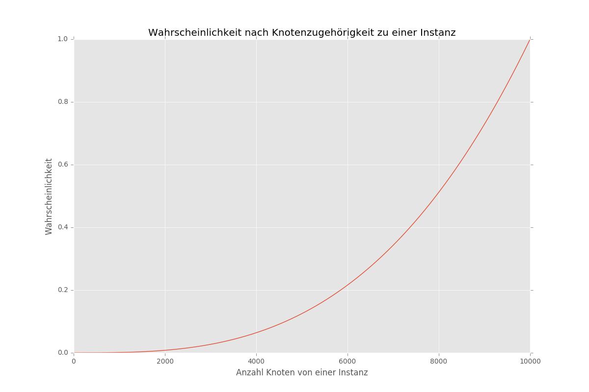

Übung 4
=======

4.1 Tor und Onion Routing
-------------------------

4.1.1
^^^^^

+-----------------+---------------+---------------+-----------+-----------------------------+---------+--------+
| Quelladresse    | Tor verwendet | Region        | City      | ISP                         | Lat     | Lon    |
+=================+===============+===============+===========+=============================+=========+========+
| 132.252.176.141 | -             | NRW           | Essen     | Universitaet Duisburg-Essen | 51.4566 | 7.0123 |
+-----------------+---------------+---------------+-----------+-----------------------------+---------+--------+
| 146.185.177.103 | X             | Noord-Holland | Amsterdam | Digital Ocean Inc.          | 52.3740 | 4.8897 |
+-----------------+---------------+---------------+-----------+-----------------------------+---------+--------+
| 192.42.116.16   | X             | Noord-Holland | Amsterdam | Not SURF Net                | 52.3740 | 4.8897 |
+-----------------+---------------+---------------+-----------+-----------------------------+---------+--------+
| 51.15.62.146    | X             | Ile-de-France | Paris     | Online SAS NL               | 48.8534 | 2.3488 |
+-----------------+---------------+---------------+-----------+-----------------------------+---------+--------+

Der verwendete ``User-Agent`` und das verwendete Betriebssystem ist jeweils dergleiche.

4.1.2
^^^^^

Zur Berechnung der Wahrscheinlichkeit, dass alle drei Relays eines Circuits zu einer Organisation gehören wird darauf verzichtet, die drei Bereiche ``Guard``-, ``Exit``- und Standard-Relay zu unterscheiden.

Wahrscheinlichkeit
""""""""""""""""""

:math:`n` ist die Anzahl aller Knoten im Netz. :math:`\alpha` ist die Anzahl der kontrollierten Knoten.

1 Knoten: :math:`\dfrac{\alpha}{n}`

2 Knoten: :math:`\dfrac{\alpha}{n} * \dfrac{(\alpha - 1)}{(n - 1)}`

3 Knoten: :math:`\dfrac{\alpha}{n} * \dfrac{(\alpha - 1)}{(n - 1)} * \dfrac{(\alpha - 2)}{(n - 2)}`

....

k Knoten: :math:`\dfrac{\alpha}{n} * \dfrac{(\alpha - 1)}{(n - 1)} * \dfrac{(\alpha - 2)}{(n - 2)}`

Code
++++

.. code-block:: python

    def control_probability(num_nodes, num_controlled=1):
        nominator = (num_controlled * (num_controlled - 1) * (num_controlled - 2))
        denominator = (num_nodes * (num_nodes - 1) * (num_nodes - 2))
        return nominator / denominator

    xy = [(i, control_probability(10000, i)) for i in range(10, 10001)]

    from matplotlib import pyplot as plt

    plt.plot([p[0] for p in xy], [p[1] for p in xy], '-')
    plt.title('Wahrscheinlichkeit nach Knotenzugehörigkeit zu einer Instanz')
    plt.xlabel('Anzahl Knoten von einer Instanz')
    plt.ylabel('Wahrscheinlichkeit')
    plt.show()

Darstellung
+++++++++++

4.1.3
^^^^^

Für echte anonyme Kommunikation benötigt man

- Verschleierung des Inhalts
- Verschleierung der Metadaten
- Verschleierung der Kommunikationspartner

Jede Form kann nicht umgesetzt werden. Inhalte werden zumindest durch HTTPS gesichert. Durch Tor können Ansatzweise die Kommunikationspartner verschleichert werden. Ein kritischer Punkt sind die Exit-Relays, weil an diesen die übermittelten Daten ohne Verwendung von HTTPS wieder sichtbar werden.

4.1.4
^^^^^

Tor macht eigentlich nur Sinn bei der Verwendung mit HTTPS. Wenn kein HTTPS verwendet wird sind die Eingaben einer Anfrage ab dem Exit-Relay wieder sichtbar. Ein Angreifer kann also zwischen Exit-Relay und der aufgerufenen Seite Daten wie z.B. Benutzernamen und Passwörter abgreifen.

4.1.5
^^^^^

Ein ``Hidden Service`` gewährleistet, dass die Kommunikation zwischen Client und Server innerhalb des Tor-Netzwerks erfolgt und dieses nicht verlässt. Das hat den Vorteil, dass der Datenverkehr zwischen Client und Server vollständig verschlüsselt ist. Zudem ist dem Server nicht bekannt, wer der Client ist.

Anders als beim normalen Verkehr in Tor sind nicht nur drei Relays beteiligt. Zum Rendevouspunkt besteht jeweils ein vollständiger Circuit zum Client und zum Server.

4.1.6
^^^^^

Durch die Verwendung von z.B. VPN erhält man als Client eine neue IP-Adresse, über die kommuniziert wird. Zudem kann über VPN eine Verschlüsselung eingesetzt werden. Nachteil ist, dass der eigentliche Verkehr zwischen Client und Dienst nicht zwingend verschlüsselt ist und auch die Metadaten offen übertragen werden.

Anders als bei Tor werden bei I2P Router und Tunnel eingesetzt. Der Router ist eine Software jeweils auf unterschdlichen Rechnern inklusive Client und Adressat. Über eine zentral verfügbare DHT werden Tunnel zwischen beiden Instanzen aufgebaut, wobei jeder Router den Datenverkehr zum nächsten Router verschlüsselt.

4.1.7
^^^^^

Eine mögliche Angriffsposition auf die Kommunikation im Tor-Netzwerk sind die Exit-Relays. Sollte der Verkehr nicht über HTTPS verschlüsselt sein ist der Datenverkehr zwischen Exit-Relay und Provider offen. Angreifer können sich z.B. als Exit-Relay ausgeben, um an entsprechende Daten zu kommen.
