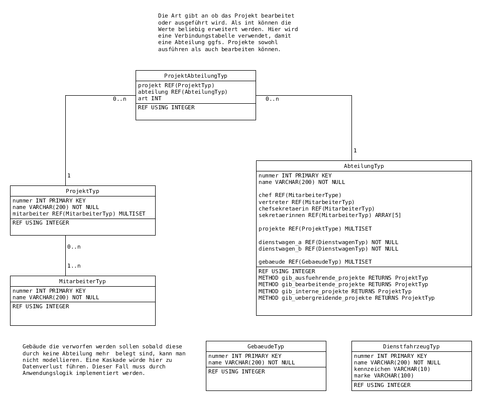

NSDBMS - Klausur SoSe 2009
==========================

Aufgabe 1
^^^^^^^^^

- Wenn Operationen auf DB-Ebene durchgeführt werden können profitieren alle Anwendungen von der implementierten Logik

    + weniger Code auf Anwendungsseite
    + Fehlervermeidung durch einmalige Implementierung

Aufgabe 2
^^^^^^^^^

.. literalinclude:: abteilungen.sql
   :language: SQL

Aufgabe 3
^^^^^^^^^

Teil a)

*Abfrage*: Gibt genau den Namen der Chefsekretärin jeder Abteilung aus.

.. code-block:: SQL

    SELECT chefsekretaerin->name
    FROM Abteilung

Teil b)

*Abfrage*: Gib für alle Projekte, die den Namen "Elchtest" haben und an denen die Abteilung mit der Nummer 1234 beteiligt ist, genau die Projektnr. aus.

.. code-block:: SQL

    SELECT *
    FROM Projekt AS p
    WHERE name = 'Elchtest'
        AND exists(
            SELECT *
            FROM ProjektAbteilung
            WHERE abteilung->nummer = 1234
                AND p.nummer = abteilung->nummer
        )

Teil c)

*Abfrage*: Gib genau den Namen aller Projekte aus, an denen ein Mitarbeiter mit dem Namen "Klinsi" beteiligt ist.

.. code-block:: SQL

    SELECT *
    FROM Projekt AS p
    WHERE exists(
        SELECT *
        FROM UNNEST(p.mitarbeiter) as m
        WHERE m.name CONTAINS 'Klinsi'
    )

Aufgabe 4
^^^^^^^^^

Teil a)

*Abfrage*: Alle Abteilungen ohne irgendwelche Projekte (AbteilungenOhneProjekteSicht). Hiermit ist gemeint, dass diese Sicht alle Abteilungen enthalten soll, allerdings ohne deren Projektinformationen, egal ob sie Projekte haben können oder nicht.

.. code-block:: SQL

    CREATE VIEW AbteilungenOhneProjekteSicht OF ProjektTyp AS (
        SELECT *
        FROM Abteilung as a
        WHERE NOT exists (
            SELECT *
            FROM UNNEST p.projekte
        )
    )

Teil b)

*Abfrage*: Alle Abteilungen ohne irgendwelche Projekte (siehe a.) mit mehr als 1000 Mitarbeitern (GrosseAbteilungenSicht) und alle mit weniger als 50 Mitarbeitern KleineAbteilungen-Sicht).

.. code-block:: SQL

    CREATE VIEW GrosseAbteilungenSicht OF AbteilungTyp UNDER AbteilungenOhneProjekteSicht AS (
        SELECT a
        FROM AbteilungenOhneProjekteSicht as a
        HAVING count(a.mitarbeiter) > 1000
    )

.. code-block:: SQL

    CREATE VIEW KleineAbteilungen OF AbteilungTyp UNDER AbteilungenOhneProjekteSicht AS (
        SELECT a
        FROM AbteilungenOhneProjekteSicht as a
        HAVING count(a.mitarbeiter) < 50
    )

Teil c)

*Abfrage*: Alle Abteilungen ohne irgendwelche Projekte (siehe a.) mit weniger als 50 Mitarbeitern, die als Dienstwagen einen BMW fahren (KleineAbteilungenMitBMWSicht).

.. code-block:: SQL

    CREATE VIEW KleineAbteilungenMitBMWSicht OF AbteilungTyp UNDER KleineAbteilungen AS (
        SELECT a
        FROM AbteilungenOhneProjekteSicht as a
        WHERE dienstwagen_a->name = 'BMW' OR dienstwagen_b->name = 'BMW')
    )

Teil d)

*Abfrage*: Alle Abteilungen, die keine Projekte ausführen können und mindestens vier Sekretärinnen haben

.. code-block:: SQL

    CREATE VIEW BearbeiterAbteilungen OF AbteilungTyp AS (
        SELECT a
        FROM Abteilung as a
        WHERE NOT a.koennen_projekte_ausfuehren
            AND CARDINALITY(a.sekretaerinnen) >= 4
    )
