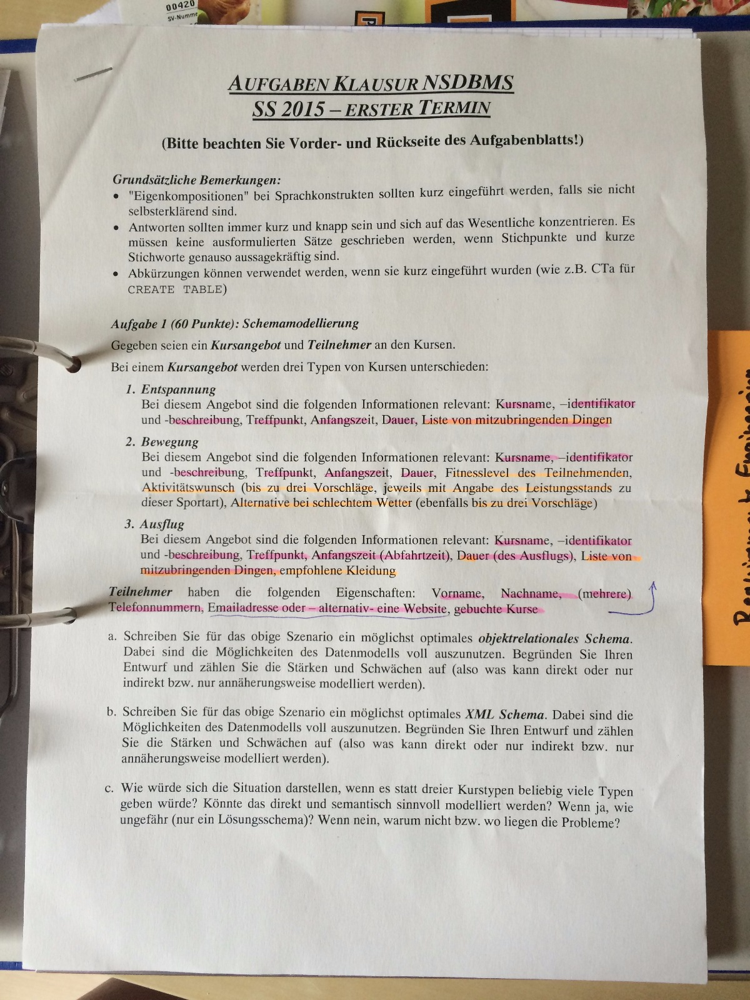
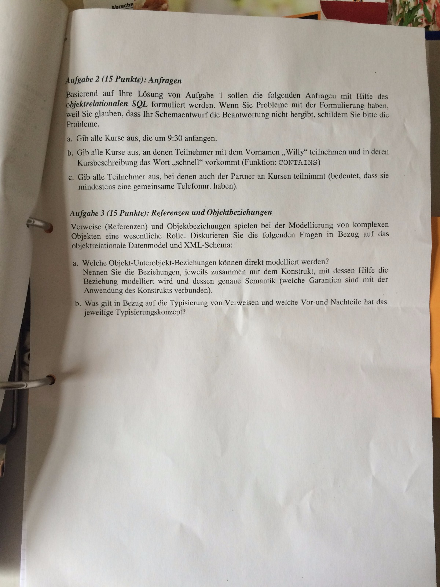

NSDBMS - Klausur SoSe 2015 - Kursangebot
========================================

Aufgabenblätter
---------------

Aufgabe 1
---------

Teil a
^^^^^^

.. literalinclude:: aufgabe_1_a.sql
   :language: SQL

Teil b
^^^^^^

.. literalinclude:: aufgabe_1_b.xml
   :language: SQL

Teil c
^^^^^^

Eine semantisch sinnvolle Modellierung ist an dieser Stelle nicht möglich, da eine Typsicherheit verloren geht. Man könnte technisch Kurse in XML durch das ``any``-Element und durch ``anyAttribute`` realisieren, aber es läge in der Verantwortung der Programme mit den entsprechend unbeschriebenen Daten umzugehen.

Aufgabe 2
---------

Teil a
^^^^^^

.. code-block:: SQL

    SELECT *
    FROM Kurs
    WHERE startzeit = TIME '09:30';

Teil b
^^^^^^

.. code-block:: SQL

    SELECT *
    FROM Kurs
    WHERE EXISTS (
        SELECT *
        FROM UNNEST(teilnehmer)
        WHERE name.vorname contains "Willy"
    );

Teil c
^^^^^^

.. code-block:: SQL

    SELECT *
    FROM Teilnehmer as t, UNNEST(t.telefonnummern) as tnummer
    WHERE EXISTS (
        SELECT *
        FROM Teilnehmer t2
        WHERE t.teilnehmerOID != t.teilnehmerOID
        AND tnummer = ANY t2.telefonnummern
        AND CARDINALITY(t2.gibAlleKurse()) > 0
    );

Aufgabe 3
---------

Teil a
^^^^^^

Die Frage zielt auf die Möglichkeiten (un)abhängig in Kombination exklusiv oder gemeinsam ab. Für SQL ist die Tabelle gefragt, mit den jeweiligen Verwendungen der Typkonstruktoren REF, ROW, ARRAY und MULTISET.
In XML können Abstraktionen durch die Verwendung von ``extension`` bzw. ``restriction`` auf ``complexContent`` bzw. ``simpleContent`` durchgeführt werden. Zudem ist in XML eine Verwendung von gemeinsam und abhängig möglich. Hier können aber Dateninkonsistenzen entstehen wenn das Elternobjekt des gemeinsam genutzten Elementes gelöscht wird.

Teil b
^^^^^^

In ORSQL sind Verweise typisiert. Bei Abfrage oder Eingabe von Daten kann man sich auf Typsicherheit verlassen. Bei XML ist Typsicherheit durch IDREF nicht garantiert. Vorteil von Typsicherheit liegt darin, dass genau mit den verwendeten Typen gerechnet werden kann. Die kann aber bei der Eingabe von Daten Einschränkungen haben. Typunsicherheit ist ansich flexibler, aber eine Anwendung kann ggfs. mit Daten oder geänderten Strukturen nichts anfangen.
