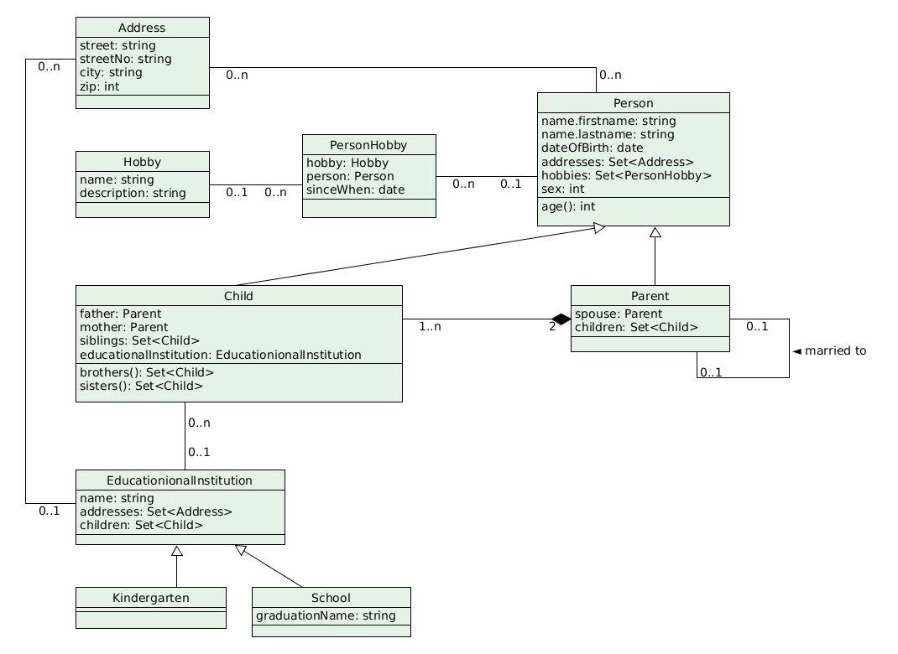

OR-Modellierung
===============

Diagramm
^^^^^^^^

Das gegebene Diagramm dient lediglich zur Veranschaulichung und zur Erleichterung bei der Formulierung von SQL-Statements. Es besteht die Möglichkeit der Unvollständigkeit.

SQL-Statements
^^^^^^^^^^^^^^

.. literalinclude:: solutions/exercise_2_OR_Modelling.sql
   :language: SQL
