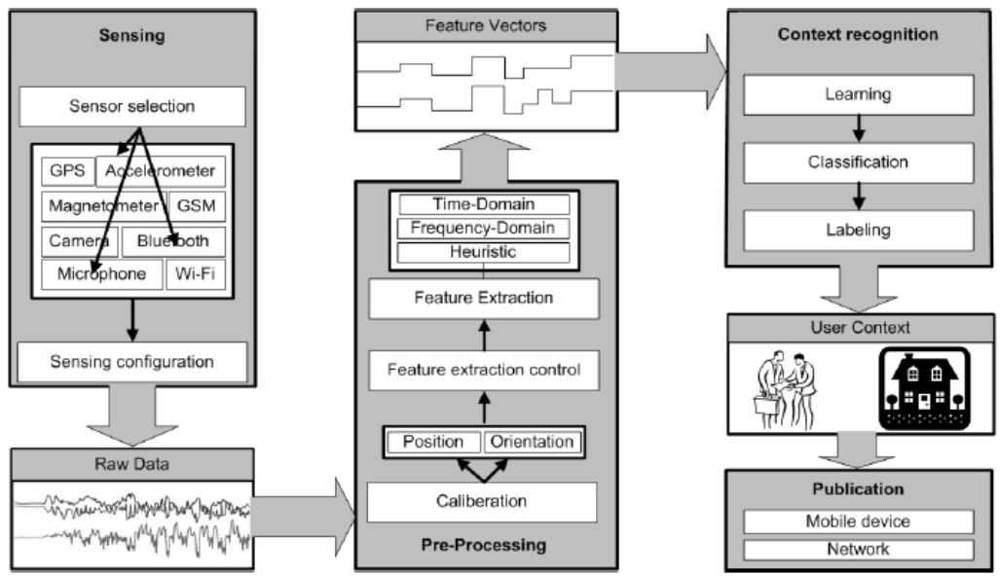
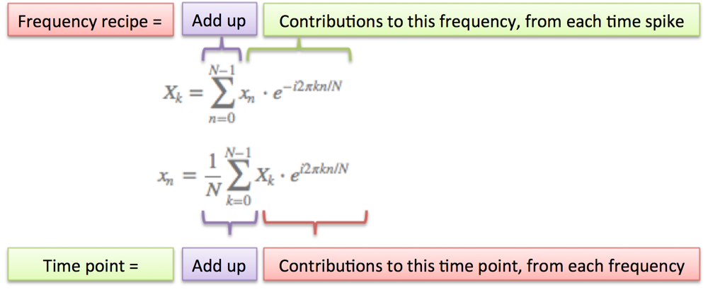
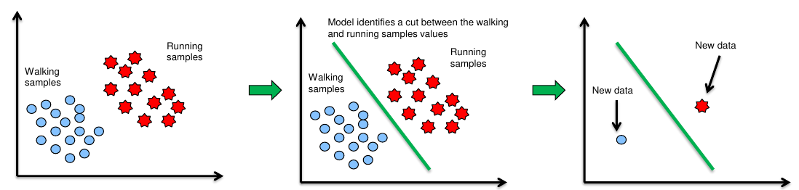
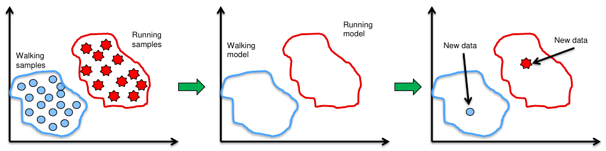
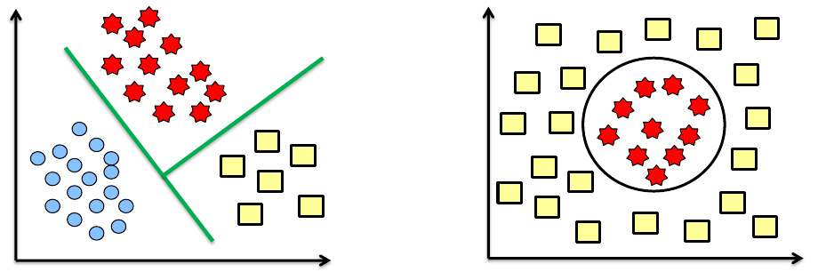

Context Acquisition
===================

Zur Ermittlung des Kontext in dem sich der Anwender befindet muss das System
klassifiziert werden.

Responsibility
    Push des Sensors an die Komponente/Pull der Komponente vom Sensor
Frequency
    Interval/Zeitpunkt
Source
    Sensor/Middleware/Context server die Daten zur Verfügung stellen
Sensor
    Typ des Sensors der zu Ermittlung verwendet wird

    physisch
        GPS, accelerometer, thermometer...

    virtuell
        Calendar, twitter status message...
    logisch
        Kombination aus physisch und virtuell z.B. Wetterdaten-Webdienst
Prozess
    Was wird ausgeführt (manuell/ermittelt/abgeleitet) um die Ermittlung
    auszuführen

    manuell
        Kontext wird durch direkten Input bereit gestellt. Hier hat zuvor eine
        Nutzerangabe stattgefunden! Bsp.: Wiederkehrender Termin im Kalender
        mit Benachrichrichtigungserinnerung

    ermittelt (``sensing``)
        Bsp.: Der Wert des Accelerometers steigt -> Der Nutzer fährt ggfs.
        mit dem Auto oder ist in die Bahn gestiegen.

Der Kontext wird in drei logischen Stufen ermittelt.

1. Datenaufnahme
2. Vorverarbeitung der ermittelten Daten
3. Klassifizierung der Feature Vektoren zu einem der Event Kategorien

.. hint:: Ein Feature Vektor ist eine mathemtische Größe der ermittelten Werte
    z.B. Min/Max/Mean, Wertebereich, Entropie, Bandbreite etc.

Sensing
-------

*Sensoren* bzw. Quellen:

- Smartphones/-watches/-networks
- Mikrofon
- Accelerometer (Beschleunigung)
- Gyroskop (Rotation um eine Achse)
- WiFi
- GPS
- Licht
- Temperatur/Luftfeuchtigkeit/Druck (DHT11)

Die meisten der Eingangssignale haben einen analogen Wert, wie z.B. Spannung,
Wiederstand oder Stromverbrauch. Dieser analoge Wert muss zur Verarbeitung in
einen digitalen Wert umgerechnet werden (ADC - Analog to Digital Conversion).
Soll das gemessene Signal wieder in einen analogen Output geschrieben werden
wird ein Digital zu analog-Konverter (DAC) benötigt. Viele Komponenten liefern
entsprechende Wandler mit.

Bei der Messung werden grundsätzlich folgende Konzepte eingehalten:

Sample
    Regelmäßige Zeitabstände zwischen den Messpunkten werden gehalten

Sampling
    Umwandlung der unabhängigen kontinuierlichen in diskrete Werte

Quantifizierung
    Umwandlung von abhängigen kontinuierlichen in diskrete Werte

Auflösung
    Wie ist der Wertebereich der diskreten Werte

Quantifizierungsfehler
    Wie groß ist der Fehler (Rundung) bei der Überführung von analogem in den
    diskreten Wert

Die Quantifizierung fügt einen Fehler (Noise) zum aufgenommenem Signal hinzu.
Dieser Fehler kann durch Dithering behoben werden. Hierbei wird ein zufälliger
kleiner Wert der Digitalisierung hinzugefügt.

.. hint:: Wie oft muss gesampelt werden? Das analoge Signal muss mindestens
    doppelt so schnell gesampelt werden wie die höchste Frequenzkomponente des
    analogen Eingangssignals ist. Bsp.: Ein Ton von 440Hz (440 Schwingungen
    pro Sekunde) soll aufgenommen werden. Samplerate >= 880 Werte pro Sekunde

Preprocessing
-------------

Ziel ist die Extraktion von Feature Vektoren. Die aufgenommenen Werte
(Samples) werden in Frames unterteilt, um z.B. ein Spektrum ermitteln zu
können.

*Beispiel*: Ein Schritt bei einem Spaziergang kann einem Frame entsprechen.

Wie wird aber die Framegröße ermittelt? Daumenregel ist die Verwendung wie
lange ein Phänomen normalerweise dauert. Für das genannte Beispiel dauert ein
Schritt ca. 0,8 Sekunden. Wenn z.B. Werte eines Sensors aufgenommen werden
geschieht diese in der Zeitdomäne (Schritt 1 bei 0,8, Schritt 2 bei 1,6...).
Für eine Ermittlung von Features kann es sinnvoll sein die ermittelten Daten
in die Frequenzdomäne zu überführen ( :math:`\frac{1}{0,8 Sekunden} = 1,25
Hz` ).

Fast Fourier Transform
^^^^^^^^^^^^^^^^^^^^^^

Die Eingabe für die Transformation ist ein **periodisches diskretes** Signal
in der Zeitdomäne.

.. math::

    X_k = \displaystyle\sum_{n=0}^{N-1} \mathrm{e}^{-i 2 \pi k n / N}

`An interactive guide to the fourier transform
<https://betterexplained.com/articles/an-interactive-guide-to-the-fourier-transform/>`_

Bekanntes Beispiel für die Fourier Transformation sind Noise cancelling
Kopfhörer. Es befindet sich ein Mikrofon im Kopfhörer, was die
Hintergrundgeräusche aufzeichnet. Durch Berechnung der Bestandteile kann für
jedes einzelne ein entsprechendes Gegensignal erzeugt werden, was im optimalen
Fall zu einer Entfernung dessen führt.

*Feature in der Zeitdomäne*:

- Min/Max/Mean
- Quadratisches Mittel
- Varianz/Standardabweichung

*Feature in der Frequenzdomäne*:

- Spektrales Zentrum
- Bandbreite

Machine Learning
----------------

ML kann verwendet werden, um die zuvor ermittelten Feature-Vektoren zu
klassifizieren. Handelt es sich z.B. um Sprache oder Musik?

supervised learning
    Lernen anhand von Ein- und Ausgabe

unsupervised learning
    Lernen von Pattern aus der Eingabe

Reinforcement learning
    Lernen anhand einer Belohnung. Hier wird die Umgebung als bekannt
    vorausgesetzt.

Klassifikation
^^^^^^^^^^^^^^

1. Aufnahme von Daten
2. Aufteilen von Test- und Trainingsdaten (normalerweise
   75% Training / 25% Test)
3. Auswahl eines Lernansatzes
4. Evaluation

Ziel ist die Minimierung des Generalisierungsfehlers.

Generalisierungsfehler
""""""""""""""""""""""

.. math:: MSE = Noise^2 + Bias(f(x))^2 + Var(f(x))

- x ist der Feature Vektor
- f(x) ist das gewählte Modell
- Noise ist der äußere unbeeinflussbare Fehler
- Bias ist der Fehler, der durch das Modell auftritt. Kein Modell kann zu
  100% zutreffen, weil diese limitiert sind.
- Der Varianzfehler ist der Fehler durch z.B. zu wenige Trainingsdaten
  auftritt

Die Noise ist nur schwer beeinflussbar. Fehler in Bias und Varianz führen zu
Over- und Under-fitting Problemen. Wenn z.B. ein zu einfaches Modell gewählt
wurde, kann es schnell zu einem Under-fitting kommen. Dann trifft das Modell
auf sehr wenige Punkte zu. Hier kann z.B. das Bestimmtheitsmaß im Falle einer
Regression ermitteln, ob ein Under-fitting vorliegt.

Bestimmtheitsmaß: :math:`R^2 = 1 - \frac{\sum{(y_i - \hat{y}_i)^2}}{\sum{(y_i - \bar{y}_i)^2}}`

Im Zähler sind die Summenquadrate der Fehler des gewählten Modells enthalten.
Diese Fehler vergleicht man gegen ein "richtig schlechtes Modell", welches im
Nenner steht. Das richtig schlechte Modell enthält einfach den Durchschnitt
aller Werte. Diese beiden Modelle vergleicht man gegeneinander. Je besser
das Modell liegt, desto niedriger wird der Zähler und das Endresultat nähert
sich eins an.

:math:`y_i`
    der aktuelle Wert

:math:`\hat{y}_i`
    der vom Modell ermittelte Wert an dieser Position

:math:`\bar{y}_i`
    der vom richtig schlechten Modell ermittelte Wert an dieser Position

Ein Over-fitting tritt dann auf, wenn das Modell zwar sehr gut auf die
Testwerte passt, aber zu speziell oder komplex ist. Durch hinzufügen von neuen
Testdaten passt sich das Modell immer wieder neu an.

Klassifizierungsmodelle
^^^^^^^^^^^^^^^^^^^^^^^

Discriminative models
    - **Entscheidungsbaum**
    - **Künstliche Neuronale Netze**
    - Hierarchische Modelle
    - Fuzzy
    - Clustering

Generative models
    - **Hidden Markov**
    - Bayesian classifiers
    - Bayesian network

Die diskriminierenden Modelle nehmen an, dass Beispieldaten aus demselben
Kontext ähnlich und Daten aus unterschiedlichen Kontexten auch unterschiedlich
sind.

Es wird eine harte Grenze zwischen zwei Mengen erstellt, die durch eine Gerade
darstellbar ist. Bei generativen Modellen wird die Menge genauer eingegrenzt.

Entscheidungsbaum
"""""""""""""""""

Über den Entscheidungsbaum wird ein Set an Attributen als Input verwendet.
Über eine Fallunterscheidung (Ja/Nein) wird der nächste Knoten des Baums
ausgewählt. Blätter des Baums enthalten die Klassifikation (Entscheidung).
Problem am Baum ist, dass er schnell zu groß/komplex werden kann und nicht
generalisiert. Attribute werden daran ausgewählt, wie groß die Differenz
in der resultierenden Klassifikation ist. Ein Zwischenknoten repräsentiert
ein Attribut. Eine Kante beschreibt den Vergleich auf einen Attributwert.

Da es sich hier um ein diskriminierendes Modell handelt werden lineare Grenzen
zwischen den Klassen entstehen.

Das Problem kann durch Kernel Machines gelöst werden. Die Idee ist die
einzelnen Features in eine höhere Dimension zu heben, um wieder eine lineare
Grenze ziehen zu können. Für eine Vielzahl von Problemen existieren bereits
Kernel Machines, die verwendet werden können. Das finden neuer Kernel Machines
ist aufwendig.

Künstliche Neuronale Netze
""""""""""""""""""""""""""

Als Hilfestellung für die erste Folie empfiehlt sich folgendes Video:

`Perceptron Part 1 <https://www.youtube.com/watch?v=ntKn5TPHHAk>`_

Passend dazu der Teil im Buch `The nature of code - neural networks
<https://natureofcode.com/book/chapter-10-neural-networks/>`_

In der Folie wird ein Bias erwähnt, der immer als zusätzlicher Input
hinzugefügt wird. Dieser Input ist notwendig damit die Eingabefunktion (Summe)
für bestimmte Eingaben, die immer 0 ergeben eben nicht 0 ergeben. Wichtig
zusätzlich ist die Learning rate. Bei Anpassung der Gewichte soll weder zu
langsam, noch zu schnell gelernt werden (am Problem vorbei gelernt). Damit das
nicht geschieht wird diese Rate bei der Anpassung der Gewichte hinzugerechnet.
Feed forward networks passen nur ihre Gewichte an und besitzen keinen internen
Status. Diese Back propagation ist nur beim supervised learning möglich, da
die Ausgabe bekannt sein muss.

Clustering
""""""""""

Wenn es bereits bestehenden Kontext und entsprechende Zuordnungen gibt, kann
über K Nearest Neighbors oder K-Means eine einfache Zuordnung neuer Eingaben
erfolgen. Bei KNN erfolgt eine Zuordnung auf Grund der Anzahl ``k`` Nachbarn,
die am nächsten sind und der Auswahl des größten Kontextzuordnung dieser
Knoten. Bei K-means findet im Gegensatz zu den zuvor genannten Verfahren ein
unsupervised learning statt. Es existiert eine Menge an Knoten die in ``k``
Cluster unterteilt werden sollen.

1. ``k`` Mittelpunkte werden per Zufall in den n-dimensionalen Raum geworfen
2. Es wird die kürzeste Distanz von jedem Knoten zum nächsten Mittelpunkt
   bestimmt und eine Zuordnung zum Mittelpunkt festgelegt
3. Die Position der Mittelpunkte von jedem Cluster werden anhand der
   Positionen der Knoten neu bestimmt
4. Schritte 2 und 3 werden solange durchgeführt, bis keine Änderungen der
   Positionen der Mittelpunkte mehr feststellbar ist

Hidden Markov
"""""""""""""

Bei Hidden Markov wird der vorige Zustand einen Prozesses mit in den
Lernprozess einbezogen. Wichtig zu wissen ist, dass die Menge der Zustände
und Wahrscheinlichkeiten der Übergange nicht bekannt sein muss (Hidden...).
Es gibt eine Menge an Zuständen, die beobachtet werden und eine Menge an
Zuständen die anhand der Beobachtungen ermittelt werden sollen.

`Machine Learning#44 Hidden Markov Modelle
<https://www.youtube.com/watch?v=Nqk_gPn2KS8>`_

`Predicting The Weather with Hidden Markov Models
<http://guizzetti.ca/blogs/lenny/2012/04/predicting-the-weather-with-hidden-markov-models/>`_

Erklärung zum Modell (Seite 85):

Mit einer Wahrscheinlichkeit von 0.5 ist der Startzustand ``Rain``, mit 0.5
ist es ``No Rain``.

.. math:: \left( \begin{array}{c} {\color{blue}Rain} \\\ {\color{orange}No Rain} \end{array}\right)
          = \left( \begin{array}{c} {\color{red}0.5} \\\ {\color{green}0.5} \end{array}\right)

1. Beobachtung: Umbrella

.. math:: \left( {\color{blue}\begin{array}{c} 0.7 \\\ 0.3 \end{array}}\right) * {\color{red}0.5}
          + \left( {\color{orange}\begin{array}{c} 0.3 \\\ 0.7 \end{array}}\right) * {\color{green}0.5}
          = \left( {\color{purple}\begin{array}{c} 0.5 \\\ 0.5 \end{array}}\right)

Wenn der Zustand ``Rain`` ist, wird mit einer Wahrscheinlichkeit von 0,7 der
nächste Zustand wieder ``Rain`` sein und mit 0,3 ``No Rain``. Das wird
verrechnet mit den 0,5 aus dem vorigen Zustand und summiert mit derselben
Verrechnung, wenn der Startzustand ``No Rain`` ist (Mit 0,3 Übergang nach
``Rain`` und 0,7 Verbleib in ``No Rain``). Die Summe ergeben die Verrechnung
für die Beobachtung.

.. math:: \left( \begin{array}{c} {\color{blue}0.8} \\\ {\color{orange}0.2} \end{array}\right) * \left( {\color{purple}\begin{array}{c} 0.5 \\\ 0.5 \end{array}}\right)
          = \left( \begin{array}{c} 0.4 \\\ 0.1 \end{array}\right)
          \rightarrow norm. \left( \begin{array}{c} 0.8 \\\ 0.2 \end{array}\right)

Der beobachtete Zustand ist Umbrella, also wird mit einer Wahrscheinlichkeit
von 0,8 der nächste Zustand wieder ``Rain`` sein, und mit 0,2 ``No Rain``. Das
wird verrechnet mit dem vorigen Ergebnis (lila). Daraus ergibt sich eine
normierte Wahrscheinlichkeit von 0,8 für ``Rain`` und 0,2 für ``No Rain``. Für
die nächsten Beobachtungen kann dasselbe Vorgehen durchgeführt werden, nur
dass mit den letzten Wahrscheinlichkeiten gearbeitet wird.

