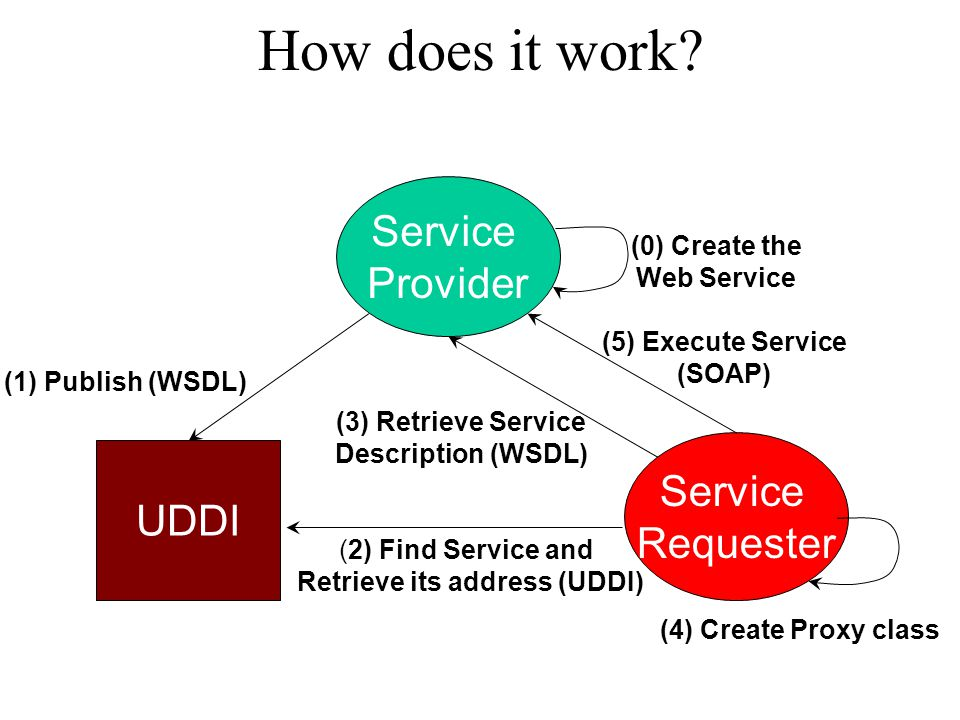
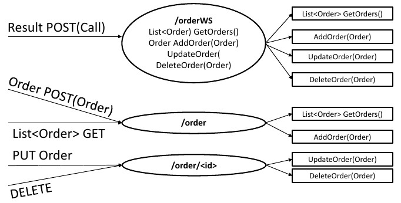
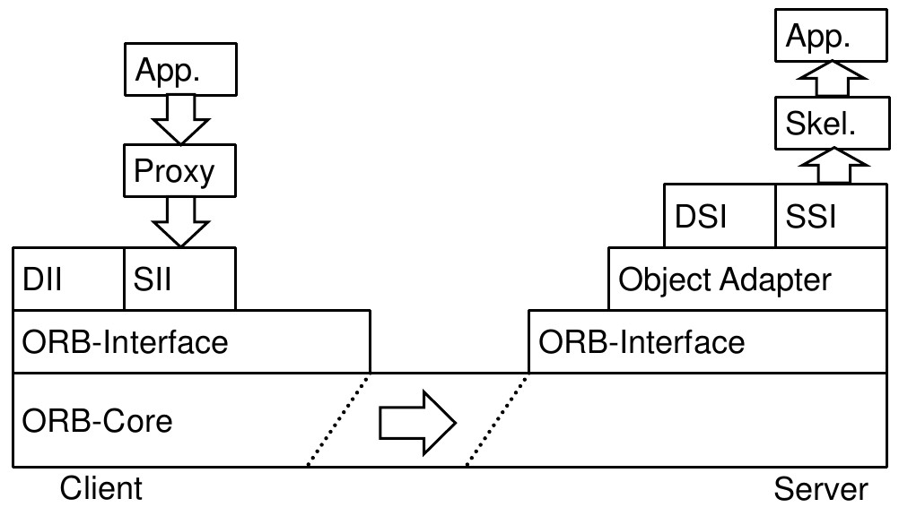
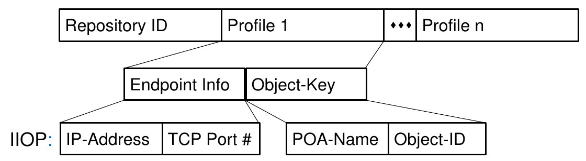

Middleware
==========

- Messaging
- WebServices (SOAP/REST)
- Remote Method Invocation (RMI)

    - nur das Konzept, nicht Java RMI als Implementierung
    - hier gehört auch CORBA hinzu

Messaging
---------

Interaktion von Prozessen durch den Austausch von "Nachrichten" nach dem
Producer/Consumer Modell. MOM (Message oriented middleware) löst die Kopplung
zwischen Sender und Empfänger. Hierdurch kann z.B. auch eine Persistierung,
Authentifizierung/Autorisierung etc. implementiert werden.

Eins <-> Eins
    Empfänger muss nicht immer derselbe sein. Versand erfolgt über eine Queue

Eins <-> Viele (publish-subscribe)
    Empfänger unterschreiben für ein bestimmtes Thema (Topic) und erhalten
    die gefilterten Nachrichten die von Sendern an die Middleware gesandt
    wurden.

Es kann als Client/Server System umgesetzt werden oder als Peer to Peer
System. Peer to Peer eliminiert das Single point of failure-Problem macht das
System aber komplexer.

*Beispiele*:

- Apache Active MQ
- IBM Websphere MQ
- JMS (Java Message Service)

    - JNDI zur Erzeugung einer Verbindung

*Wichtig*:

- Ermöglicht lose Kopplung durch die Asynchronität
- Reduzierung von Bottlenecks
- Erweiterbarkeit
- Schwierig zu debuggen
- Abstraktionen wie z.B. Synchronität schwierig umzusetzen

RPC
---

Ziel ist der Aufruf einer Prozedur/Funktion/Methode zwischen unterschiedlichen
Prozessen. Die Prozesse können auch auf unterschiedlichen Computern ausgeführt
werden. RPC ist synchron, d.h. Lieferung des Ergebnisses erst nach gesamter
Verarbeitung der Methode.

Parameter werden durch Call-by-value oder Call-by-reference weitergegeben.

Implementierung durch Stub/Proxy (Client) und Skeleton (Server).

In Übung 1 wurden auf Basis der spezifizierten IDL Proxy und Skeleton-Klassen
generiert. Vom Proxy musste keine spezielle erbende Klasse. implementiert
werden. Eine Verwendung als Client war direkt möglich. Für das Skeleton wurde
die Implementierung der in der IDL definierten Methode benötigt.

Übung 1 Testklasse
""""""""""""""""""

.. code-block:: Java

    // Erzeugung eines spezifischen Skeletons
    Producer_Skeleton skeleton = new Producer_Skeleton() {
        @Override
        public Type2 produce() {
            Type2 type2 = new Type2();
            type2.field1 = true;
            type2.field2 = 47.11;
            type2.field3 = "Hello world";
            type2.field4 = SAMPLE_LONG_ARRAY;
            type2.identifier = 123L;
            return type2;
        }
    };
    long skeletonId = Core.getInstance().getSimpleServiceRegistry().register(skeleton);

    // Erzeugung des Clients
    Producer_Proxy client = new Producer_Proxy();

    // Adressierung
    client.setIdentifier(new ObjectId("localhost", 4711, skeletonId));

    // Aufruf
    Type2 item = client.produce();

    // Validierung des Ergebnisses
    Assert.assertEquals(true, item.field1);
    Assert.assertEquals(47.11, item.field2, 0.0001);
    Assert.assertEquals("Hello world", item.field3);
    for (int i = 0; i < SAMPLE_LONG_ARRAY.length; i++) {

        Assert.assertEquals(SAMPLE_LONG_ARRAY[i], item.field4[i]);
    }

In der Testklasse ist bereits eine Adressierung per Hostname und Port
angegeben, die für diese Übung aber noch nicht benötigt wurde. Es genügt die
ID des Skeletons zu wissen, da eine Methode innerhalb eines Skeletons im
gleichen Prozess verwendet wird.

Generierte Klassen
""""""""""""""""""

Durch eine Generierung der Middleware werden viele Probleme durch manuelles
Schreiben behoben (Endianess, unterschiedliche Datentypen in einzelnen
Sprachen). Bei Datentypen werden zudem die (De-)Serialisierung auf
Applikationsebene (Abstract Syntax) und Netzwerkebene (Transfer Syntax)
unterschieden. Komplex wird es bei der Übertragung von Objekten/Strukturen.

Producer
^^^^^^^^

.. literalinclude:: ../../../../peco/middleware/generated-src/peco/de/hindenbug/aise/peco/Producer.java

Producer_Proxy
^^^^^^^^^^^^^^

.. literalinclude:: ../../../../peco/middleware/generated-src/peco/de/hindenbug/aise/peco/Producer_Proxy.java

Producer_Skeleton
^^^^^^^^^^^^^^^^^

.. literalinclude:: ../../../../peco/middleware/generated-src/peco/de/hindenbug/aise/peco/Producer_Skeleton.java

(De-)Serialisierung von Daten
^^^^^^^^^^^^^^^^^^^^^^^^^^^^^

Damit eine Nachricht korrekt gelesen werden kann gibt es unterschiedliche
Möglichkeiten. In der gezeigten Implementierung ist eine Nachricht zu Ende
wenn ein End of line (EOL) gesendet wird. Das ist leider auch eine schlechte
Umsetzung, da z.B. ein LF oder ein CRLF gesendet werden kann. Besser ist
das Setzen der Länge des Pakets an der ersten Stelle (das Paket ist n Bytes
lang).

Adressierung
""""""""""""

IP - Port
    muss konfiguriert werden

Programmnummer - Prozedurnummer
    wird ins Programm kompiliert

Für einen Lookup kann auch wieder ein separater Prozess (Port Mapper)
verwendet werden, da normalerweise ein Port für den Server dynamisch ermittelt
wird.

Web Services
""""""""""""

Üblich:

- TCP/IP
- HTTP(S)
- WSDL (Dienstbeschreibung)
- XML/JSON (Datenaustausch)

    - Mittlerweile beide Formate mit Schema versehbar
    - JAXB zur (De-)Serialisierung von XML in Java
    - Jackson zur (De-)Serialisierung von JSON in Java

- SOAP/REST (Nachrichten)
- UDDI (Lookup)

SOAP
""""

1. Nachrichtenformat
2. Transport Protokoll
3. Menge an Verarbeitungsregeln
4. Konventionen zur Implementierung von RPCs

SOAP envelope
    1. SOAP header
    2. SOAP body

SOAP Services werden durch eine WSDL beschrieben. Diese wird im Normalfall
durch annotierten Code generiert. Bereits bestehende Bibliotheken/Frameworks
stellen diese Daten bei Abruf zur Verfügung und rufen entsprechende
Objekte/Methoden/Funktionen bei Anfrage auf. Als Entwickler muss lediglich
die Methode annotiert werden.

UDDI
""""

REST
""""

RMI/CORBA
"""""""""

RMI ist der objektorientierte Ansatz als Erweiterung zum prozeduralen Ansatz
von RPC gedacht. CORBA ist ein Middleware Standart entwickelt durch die Object
Management Group. Elementar ist der ORB (object request broker), der die
Übertragung von Objekten übernimmt.

SII
    Static invocation interface

DII
    Dynamic invocation interface

SSI
    Static skeleton interface

DSI
    Dynamic skeleton interface - Kann z.B. bei der Interaktion mehrerer
    Services (Remote) mit einem Client wichtig sein.

Object Adapter
    Administrative Einheit zur Adressierung von mehreren Skeletons und deren
    Services.

.. important:: Ein Objekt in CORBA wird adressiert durch die Endpunktinformation und den Objektschlüssel bestehend aus dem Namen des Objekt Adapters und der Objekt-ID.

Das Transferformat in dem Daten in CORBA übertragen werden wird durch CDR
festgelegt, das Nachrichtenformat durch GIOP, Referenzen durch IOR.

*Standarddienste*:

Namensdienst
    Die Idee ist die Realisierung von "*White Pages*"-Anfragen. Es wird also
    direkt ein bestimmter Dienst angefragt.

Vermittlerdienst
    Im Gegensatz zum Namensdienst werden hier "*Yellow Page*"-Anfragen
    verarbeitet. "Welche Dienste berechnen X?". Der Trader beinhaltet Dienste,
    die sich registrieren und in regelmäßigen Abständen erreichbar sind
    (Ähnlich UDDI).

Ereignisdienst
    Ähnlich zur Message-oriented middleware. Beinhaltet dieselbe
    Funktionalität (Publish/Subscribe).
