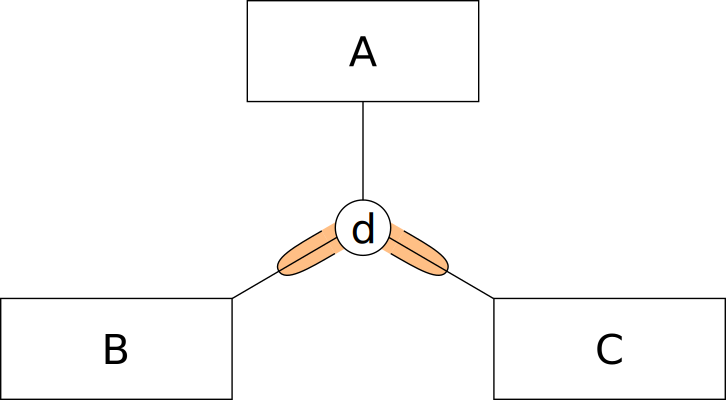

Übungsblatt 4: Datenmodellierung
================================

Tipps zur Modellierung (auch für die Klausur relevant):

1. Es spart Zeit bei der Bearbeitung, wenn Sie sich schon während des Lesens alle für das Modell wichtige Aspekte farblich markieren (Beispieisweise alle Entitaten in rotund alle Attribute in blau for die Datensicht).

2. Alternativ kann es auch helfen, den Textteil, der Modellierungsgegenstand ist, mit dem endsprechenden Modellelement zu markieren. Beispielsweise können Sie ein Rechteck um die Entität zeichnen, wenn Sie eine im Text gefunden haben, die modelliert werden soll.

3. Wenn aus Ihrer Sicht wichtige Informationen fehlen, die for das vollständige Lösen einer Aufgabe notwendig sind, dann dokumentieren Sie bitte alle Annahmen, die Sie treffen! So können wir Ihre Lösung besser nachvollziehen.

4. Es kann durchaus mehrere richtige Lösungen zur Modellierung eines Sachverhaltes geben! Es können aber auch Lösungen, die augenscheinlich richtig sind, falsch sein, da sie im Detail etwas anderes bedeuten. Achten Sie auf die genaue Semantik! Ist der Besitzer eines Fahrzeuges ein Attribut oder eine eigenständige Entität? Ist das Attribut "Versicherungsdauer" ein Attribut von "Fahrzeug" oder der Relation "versichert"?

Aufgabe 0
^^^^^^^^^

Finden Sie ein geeignetes Modellierungswerkzeug zum Erstellen von UML- und EER Diagrammen. Beispielsweise gibt es Microsoft Visio Professional 2013 kostenlos in der `Microsoft Campuslizenz <http://goo.gl/HTmVgY>`_ oder das ebenfalls kostenlose `PapyrusUML <http://www.papyrusuml.org>`_. Im Pool-Raum SA-202 ist fernen `SparxSystems Enterprise Architect <http://www.sparxsystems.com.au>`_ installiert.

Im Prinzip eignen sich auch Präsentationsprogramme wie Microsoft Powerpoint oder 0pen-Office Draw. Welches Werkzeug Sie verwenden spielt keine Rolle. Achten Sie aber darauf dass **die in der Vorlesung vorgestellte Notation** unterstützt wird! Teiiweise kann sich die Notation in den Tools im Detail unterscheiden.

Aufgabe 1 (13 Punkte)
^^^^^^^^^^^^^^^^^^^^^

Aufgabenstellung
----------------

Modellieren Sie folgende textuelle Anforderungen an ein Bibliothekssystem als Datenmodell (EER— Modell). Verwenden Sie ausschließlich die in der Vorlesung vorgestellte Notation. Für einige Relationen können Kardinalitäten abgeleitet werden, die ebenfalls modelliert werden sollen. Wenn Sie sich in einem Fall nicht sicher sind, wie die Kardinalität ist, so dokumentieren Sie bitte ihre Annahmen.

Textuelle Anforderung
---------------------

Im Bibliothekssystem sollen Bücher verwaltet werden, die durch Benutzer ausleihbar sind. Es muss zwischen Exemplaren und Medien unterschieden werden, da im Bibliothekssystem die physischen Bücher in den Regalen der Bibliothek durch eine Zuordnung von Exemplaren zu Medien dargestellt werden. Diese Darstellung erlaubt, mehrere Exemplare des gleichen Mediums verwalten zu können, ohne dass für jedes Exemplar alle Stammdaten redundant gespeichert werden müssen. Beispielsweise können so zwei Kopien des gleichen Mediums als eigene Exemplare dargestellt werden, bzw. verschiedene Auflagen und Bände eines Mediums verwaltet werden. Ein Medium besteht aus einer eindeutigen ID, einer ISBN-Nummer, einem Autor, einem Titel, einem Erscheinungsjahr, dem Band und dem Verlag. Diese Daten gelten jeweils für alle Exemplare dieses Mediums. Jedes Exemplar muss zudem noch eine eindeutige Bibliotheks-Signatur, sowie ein Datumsattribut haben, welches angibt, wann das Exemplar dem Bibliotheksbestand hinzugefügt worden ist. Medien können entweder Neuerscheinungen, Wiederauflagen oder sonstiges sein. Wiedererscheinungen unterscheiden sich von Neuauflagen insofern, dass Wiedererscheinungen in einem vorherigen Jahr bereits erschienen sind, was natürlich als Datumsattribut dokumentiert werden muss. Exemplare sind entweder digital als PDF vorhanden oder sind gedruckte Ausgaben im Hardcover-Format oder als Taschenbuch.

Nutzer der Bibliothek sollen im Bibliothekssystem gesondert behandelt werden. Für jeden Nutzer müssen Vor- und Nachname sowie die Adresse, die aus Straße, Postleitzahl, und Ort besteht festgehalten werden. Nutzer sollen beliebig viele Exemplare ausleihen können. Es wird zu jeder Ausleihe dokumentiert, wann ein Exemplar ausgeliehen wurde und wann es zurückgegeben wurde. Des Weiteren sollen Benutzer sich jeden Monat ein neues Exemplar wünschen können. Die Exemplare werden dann von der Beschaffungsstelle gekauft. Das Wunschdatum sowie der Nachname des Benutzers muss dokumentiert werden, um sicher zu stellen, dass nur ein Wunsch pro Benutzer und Monat bearbeitet wird.

Lösung
------

Aufgabe 2 (2 Punkte)
^^^^^^^^^^^^^^^^^^^^

Aufgabenstellung
----------------

Gegeben seien die folgenden vier Beschreibungen von Relationen zwischen drei Klassen sowie die folgenden vier Modelle. Geben Sie zu jeder Beschreibung das Modell an, welches die korrekte Relation zwischen den drei Klassen darstellt.

Beschreibungen der Relationen
-----------------------------

1. Eine Entität der Oberklasse A kann zur Unterklasse B und zur Unterklasse C gehören.
2. Eine Entität der Oberklasse A gehört zu Unterklasse B, zu Unterklasse C, zu irgendeiner anderen Unterklasse, oder zu allen möglichen Unterklassen.
3. Eine Entität der Oberklasse A gehört zur Unterklasse B oder zur Unterklasse C oder zu beiden Unterklassen, aber sonst zu keiner anderen.
4. Eine Entität der Oberklasse A gehört zu der Unterklasse B, aber nicht zur Unterklasse C.
5. Eine Entität der Oberklasse A gehört zu genau einer der Unterklassen B oder C oder zu genau einer anderen Unterklasse.
6. Eine Entität der Oberklasse A gehört zu genau einer der Unterklassen B und C und zu keiner anderen Unterklasse.

a)

b)

c)

d)

Lösung
------

EER kam in der Vorlesung nicht vor.
