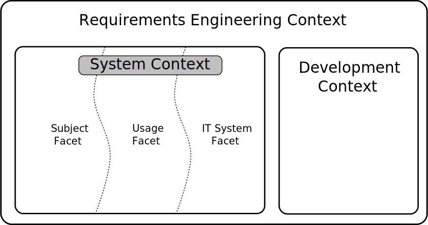
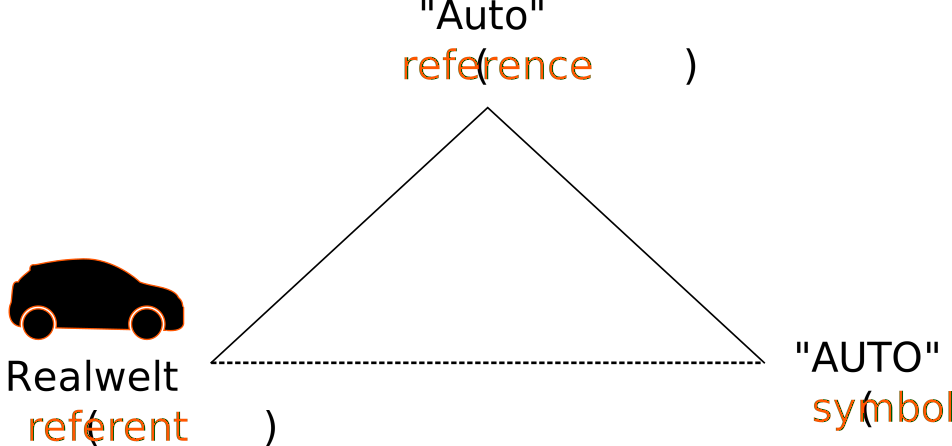
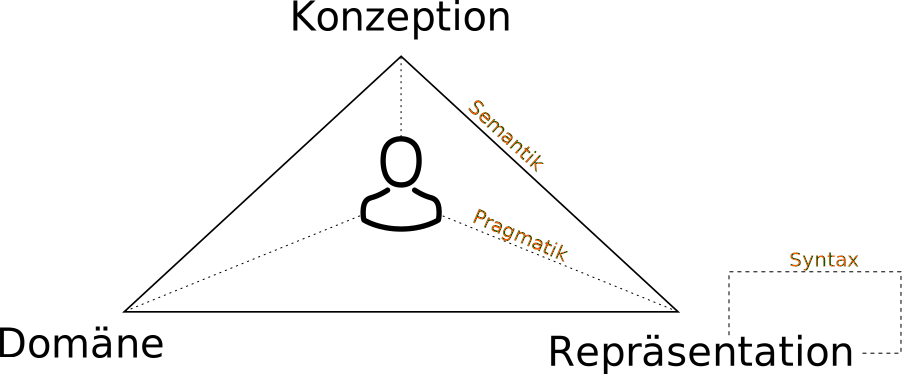

Introduction and Fundamentals I
===============================

How are the terms "requirements engineering" and "requirements" defined?
^^^^^^^^^^^^^^^^^^^^^^^^^^^^^^^^^^^^^^^^^^^^^^^^^^^^^^^^^^^^^^^^^^^^^^^^

*Requirements engineering* ist definiert durch die drei Dimensionen *Content*, *Documentation* und *Agreement*. Es ist der Prozess, der während der Durchführung des Projektes statt finden. Alle Beteiligten legen die umzusetzenden Inhalte fest. Es muss eine Übereinstimmung und darauf folgende Dokumentation der der Inhalte erfolgen.

Ein *Requirement* (Anforderung) ist eine Bedingung oder Fähigkeit, die ein System erfüllen muss, um das Problem eines Nutzers lösen zu können. Eine Anforderung muss dokumentiert und durch die Nutzer akzeptiert sein.

Name the three goals of requirements engineering!
^^^^^^^^^^^^^^^^^^^^^^^^^^^^^^^^^^^^^^^^^^^^^^^^^

- ``Content``
- ``Agreement``
- ``Documentation``

How are the three dimensions interrelated?
^^^^^^^^^^^^^^^^^^^^^^^^^^^^^^^^^^^^^^^^^^

Die drei Dimensionen stehen jeweils senkrecht zueinander und beeinflussen sich gegenseitig. So kann ein Wachstum in der Agreement Dimension zu geringerer Dokumentation führen.

What is the goal of each dimension?
^^^^^^^^^^^^^^^^^^^^^^^^^^^^^^^^^^^

:Agreement: Einigung der Nutzer auf Anforderungen
:Documentation: Festhalten, der durch die Nutzer festgelegten Anforderungen
:Content: Das Verständnis der Nutzer des Systems

Which types of requirements do you know?
^^^^^^^^^^^^^^^^^^^^^^^^^^^^^^^^^^^^^^^^

- ``Functional``
- ``Quality``
- ``Constraint``

Introduction and Fundamentals II
================================

What is a non-functional requirement?
^^^^^^^^^^^^^^^^^^^^^^^^^^^^^^^^^^^^^

Eine nicht funktionale Anforderung ist meistens durch die Nutzer nicht ausreichend verstanden und auch nicht ausreichend dokumentiert, können aber als *nicht-funktional* dennoch akzeptiert werden.

Which types of constraints do you know?
^^^^^^^^^^^^^^^^^^^^^^^^^^^^^^^^^^^^^^^

:Kulturell: z.B. müssen bestimmte Symbole ausgeschlossen werden
:Organisatorisch: z.B. Projektabgabe
:Physisch: z.B. durch Witterung bedingte Anforderungen (-10°C - 50°C)
:Recht: z.B. Festlegungen durch die Straßenverkehrsordnung

Name the key interactions between requirements engineering and organizational processes.
^^^^^^^^^^^^^^^^^^^^^^^^^^^^^^^^^^^^^^^^^^^^^^^^^^^^^^^^^^^^^^^^^^^^^^^^^^^^^^^^^^^^^^^^

- ``Marketing``
- ``Product Management``
- ``Customer Relationship Management``

What are the key interactions between requirements engineering and other development activities?
^^^^^^^^^^^^^^^^^^^^^^^^^^^^^^^^^^^^^^^^^^^^^^^^^^^^^^^^^^^^^^^^^^^^^^^^^^^^^^^^^^^^^^^^^^^^^^^^

- ``Design``
- ``Quality Assurance``
- ``(Project Management)``
- ``(System Maintenance)``

What is the main goal of systems analysis?
^^^^^^^^^^^^^^^^^^^^^^^^^^^^^^^^^^^^^^^^^^

Das Hauptziel ist das Verständnis und die Definition von Anforderungen von bestehenden Systemen oder Prozessen in Bezug auf deren Funktion, Daten und Verhalten.

What are the shortcomings of requirements engineering as an early development phase?
^^^^^^^^^^^^^^^^^^^^^^^^^^^^^^^^^^^^^^^^^^^^^^^^^^^^^^^^^^^^^^^^^^^^^^^^^^^^^^^^^^^^

- Keine Kontinuität beim Prozess des Requirement engineering
- Analyse der Ist-Situation
- Keine Widerverwendung der bestehenden Anforderungen
- Zu enger focus auf das Gesamtbild

Describe the concept of requirements engineering as a cross-lifecycle activity.
^^^^^^^^^^^^^^^^^^^^^^^^^^^^^^^^^^^^^^^^^^^^^^^^^^^^^^^^^^^^^^^^^^^^^^^^^^^^^^^

Zwischen der Entwicklung des Systems und der Anforderungserhebung finden ständig Interaktionen statt. Man wechselt kontinuierlich zwischen beiden Aktivitäten. Zu diesem Zweck können z.B. Systeme wie ``Scrum`` oder ``Extreme Programming`` verwendet werden.

What are the advantages of establishing requirements engineering as a distinct organisational process?
^^^^^^^^^^^^^^^^^^^^^^^^^^^^^^^^^^^^^^^^^^^^^^^^^^^^^^^^^^^^^^^^^^^^^^^^^^^^^^^^^^^^^^^^^^^^^^^^^^^^^^

- Änderungen können schneller erfasst und ggfs. umgesetzt werden
- Die Konsistenz des Systems auf einem aktuellen Stand und kann in der Dokumentation nachgelesen werden
- Das System kann variabler entwickelt werden

Framework for Requirements
==========================

What are the characteristics of a vision?
^^^^^^^^^^^^^^^^^^^^^^^^^^^^^^^^^^^^^^^^^

- Definiert die Absicht einer Änderung
- Kurz und prägnant
- Anleitung zur Entwicklung der Anforderungen
- Was steht im Vordergrund, nicht wie

What is the purpose of the framework for requirements engineering?
^^^^^^^^^^^^^^^^^^^^^^^^^^^^^^^^^^^^^^^^^^^^^^^^^^^^^^^^^^^^^^^^^^

- Strukturierung der Anforderungserhebung
- Referenz für Kunden, aber auch für Entwickler

    + Training der Beteiligten
    + Analyse der Stärken und Schwächen in der Erhebung

How is the requirements engineering context structured?
^^^^^^^^^^^^^^^^^^^^^^^^^^^^^^^^^^^^^^^^^^^^^^^^^^^^^^^

Name and describe the core activities of requirements engineering.
^^^^^^^^^^^^^^^^^^^^^^^^^^^^^^^^^^^^^^^^^^^^^^^^^^^^^^^^^^^^^^^^^^

:Documentation: Formulierung von Anforderungen in einem festgelegten Format
:Elicitation: Erhebung von neuen und bereits bestehenden und relevanten Anforderungen
:Negotiation: Identifizierung von Konflikten, deren Analyse, Auflösung und Dokumentation

Name and describe the types of requirements artefacts used during requirements engineering.
^^^^^^^^^^^^^^^^^^^^^^^^^^^^^^^^^^^^^^^^^^^^^^^^^^^^^^^^^^^^^^^^^^^^^^^^^^^^^^^^^^^^^^^^^^^

:Goals: Abstrakte Form einer Eigenschaft, die im System realisiert werden soll
:Scenarios: Konkrete Beispiel, wann einer abstrakte Eigenschaft zutrifft oder fehl schlägt
:Solution Oriented Requirements: Genaue Formulierung der Scenarios in Form von in Daten, Funktion und Verhalten

What are the goals of the cross-sectional activities (i.e.,validation and management)?
^^^^^^^^^^^^^^^^^^^^^^^^^^^^^^^^^^^^^^^^^^^^^^^^^^^^^^^^^^^^^^^^^^^^^^^^^^^^^^^^^^^^^^

- ``Validation``

    + Validierung der Anforderungsartefakte (``requirement artefacts``)
    + Validierung der Kernaktivitäten (``core activities``)
    + Validierung des Kontext (``context consideration``)

- ``Management``

    + Management der Anforderungsartefakte
    + Management der Kernaktivitäten
    + Management des Kontext

Context I
=========

Can a requirement be defined without knowing the context the system is embedded/operating in?
^^^^^^^^^^^^^^^^^^^^^^^^^^^^^^^^^^^^^^^^^^^^^^^^^^^^^^^^^^^^^^^^^^^^^^^^^^^^^^^^^^^^^^^^^^^^^

Eine Anforderung ist immer in einem bestimmten Kontext, für das ein System entwickelt wird, definiert.

What influence does the context has?
^^^^^^^^^^^^^^^^^^^^^^^^^^^^^^^^^^^^

Der Kontext beeinflusst die Anforderungen, die ein System erfüllen muss

What are system context objects?
^^^^^^^^^^^^^^^^^^^^^^^^^^^^^^^^

Systemkontextobjekte sind materielle und immaterielle Objekte, die sich im Systemkontext befinden.

Describe typical examples of material and immaterial context objects.
^^^^^^^^^^^^^^^^^^^^^^^^^^^^^^^^^^^^^^^^^^^^^^^^^^^^^^^^^^^^^^^^^^^^^

- materiell

    + Stakeholder
    + Dokumentationen
    + Hardware

- immateriell

    + Organisationen
    + Prozesse
    + Daten

How can the system context be structured?
^^^^^^^^^^^^^^^^^^^^^^^^^^^^^^^^^^^^^^^^^

Der Systemkontext kann in die drei Facetten ``Usage``, ``Subject`` und ``IT System`` unterteilt werden.

What are the relations in this structure?
^^^^^^^^^^^^^^^^^^^^^^^^^^^^^^^^^^^^^^^^^

In der Benutzungsfacette (``Usage``) befinden sich immaterielle Repräsentationen der verwendeten Objekte. In der Subjektfacette (``Subject``) sind die materiellen Objekte der Repräsentationen. In der IT-System-Facette befinden sich alle Objekte, die zur Datenverarbeitung der materiellen Objekte vorhanden sein müssen.

In der Übung anders definiert!

Why should properties and relationships of context objects be considered?
^^^^^^^^^^^^^^^^^^^^^^^^^^^^^^^^^^^^^^^^^^^^^^^^^^^^^^^^^^^^^^^^^^^^^^^^^

Eigenschaften und Beziehungen von Objekten können sich während der Entwicklung ändern, daher müssen diese zu den Objekten erfasst werden. Zudem sind sie wesentliche Bestandteile der Objekte und sind zwingend zur vollständigen Dokumentation erforderlich.

Context II
==========

Why should the development context be considered during RE?
^^^^^^^^^^^^^^^^^^^^^^^^^^^^^^^^^^^^^^^^^^^^^^^^^^^^^^^^^^^

Die Entwicklung des Systems beeinflusst die Anforderungserhebung, wie z.B. durch Richtlinien in Bezug auf die Systemumgebung, Budget, Entwicklungszeit

How is the requirements engineering context structured?
^^^^^^^^^^^^^^^^^^^^^^^^^^^^^^^^^^^^^^^^^^^^^^^^^^^^^^^

- ``system context objects``
- ``requirements engineering context objects``
- ``development context objects``

What are the benefits of structuring the RE context?
^^^^^^^^^^^^^^^^^^^^^^^^^^^^^^^^^^^^^^^^^^^^^^^^^^^^

- Beteiligten wird die Identifizierung von Kontextobjekten erleichtert, wonach man genau unterscheiden kann, was in das RE gehört und was nicht.
- Die Qualität der Anforderungsspezifikation wird erhöht

Name typical examples for additional requirements engineering context objects?
^^^^^^^^^^^^^^^^^^^^^^^^^^^^^^^^^^^^^^^^^^^^^^^^^^^^^^^^^^^^^^^^^^^^^^^^^^^^^^

passiv:

- Handbuch des Vorgängersystems
- Datenbankschema
- User interface

aktiv:

- Kundendaten
- Prozessmodifikationen

Which role can a RE context objects have?
^^^^^^^^^^^^^^^^^^^^^^^^^^^^^^^^^^^^^^^^^

- ``Active``
- ``Passive``

Which RE context object can be changed during RE and development?
^^^^^^^^^^^^^^^^^^^^^^^^^^^^^^^^^^^^^^^^^^^^^^^^^^^^^^^^^^^^^^^^^

Objekte, die zum System gehören können während des RE geändert werden. Systemkontextobjekte können nicht geändert werden.

Why is there a grey zone between the system and the system context?
^^^^^^^^^^^^^^^^^^^^^^^^^^^^^^^^^^^^^^^^^^^^^^^^^^^^^^^^^^^^^^^^^^^

Es gibt Objekte, bei denen keine klare Zuordnung zum System oder zum Kontext gemacht werden kann.

Can this grey zone change? If so, how?
^^^^^^^^^^^^^^^^^^^^^^^^^^^^^^^^^^^^^^

Die kleinste Zone ist das System boundary. Diese Zone ist umgeben von der grauen Zone und widerum umgeben vom Systemkontext. Objekte können zwischen allen drei Bereichen wechseln. Dabei kann die graue Zone übersprungen werden.

With which type of context object does the system interact?
^^^^^^^^^^^^^^^^^^^^^^^^^^^^^^^^^^^^^^^^^^^^^^^^^^^^^^^^^^^

Das System interagiert über Schnittstellen (``system interfaces``) mit den Kontextobjekten und umgekehrt.

Conceptual Modelling I
======================

What is the meaning of the term "model"?
^^^^^^^^^^^^^^^^^^^^^^^^^^^^^^^^^^^^^^^^

Das Modell ist eine Abstraktion auf ein Realweltobjekt aus dem Diskursuniversum. Dieses Universum beinhaltet jeden Teil, der für das System in Betracht gezogen werden muss.

.. epigraph::

   Unter einem Diskursuniversum versteht man in der Logik und Sprachphilosophie die Gesamtheit der Gegenstände, auf die sich Aussagen wie "alle Gegenstände sind ... " (Allaussage) oder "es gibt keine Gegenstände, die ... sind" (negative Existenzaussage) beziehen.

   -- Wikipedia

What are the typical properties of conceptual models?
^^^^^^^^^^^^^^^^^^^^^^^^^^^^^^^^^^^^^^^^^^^^^^^^^^^^^

- reduction property
- extension property

What is the role of abstraction in conceptual modelling?
^^^^^^^^^^^^^^^^^^^^^^^^^^^^^^^^^^^^^^^^^^^^^^^^^^^^^^^^

Es sollen irrelevante Informationen herausgefiltert werden.

Which reduction principles do you know?
^^^^^^^^^^^^^^^^^^^^^^^^^^^^^^^^^^^^^^^

:Selection: Teile die einfließen
:Aggregation: Kombinierung von Teilen bzw. Aspekten
:Classification: Gemeinsamkeiten werden in Generalisierungen zusammengefasst.

Which extension principles do you know? What does it mean to "extend" a model? When does an extension makes sense?
^^^^^^^^^^^^^^^^^^^^^^^^^^^^^^^^^^^^^^^^^^^^^^^^^^^^^^^^^^^^^^^^^^^^^^^^^^^^^^^^^^^^^^^^^^^^^^^^^^^^^^^^^^^^^^^^^^

Nicht im Skript genannt.

What is defined by the Semiotic Triangle? Explain the key concepts.
^^^^^^^^^^^^^^^^^^^^^^^^^^^^^^^^^^^^^^^^^^^^^^^^^^^^^^^^^^^^^^^^^^^

:Referent: Realweltobjekt
:Symbol: Die sprachliche Bezeichung des Objekts
:Reference: Das Bild, was eine Person zum ``Referent`` und ``Symbol`` im Kopf hat

Zwischen dem Symbol und dem Referent gibt es keine direkte Beziehung. Die Sprache ist abhängig von der Person und kann andere Bedeutungen haben.

What is the difference between the Semiotic Triangle and the Semiotic Tetrahedron? Explain the key concepts.
^^^^^^^^^^^^^^^^^^^^^^^^^^^^^^^^^^^^^^^^^^^^^^^^^^^^^^^^^^^^^^^^^^^^^^^^^^^^^^^^^^^^^^^^^^^^^^^^^^^^^^^^^^^^

Semiotic Tetrahedron
--------------------

:Domain: Ist das Diskursuniversum
:Conception: Das Bild des Realweltobjektes (entspricht etwa der ``Reference``)
:Representation: Beschreibung des Objekts, vom ``Actor``
:Actor: Interpret oder Designer des Models

Das semiotische Dreieck dient als reine Beschreibung des Objekts, während im Tetrahedron auch auf die Änderungen eingegangen wird. Es erweitert das Dreieck um eine Person, die entweder die Rolle des Erstellers oder des Interpreten annimmt.

Which transformation effects can occur during model construction?
^^^^^^^^^^^^^^^^^^^^^^^^^^^^^^^^^^^^^^^^^^^^^^^^^^^^^^^^^^^^^^^^^

1. Repräsentation (``representation``), ``conception`` -> ``representation``
2. Wahrnehmung (``perception``), ``domain`` -> ``conception``

Which transformation effects can occur during model interpretation?
^^^^^^^^^^^^^^^^^^^^^^^^^^^^^^^^^^^^^^^^^^^^^^^^^^^^^^^^^^^^^^^^^^^

1. Interpretation (``interpretation``), ``conception`` -> ``domain``
2. Zuweisung (``association``), ``representation`` -> ``conception``

Conceptual Modelling II
=======================

How can the quality of conceptual models be assessed?
^^^^^^^^^^^^^^^^^^^^^^^^^^^^^^^^^^^^^^^^^^^^^^^^^^^^^

Qualität der ...

- Syntax
- Semantik
- Pragmatik

What are the key benefits of conceptual modelling in requirements engineering?
^^^^^^^^^^^^^^^^^^^^^^^^^^^^^^^^^^^^^^^^^^^^^^^^^^^^^^^^^^^^^^^^^^^^^^^^^^^^^^

- Fokussierung auf einem spezifischen Zweck
- Einfach zu verstehen und zu merken
- Vereinfachung
- Förderung der Kommunikation durch zweckbasierte Abstraktion
- Besseres Verständnis zur Problemlösung
- Bessere Möglichkeiten zur Automatisierung

How can modelling languages be defined?
^^^^^^^^^^^^^^^^^^^^^^^^^^^^^^^^^^^^^^^

1. Semantik
2. abstrakte Syntax
3. Notation
4. konkrete Syntax

Die konkrete Syntax ist die genaueste Beschreibung eines Modells und enthält alles Details. Von der Semantik wird versucht über die unterschiedlichen Stufen bis zu einer konkreten Syntax zu kommen.

Which modelling layers do you know? Explain them!
^^^^^^^^^^^^^^^^^^^^^^^^^^^^^^^^^^^^^^^^^^^^^^^^^

:Meta-meta-model: Grobe Definition (``MOF 2.0``)
:Meta-models: UML Klassendiagramm
:Application models: Konkretes Klassendiagramm
:Concrete objects: Ausgeprägte Daten

Der Begriff `Meta Object Facility <https://de.wikipedia.org/wiki/Meta_Object_Facility>`_ (MOF) wurde von der Object Management Group (OMG) eingeführt und beschreibt eine spezielle Metadaten-Architektur.

Solution-Oriented Requirements – Data Modelling I
=================================================

.. _sor_perspectives:

What are the three perspectives on solution-oriented requirements?
^^^^^^^^^^^^^^^^^^^^^^^^^^^^^^^^^^^^^^^^^^^^^^^^^^^^^^^^^^^^^^^^^^

- ``Data model``
- ``Behavioural model``
- ``Functional model``

.. _sor_data_model_aspects:

What aspects of a system are modelled in the data perspective?
^^^^^^^^^^^^^^^^^^^^^^^^^^^^^^^^^^^^^^^^^^^^^^^^^^^^^^^^^^^^^^

- Entitäten
- Attribute
- Relationen

What is the relation between data modelling and the four modelling layers (M0-M3)?
^^^^^^^^^^^^^^^^^^^^^^^^^^^^^^^^^^^^^^^^^^^^^^^^^^^^^^^^^^^^^^^^^^^^^^^^^^^^^^^^^^

Innerhalb des ``data modelling`` wird genau wie in den unterschiedlichen Ebenen das Datenmodell entworfen. Die unterschiedlichen Ebenen sind dabei unterschiedlich genau in Bezug auf das Modell.

Which aspects of a system are modelled in the data perspective?
^^^^^^^^^^^^^^^^^^^^^^^^^^^^^^^^^^^^^^^^^^^^^^^^^^^^^^^^^^^^^^^

siehe :ref:`sor_data_model_aspects`

What are the modelling constructs of the ER model?
^^^^^^^^^^^^^^^^^^^^^^^^^^^^^^^^^^^^^^^^^^^^^^^^^^

- ``Entity``
- ``Attribute``
- ``Relationship``
- ``Cardinality``

Explain the cardinality constraints using an own example?
^^^^^^^^^^^^^^^^^^^^^^^^^^^^^^^^^^^^^^^^^^^^^^^^^^^^^^^^^

Die Kardinalität beschreibt wie viele Objekte minimal und maximal an einer Beziehung teilnehmen. Beispiel Bus und Passagiere:

In jedem Fall nimmt ein Bus an der Beziehung teil. Es können 0 - 50 Passagiere im Bus mitfahren.

Define a valid instantiations of this example with at least 3 instances of each entity type.
^^^^^^^^^^^^^^^^^^^^^^^^^^^^^^^^^^^^^^^^^^^^^^^^^^^^^^^^^^^^^^^^^^^^^^^^^^^^^^^^^^^^^^^^^^^^

- In Bus A fahren die Passagiere 1 und 2 mit.
- In Bus B werden keine Passagiere befördert.
- Passagier 3 fährt ein keinem Bus

Solution-Oriented Requirements – Data Modelling II
==================================================

What are the core modelling concepts of the data perspective of solution-oriented requirements?
^^^^^^^^^^^^^^^^^^^^^^^^^^^^^^^^^^^^^^^^^^^^^^^^^^^^^^^^^^^^^^^^^^^^^^^^^^^^^^^^^^^^^^^^^^^^^^^

keine Angabe

Which aspects of a system are modelled in the data perspective?
^^^^^^^^^^^^^^^^^^^^^^^^^^^^^^^^^^^^^^^^^^^^^^^^^^^^^^^^^^^^^^^

siehe :ref:`sor_data_model_aspects`

How can generalization sets be classified and which combinations are possible?
^^^^^^^^^^^^^^^^^^^^^^^^^^^^^^^^^^^^^^^^^^^^^^^^^^^^^^^^^^^^^^^^^^^^^^^^^^^^^^

:``Disjoint``: Objekte der übergeordneten Klasse können nur zu einer Subklasse gehören
:``Overlapping``: Objekte der übergeordneten Klasse können zu zwei oder mehreren Subklassen gehören
:``Complete``: Jedes Objekt der Superklasse gehört zu mindestens einer Subklasse
:``Incomplete``: Objekte von Superklassen müssen nicht zu Subklassen gehören

1. Disjunkt/Komplett
2. Disjunkt/Unvollständig
3. Überschneidend/Komplett
4. Überschneidend/Unvollständig

What are the modelling constructs of the UML class diagram?
^^^^^^^^^^^^^^^^^^^^^^^^^^^^^^^^^^^^^^^^^^^^^^^^^^^^^^^^^^^

- ``class``
- ``attribute``
- ``association``
- ``association class``
- ``aggregation``
- ``composition``
- ``generalization``

What is the difference between an aggregation and a composition in UML class diagrams?
^^^^^^^^^^^^^^^^^^^^^^^^^^^^^^^^^^^^^^^^^^^^^^^^^^^^^^^^^^^^^^^^^^^^^^^^^^^^^^^^^^^^^^

Bei einer Komposition kann das Teil nicht ohne das Ganze existieren, es ist davon abhängig. In der Aggregation muss das nicht sein. Bei einer Komposition gehört ein Teil immer genau zu einem Ganzen, auf die Multiplizität kann verzichtet werden.

Solution-Oriented Requirements – Behavioural Modelling I
========================================================

.. _sor_modelling_concepts:

What are the central modelling concepts of the behavioural perspective of solution-oriented requirements?
^^^^^^^^^^^^^^^^^^^^^^^^^^^^^^^^^^^^^^^^^^^^^^^^^^^^^^^^^^^^^^^^^^^^^^^^^^^^^^^^^^^^^^^^^^^^^^^^^^^^^^^^^

- ``states``
- ``events``
- ``transitions``

.. _sor_system_modelling_aspects:

What aspects of a system are modelled in the behavioural perspective?
^^^^^^^^^^^^^^^^^^^^^^^^^^^^^^^^^^^^^^^^^^^^^^^^^^^^^^^^^^^^^^^^^^^^^

- deterministische endliche Automaten (``DFA``)
- nicht-deterministische endliche Automaten (``NFA``)

What are the modelling constructs of finite automata?
^^^^^^^^^^^^^^^^^^^^^^^^^^^^^^^^^^^^^^^^^^^^^^^^^^^^^

- ``state``
- ``transition``

What is the difference between Mealy and Moore Automata?
^^^^^^^^^^^^^^^^^^^^^^^^^^^^^^^^^^^^^^^^^^^^^^^^^^^^^^^^

Bei Mealy hängt die Ausgabe vom aktuellen Status und dem Eingabesymbol ab. Bei Moore basiert die Ausgabe nur auf dem aktuellen Status. Hier wird die Ausgabe in den Status geschrieben (:math:`s_1;x`). Bei Mealy wird die Ausgabe an die Transition notiert (:math:`a / o`)

Which differences exist between the presented modelling languages of the behavioural perspective?
^^^^^^^^^^^^^^^^^^^^^^^^^^^^^^^^^^^^^^^^^^^^^^^^^^^^^^^^^^^^^^^^^^^^^^^^^^^^^^^^^^^^^^^^^^^^^^^^^

Bei Mealy und Moore werden zusätzliche Ausgabealphabete und -funktionen definiert, die bei ``DFA`` und ``NFA`` so nicht existieren.

Solution-Oriented Requirements – Behavioural Modelling II
=========================================================

Which are three perspectives on solution-oriented requirements?
^^^^^^^^^^^^^^^^^^^^^^^^^^^^^^^^^^^^^^^^^^^^^^^^^^^^^^^^^^^^^^^

siehe :ref:`sor_perspectives`

What are the central modelling concepts of the behavioural perspective of solution-oriented requirements?
^^^^^^^^^^^^^^^^^^^^^^^^^^^^^^^^^^^^^^^^^^^^^^^^^^^^^^^^^^^^^^^^^^^^^^^^^^^^^^^^^^^^^^^^^^^^^^^^^^^^^^^^^

siehe :ref:`sor_modelling_concepts`

Which aspects of a system are modelled in the behavioural perspective?
^^^^^^^^^^^^^^^^^^^^^^^^^^^^^^^^^^^^^^^^^^^^^^^^^^^^^^^^^^^^^^^^^^^^^^

siehe :ref:`sor_system_modelling_aspects`

What are the modelling constructs of Statecharts?
^^^^^^^^^^^^^^^^^^^^^^^^^^^^^^^^^^^^^^^^^^^^^^^^^

- ``state``
- ``transition``
- ``conditional transition``
- ``activities``
- ``actions`` of states and transitions
- ``default state``
- ``hierarchical refinement``
- ``concurrency``
- ``history state``
- ``condition state``

What are the modelling constructs of UML State Machine Diagrams?
^^^^^^^^^^^^^^^^^^^^^^^^^^^^^^^^^^^^^^^^^^^^^^^^^^^^^^^^^^^^^^^^

- ``initial state``
- ``final state``
- ``activity``
- ``entry point``
- ``exit point``
- ``submachine state``
- ``shallow history``
- ``deep history``

Which differences exist between the presented modelling languages of the behavioural perspective?
^^^^^^^^^^^^^^^^^^^^^^^^^^^^^^^^^^^^^^^^^^^^^^^^^^^^^^^^^^^^^^^^^^^^^^^^^^^^^^^^^^^^^^^^^^^^^^^^^

- In UML state machine-Diagrammen können Activitäten in unterschiedliche submachine states unterteilt werden. Bei normalen state machine-Diagrammen werden lediglich hierarchische state charts eingesetzt. Durch submachine states werden die Diagramme tendenziell übersichtlicher
- In Automaten ist man auf Alphabete für die Zustände und Übergänge beschränkt. In state machines wird das aufgehoben
- In state machine-Diagrammen können Ein-, Ausgänge und Aktionen zur Laufzeit einer Aktivität/Status verwendet werden

How do you decide which modelling construct of Statecharts is suitable to model which information?
^^^^^^^^^^^^^^^^^^^^^^^^^^^^^^^^^^^^^^^^^^^^^^^^^^^^^^^^^^^^^^^^^^^^^^^^^^^^^^^^^^^^^^^^^^^^^^^^^^

- Für Diagramme die einen hohen Grad an Unterteilung erfordern sind UML state machine-Diagramme besser geeignet
- Einfache Sachverhalte in denen die Komponenten bekannt sind können besser durch Automaten dargestellt werden, Bsp. Reguläre Ausdrücke

Solution-Oriented Requirements – Functional Modelling I
=======================================================

What are the three key components of Structured Analysis according to DeMarco?
^^^^^^^^^^^^^^^^^^^^^^^^^^^^^^^^^^^^^^^^^^^^^^^^^^^^^^^^^^^^^^^^^^^^^^^^^^^^^^

- ``Data Dictionaries``
- ``Data Flow Diagrams``
- ``Mini Specifications``

What is the main purpose of Structured Analysis?
^^^^^^^^^^^^^^^^^^^^^^^^^^^^^^^^^^^^^^^^^^^^^^^^

Strukturierte Analyse soll die Diskussion über ein Problem, durch die Strukturierung des Problems, erleichtern.

Name the modelling constructs of Data Flow Diagrams!
^^^^^^^^^^^^^^^^^^^^^^^^^^^^^^^^^^^^^^^^^^^^^^^^^^^^

- ``process``
- ``data flow``
- ``data store``
- ``source/sink``

How can the context of the system be identified in DFDs?
^^^^^^^^^^^^^^^^^^^^^^^^^^^^^^^^^^^^^^^^^^^^^^^^^^^^^^^^

Kontextobjekte können als Quellen/Senken oder Datenspeicher auftreten. Details über die Funktionen können in die Modellierung von Prozessen einfließen.

How can complexity be handled in DFD?
^^^^^^^^^^^^^^^^^^^^^^^^^^^^^^^^^^^^^

Durch die Verwendung von Data dictionaries und Mini specifications wird die Darstellung näher erläutert.

What is the difference between visible balancing and data store balancing?
^^^^^^^^^^^^^^^^^^^^^^^^^^^^^^^^^^^^^^^^^^^^^^^^^^^^^^^^^^^^^^^^^^^^^^^^^^

:visible balancing: - alle Ein- und Ausgaben müssen im DFD sichtbar sein
    - Konsistenz wird visuell geprüft
:data dictionary balancing: - die Balance muss nicht zwingend sichtbar sein im DFD
    - Datenflüsse können aufgeteilt werden das DD eine entsprechende Anordnung liefert
:visual data store balancing: - alle untergeordneten DFDs müssen alle Lese- und Schreibzugriffe des übergeordneten DFDs genau spezifizieren

What is the purpose of mini specifications?
^^^^^^^^^^^^^^^^^^^^^^^^^^^^^^^^^^^^^^^^^^^

Definition von einfachen Prozessen (Funktionen) sollen in Mini specs realisiert werden.

Explain the relation of data dictionaries and the balancing rules!
^^^^^^^^^^^^^^^^^^^^^^^^^^^^^^^^^^^^^^^^^^^^^^^^^^^^^^^^^^^^^^^^^^

Innerhalb eines DFD ist für jeden Datenspeicher und jeden Datenfluss eine Data dictionary definiert. Sollte der Datenspeicher in andere Datenspeicher aufgeteilt sein, müssen diese entsprechend in untergeordneten DFD spezifiziert werden. Datenspeicher die in einem DFD verwendet werden dürfen in darunterliegenden DFD nicht mehr genutzt werden (siehe Seite 21/2).

Solution-Oriented Requirements – Functional Modelling II
========================================================

Why should a data flow diagram be readable at a glance?
^^^^^^^^^^^^^^^^^^^^^^^^^^^^^^^^^^^^^^^^^^^^^^^^^^^^^^^

Das DFD soll den Nutzer bei der Diskussion zu Problemen unterstützen.

Why can a data flow never exist between a source and a sink unless there is a process in between?
^^^^^^^^^^^^^^^^^^^^^^^^^^^^^^^^^^^^^^^^^^^^^^^^^^^^^^^^^^^^^^^^^^^^^^^^^^^^^^^^^^^^^^^^^^^^^^^^^

Quellen und Senken sind Objekte außerhalb des ``system boundary``. Prozesse sind Teil des Systems. Sollten Datenflüsse zwischen Quellen und Senken notiert werden, würden diese außerhalb des Systems statt finden und werden daher nicht notiert.

Why can a source never directly access a data store unless it is via a process?
^^^^^^^^^^^^^^^^^^^^^^^^^^^^^^^^^^^^^^^^^^^^^^^^^^^^^^^^^^^^^^^^^^^^^^^^^^^^^^^

Es werden nur Datenflüsse notiert, die Daten ändern. Um Daten zu ändern, müssen diese zunächst gelesen werden. Daten werden aber nicht durch Quellen oder Senken geändert, sondern durch Prozesse.

What is the difference between temporal events and external event?
^^^^^^^^^^^^^^^^^^^^^^^^^^^^^^^^^^^^^^^^^^^^^^^^^^^^^^^^^^^^^^^^^^

Die Quellen von externen Ereignisse sind ``Sources``, bei temporären Ereignissen liegen Änderungen in Uhren oder internen Datenspeichern vor. Prozesse können auf beide Typen von Ereignissen reagieren.

What is the law of data preservation? How does it improve meaningfulness of data flow diagrams?
^^^^^^^^^^^^^^^^^^^^^^^^^^^^^^^^^^^^^^^^^^^^^^^^^^^^^^^^^^^^^^^^^^^^^^^^^^^^^^^^^^^^^^^^^^^^^^^

Durch die Datenerhaltung sollen alle Daten, die ein Prozess benötigt festgehalten werden, auch wenn diese optional sind. Es obliegt dem Prozess, ob diese Daten verwendet werden oder nicht. Das Gesetz erhöht den Detailgrad des Diagramms und Missverständnisse können vermieden werden.

Which approaches do you know to support the creation of data flow diagrams?
^^^^^^^^^^^^^^^^^^^^^^^^^^^^^^^^^^^^^^^^^^^^^^^^^^^^^^^^^^^^^^^^^^^^^^^^^^^

1. ``Context Delineation``
2. ``Event-Based Partitioning``
3. ``Jigsaw Puzzle``
4. ``Pursuit of Data``

What is the principle idea behind each approach?
------------------------------------------------

:``Context Delineation``: Die wichtigsten Absichten eines Systems werden beschrieben und modelliert. Diese Grundlage kann für die Erstellung weiterer Diagramme verwendet werden
:``Event-Based Partitioning``: Trigger und Event von außerhalb des Systems werden identifiziert und modelliert, um die internen Modelle festlegen zu können.
:``Jigsaw Puzzle``: Grundlegende Funktionen werden identifiziert und in einzelnen Diagrammen modelliert. Danach werden diese zur Komplettierung zusammengefügt.
:``Pursuit of Data``: Verfolgung von Eingaben in das System und Ausgaben aus dem System und aller Transformationen der Daten dazwischen.

What are their advantages and disadvantages?
--------------------------------------------

+------------------------------+-------------------------------------------------------------------------+------------------------------------------------------+
| Methode                      | Vorteile                                                                | Nachteile                                            |
+==============================+=========================================================================+======================================================+
| ``Context Delineation``      | - sehr einfach zu verstehen                                             | - sehr grob                                          |
|                              | - gute Grundlage für andere Diagramme                                   |                                                      |
+------------------------------+-------------------------------------------------------------------------+------------------------------------------------------+
| ``Event-Based Partitioning`` | - Fokussierung auf Ereignisse in der realen Welt                        | - es werden nur Reaktionen modelliert                |
|                              | - es werden alle externen Eingaben verarbeitet                          | - Datenspeicher werden ggfs. insuffizient modelliert |
|                              | - erleichtert Diskussionen in Bezug auf Beziehungen zwischen Funktionen |                                                      |
+------------------------------+-------------------------------------------------------------------------+------------------------------------------------------+
| ``Jigsaw Puzzle``            | - Schnelle Fortschritte in einzelnen Evaluationen                       | - Zusammenführung ggfs. schwer                       |
|                              | - Intuitiv und einfach verständlich                                     | - kann zu Konflikten führen                          |
+------------------------------+-------------------------------------------------------------------------+------------------------------------------------------+
| ``Pursuit of Data``          | - Geeignet für Systeme, die stark auf Datenveränderung basieren         | - kann zu Inkonsistenzen führen                      |
|                              | - Unterstützt das Denken in Datenflüssen                                | - problematisch bei großen Systemen                  |
+------------------------------+-------------------------------------------------------------------------+------------------------------------------------------+

Name the key steps of each approach and illustrate them using an example.
-------------------------------------------------------------------------

+------------------------------+--------------------------------------------------------------------------+----------+
| Methode                      | Schritte                                                                 | Beispiel |
+==============================+==========================================================================+==========+
| ``Context Delineation``      | 1. Identifizierung des Zwecks des Systems                                |          |
|                              | 2. Erstellung eines Kontextdiagrams                                      |          |
|                              | 3. Beschreibung der Ereignisse                                           |          |
+------------------------------+--------------------------------------------------------------------------+----------+
| ``Event-Based Partitioning`` | 1. Identifizierung relevanter Ereignisse                                 |          |
|                              | 2. Modellierung der Ereignisse                                           |          |
|                              | 3. Integration und Hierarchisierung der Diagramme                        |          |
|                              | 4. Vervollständigung des Modells                                         |          |
+------------------------------+--------------------------------------------------------------------------+----------+
| ``Jigsaw Puzzle``            | 1. Identifizierung der Funktionen und Funktionssequenzen                 |          |
|                              | 2. Modellierung der Prozesse mit Ein-, Ausgaben und Datenspeichern       |          |
|                              | 3. Identifizierung der Verbindungen von Schnittstellen zu den Funktionen |          |
|                              | 4. Zusammenführung der Diagramme                                         |          |
+------------------------------+--------------------------------------------------------------------------+----------+
| ``Pursuit of Data``          | 1. Identifizierung der Ein- und Ausgaben des Systems                     |          |
|                              | 2. Identifizierung der Zwischendaten                                     |          |
|                              | 3. Modellierung des Datenflusses zwischen den Daten                      |          |
|                              | 4. Einführung von Prozessen zwischen den Datenflüssen                    |          |
|                              | 5. Benamung der Prozesse                                                 |          |
+------------------------------+--------------------------------------------------------------------------+----------+

Can goals and scenarios support the event-based partitioning? If so, how?
^^^^^^^^^^^^^^^^^^^^^^^^^^^^^^^^^^^^^^^^^^^^^^^^^^^^^^^^^^^^^^^^^^^^^^^^^

Ziele und Szenarien sind grobe Formulierungen der konkreten Modelle, bilden daher die Grundlage jedes Modells und sind damit elementar für die konkrete Modellierung. Scenarios können vor allem bei der ereignisgesteuerten Modellierung verwendet werden.
