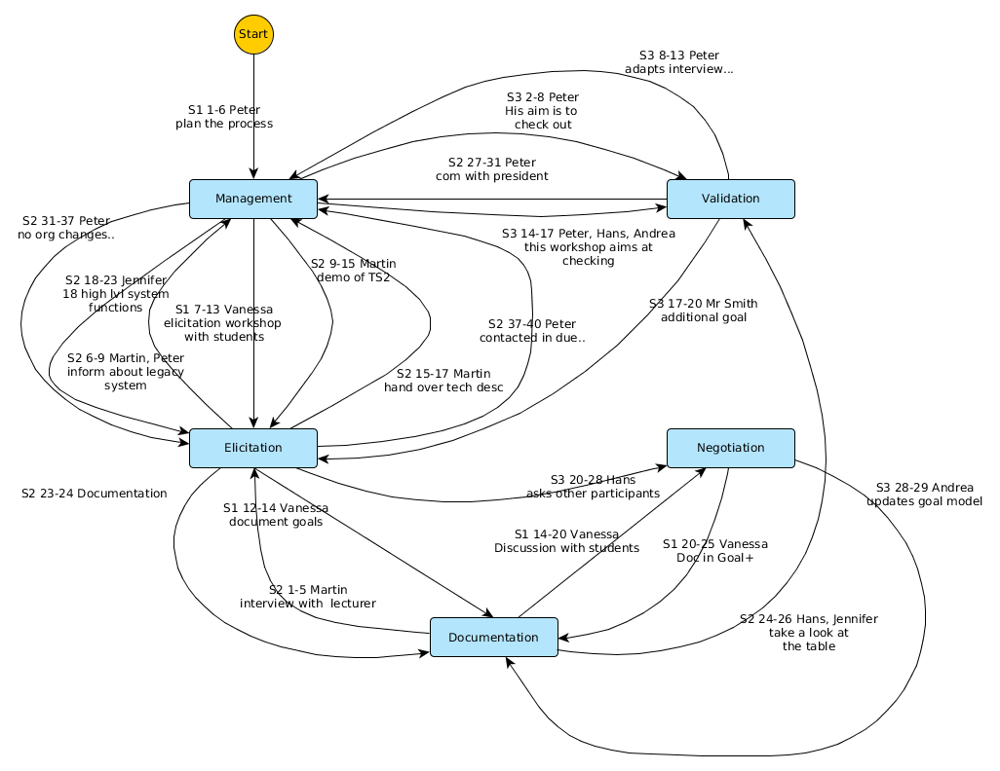

E-01 - Requirements Engineering Fundamentals
============================================

**Team**:

- Peter (Lead)
- Vanessa
- Martin
- Hans
- Jennifer
- Andrea

Anmerkungen
^^^^^^^^^^^

Seite 3
"""""""

Beim Brainstorming wird das Ziel *Internship market* verworfen, da es keinen Gewinn für die Studenten darstellt. Die grob formulierten Ziele werden in ``Goal+`` nach Dokumentationsstandarts festgehalten.

Seite 4
"""""""

Das veraltete System ``TeachSupport 2`` wird immer eingesetzt und enthält wichtige Funktionen für Studenten, Lehrpersonal und die Administration. Es werden 18 wichtige Funktionen ermittelt und festgehalten die weiterhin Bestand haben sollen.
Zudem wird durch die Administration des Schule festgehalten, dass bestimmte Gesetze und Datenschutzrichtlinien der Hochschule erhalten und nicht verändert werden sollen.

Seite 5
"""""""

Es wird festgestellt, dass einige der Interviews nicht zu konkreten Zielen geführt haben. Es wird ein Trainingsprozess für Interviewer festgelegt, der zwar mehr Zeit in Anspruch nimmt, aber ein besseres Resultat aus den Interviews garantiert.
Ein zusätzliches Ziel eines Stakeholders wird dargestellt, diskutiert und durch das Team in die Dokumentation aufgenommen (Automatische Generierung von Prüfungs-Zertifikaten).

Aufgabe 1
^^^^^^^^^

Teilaufgabe a)
""""""""""""""

+---------+---------------+
| Zeile   | RE activity   |
+=========+===============+
| S1. 1-6 | Management    |
+---------+---------------+
| 12      | Elicitation   |
+---------+---------------+
| 16-20   | Negotiation   |
+---------+---------------+
| 20-25   | Documentation |
+---------+---------------+
| 24-25   | Management    |
+---------+---------------+
| S2. 1-5 | Elicitation   |
+---------+---------------+
| 6-9     | Management    |
+---------+---------------+
| 9-15    | Elicitation   |
+---------+---------------+
| 15-17   | Management    |
+---------+---------------+
| 18-23   | Elicitation   |
+---------+---------------+
| 23-24   | Documentation |
+---------+---------------+
| 24-26   | Validation    |
+---------+---------------+
| 27-31   | Management    |
+---------+---------------+
| 31-37   | Elicitation   |
+---------+---------------+
| 37-40   | Management    |
+---------+---------------+
| S3. 2-8 | Validation    |
+---------+---------------+
| 8-12    | Management    |
+---------+---------------+
| 14-17   | Validation    |
+---------+---------------+
| 17-20   | Elicitation   |
+---------+---------------+
| 20-28   | Negotiation   |
+---------+---------------+
| 28-29   | Documentation |
+---------+---------------+

Teilaufgabe b)
""""""""""""""

Framework der Aktivitäten kommen in der Klausur.

Zeichnen der Verbindungen in Abhängigkeit der Zeilen. Nur einmal soll eine Aktivität gezeichnet werden. Dadurch ergibt sich ein Graph aus dem man die Verbindungen zwischen den Aktivitäten erkennen kann.

Aufgabe 2
^^^^^^^^^

Teilaufgabe a)
""""""""""""""

+-----+----------------------------+--------------------------+----------------+
| No. | Requirements source        | Requirements source type | Line reference |
+=====+============================+==========================+================+
| 1   | TeachSupport 2             | System                   | S.1 2-3        |
+-----+----------------------------+--------------------------+----------------+
| 2   | students                   | Stakeholder              | S.1 9          |
+-----+----------------------------+--------------------------+----------------+
| 3   | university president       | Stakeholder              | S.2 29         |
+-----+----------------------------+--------------------------+----------------+
| 4   | lecturer                   | Stakeholder              | S.2 1          |
+-----+----------------------------+--------------------------+----------------+
| 5   | TeachSupport 2 user manual | Document                 | S.2 16         |
+-----+----------------------------+--------------------------+----------------+
| 6   | examination officer        | Stakeholder              | S.2 15-16      |
+-----+----------------------------+--------------------------+----------------+
| 7   | registrars's office        | Stakeholder              | S.2 37         |
+-----+----------------------------+--------------------------+----------------+
| 8   | data privacy acts and laws | Document                 | S.2 38         |
+-----+----------------------------+--------------------------+----------------+
| 9   | data protection officer    | Stakeholder              | S.2 40         |
+-----+----------------------------+--------------------------+----------------+
| 10  | Mr. Smith                  | Stakeholder              | S.3 17         |
+-----+----------------------------+--------------------------+----------------+

Aufgabe 3
^^^^^^^^^

Teilaufgabe a)
""""""""""""""

Am besten in der Form einer Tabelle mit den Spalten ob Zunahme oder Rückschritt statt findet, welche Dimension und in welcher Zeile das statt findet.

*Seite 1, 7 - 25*:

+-------------------+--------------------+-------+
| Ziel              | \+ :math:`\vee` \- | Zeile |
+===================+====================+=======+
| ``Agreement``     | \-                 | 7-12  |
+-------------------+--------------------+-------+
| ``Content``       | \+                 | 7-25  |
+-------------------+--------------------+-------+
| ``Documentation`` | \+                 | 13-14 |
+-------------------+--------------------+-------+
| ``Agreement``     | \+                 | 18-19 |
+-------------------+--------------------+-------+
| ``Documentation`` | \+                 | 20-25 |
+-------------------+--------------------+-------+

*Seite 2, 27-40*:

+---------------+--------------------+-----------+
| Ziel          | \+ :math:`\vee` \- | Zeile     |
+===============+====================+===========+
| ``Agreement`` | \-                 | 27        |
+---------------+--------------------+-----------+
| ``Content``   | \+                 | 28, 38-39 |
+---------------+--------------------+-----------+

*Seite 3, 14-29*: Die Diskussion durch ein zusätzlich erwähntes und später auch festgelegtes Ziel steigert vor allem das ``Agreement``-Level. ``Content`` und ``Documentation`` steigen mit, da das Ziel festgehalten wird.

+-----------------------------+--------------------+-------+
| Ziel                        | \+ :math:`\vee` \- | Zeile |
+=============================+====================+=======+
| ``Agreement`` & ``Content`` | \+                 | 22    |
+-----------------------------+--------------------+-------+
| ``Agreement``               | \-                 | 24-25 |
+-----------------------------+--------------------+-------+
| ``Agreement``               | \+                 | 27    |
+-----------------------------+--------------------+-------+
| ``Documentation``           | \+                 | 28    |
+-----------------------------+--------------------+-------+

Aufgabe 4
^^^^^^^^^

Teilaufgabe a)
""""""""""""""

**Situation 1**: Durch nicht statt findende Kommunikation (*lack of user input*) fehlen dem Team wichtige Bestandteile zur Ermittlung der bisherigen Funktionen des eingesetzten Programms. Diese Funktionen fließen ggfs. nicht in das neue System ein, was zu einer Inakzeptanz führt. Zudem sind die Vorstellungen eines Vorgesetzten, über die Verschwendung von Geldern kontraproduktiv für das gesamte Projekt (*unrealistic expectations*).

**Situation 2**: Durch Übersteigung des Budgets, werden Stakeholder aus der Entwicklung entfernt, was widerum zur nicht Akzeptanz der Lösung führen kann. Wichtige Anforderungen können durch das Fehlen der Stakeholder nicht dokumentiert werden (*incomplete requirements & specifications*).

**Situation 3**: Auftritt von Änderungen der Spezifikationen (*changing requirements & specifications*). Wegfallende Anforderungen sind nicht so gravierende wie geänderte Spezifikationen, es bleibt zu erheben wie viel des Inhaltes bis zum ersten Release angepasst werden muss. Ggfs. sind die Erwartungen der neuen Administration aber zu hoch (*unrealistic expectations* und *unrealistic time frames*).

**Situation 4**: Es wurden Stakeholder während des Entwicklungsprozess komplett außen vor gelassen. Dadurch fehlen Anforderungen, was wieder zu einer Inakzeptanz des Systems führt (*lack of user input* und *incomplete requirements & specifications*).

**Situation 5**: Durch den Verlust von Dokumentation wurden Anforderungen nicht umgesetzt, was zu einer inkompletten Lösung führt (wieder *incomplete requirements & specifications*).

Aufgabe 5
^^^^^^^^^

Teilaufgabe a)
""""""""""""""

Klausur!!

**Vision a**: With "*UniversityTeach plus*", staff and students reach the next level of organizing their daily work in administration and studying.

**Vision b**: With "*UniversityTeach plus*", staff and students will get a better solution for daily daily work in school.

Teilaufgabe b)
""""""""""""""

Vision 1:

- Aufzählung der Stakeholder schlecht
- *shall be supported* ist keine Vision sondern zu schwammig formuliert

Vision 2:

- Bezug auf lediglich zwei Stakeholder
- *shall enable* wie in Vision 1

Vision 3:

- *shall be* wie in Vision 1

Teilaufgabe c)
""""""""""""""

Vision 1:

- Stakeholder
- Items

Vision 2:

- Results

Aufgabe 6
^^^^^^^^^

+--------+------------------------------+
| #      | Typ                          |
+========+==============================+
| Req 1  | Rahmenbedingung              |
+--------+------------------------------+
| Req 2  | Funktional                   |
+--------+------------------------------+
| Req 3  | Qualität                     |
+--------+------------------------------+
| Req 4  | Rahmenbedingung              |
+--------+------------------------------+
| Req 5  | Qualität                     |
+--------+------------------------------+
| Req 6  | Funktional                   |
+--------+------------------------------+
| Req 7  | Qualität - Usability         |
+--------+------------------------------+
| Req 8  | Rahmenbedingung              |
+--------+------------------------------+
| Req 9  | Funktional                   |
+--------+------------------------------+
| Req 10 | Qualität - Interoperabilität |
+--------+------------------------------+
| Req 11 | Funktional                   |
+--------+------------------------------+
| Req 12 | Funktional                   |
+--------+------------------------------+

