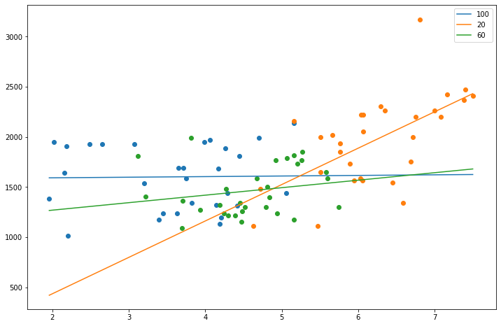

# Setup

This project is based on Qt for Python and the [fman build
system](https://build-system.fman.io/) to support the build of os specific
packages. The packages that were build can be deployed to Windows, MacOS ans
different Linux distros without the need to install a python interpreter. To
build a package an installation of python 3.5 or 3.6 is required! Python 3.7
is not tested at this point. Take a look at the [fbs
tutorial](https://github.com/mherrmann/fbs-tutorial) for more information.

First of all create a virtual environment to install all dependencies.

```shell
python -m venv .venv
```

Activate the environment

```shell
# On Mac/Linux:
source .venv/bin/activate
# On Windows:
call .venv\scripts\activate.bat
```

Run the application.

```shell
fbs run
```

Build a package based on your current operating system.

```shell
fbs freeze
```

There were some issues on windows building and executing a native package.
At the moment the current version of `PyInstaller` is 3.6. Using this
version leads to build issues! Use version **3.4** instead as defined in the
requirements.

# Evaluation

Fitts law is evaluated inside the jupyter notebook `Click evaluation.ipynb`.
Recordings of the tests are saved inside the `clicks_...csv` files. Tests were
run on a standard computer using a mouse with a 24" monitor and on a notebook
with a touchpad with a 14" monitor. A linear regression at the end of the
notebook shows the resulting lines for each circle size.

